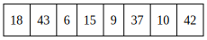
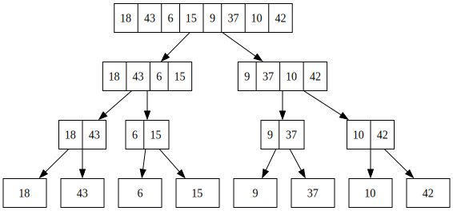
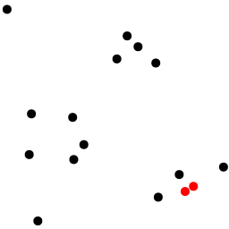

# Chia để trị

*"Divide et impera. Veni, vidi, vici" - Julius Caesar*

<br>

Chia để trị là một mô hình thuật toán. Một thuật toán áp dụng mô hình chia sẽ trị sẽ giải quyết bài toán bằng cách chia bài toán thành các bài toán nhỏ hơn (thường là chia làm đôi). Từ những bài toán nhỏ hơn này ta kết hợp các đáp án của chúng lại với nhau để tìm được đáp án của bài toán ban đầu.

Giống như khi ta đọc và nhớ một số điện thoại, ta không nhớ một lúc 10 chữ số `xxxxxxxxx` mà ta chia nó ra thành 3 phần nhỏ hơn `xxxx-xxx-xxx` để dễ ghi nhớ.

## Tư tưởng

Một thuật toán áp dụng chia để trị có 3 bước chính:

- **Chia**: Chia nhỏ bài toán thành các bài toán con.
- **Trị**: Giải các bài toán con. Nếu bài toán nhỏ ấy đủ nhỏ, ta sẽ tìm đáp án của bài toán nhỏ ấy. Nếu không thì giải bài toán con một cách đệ quy.
- **Hợp**: Kết hợp các đáp án của các bài toán con để cho ra đáp án của bài toán ban đầu. 

## Merge Sort

Ta đã được thấy mô hình chia để trị qua thuật toán [merge sort](../basic/sorting.md#sắp-xếp-trộn-merge-sort).

Ta có một mảng 8 phần tử:

<center>

</center>

Thuật toán sẽ bao gồm các bước:

**Chia**: Thuật toán chia mảng thảnh hai mảng con.

**Trị**: Sắp xếp các mảng con một cách đệ quy bằng Merge sort.

<center>

</center>

**Hợp**: Gộp các mảng con lại với nhau (có thể hợp một cách hiệu quả bằng [hai con trỏ](../basic/two-pointers.md#gộp-mảng)).

<center>

</center>

## Độ phức tạp thuật toán
 
Để tính độ phức tạp của các thuật toán áp dụng mô hình chia để trị, ta tiến hành phân tích thuật toán bằng [định lí Master](https://en.wikipedia.org/wiki/Master_theorem_(analysis_of_algorithms)).

Giả sử \\(T(n)\\) là số thao tác cần thực hiên của một thuật toán, ta có:

\\[T(n) = aT(n / b) + f(n)\\]

với \\(n\\) là kích thước của dữ liệu, hai hằng số \\(a\\), \\(b\\) lần lượt là số bài toán con và tỉ lệ kích thước dữ liệu của bài toán gốc và bài toán con, còn hàm \\(f(n)\\) chính là số thao tác để thực hiện việc chia bài toán và hợp các bài toán con.

Sử dụng công thức này, có thể tích được độ phức tạp của các thuật toán. Ví dụ với thuật toán Merge Sort thì ta có: \\(T(n) = 2T(n / 2) + O(n)\\), từ đây suy ra độ phức tạp sẽ là \\(O(n \log{n})\\).

Có thể xem thông tin về định lí Master tại các nguồn tài liệu khác.

## Phần tử nhỏ thứ k

Bài toán: Cho một mảng `a` có \\(n\\) phần tử. Hãy tìm và in ra giá trị của phần tử nhỏ thứ \\(k\\) trong mảng (các phần tử bắt đầu từ 1).

VD: Phần tử nhỏ thứ 3 của mảng `a = [18, 43, 6, 15, 9, 37, 10, 42]` có giá trị bằng 10.

Ta có thể sắp xếp lại các phần tử trong mảng bằng một thuật toán sắp xếp nào đấy ([QuickSort](../basic/sorting.md#sắp-xếp-nhanh-quicksort) - \\(O(n\log{n})\\)) và in ra phần tử thứ \\(k\\) trong mảng. 

Độ phức tạp của thuật toán sẽ là \\(O(n\log{n})\\).

Tuy nhiên, ta có thể xử lý bài toán với độ phức tạp \\(O(n)\\) một cách đơn giản bằng cách áp dụng mô hình chia để trị và có phần giống với QuickSort.

Thuật toán của ta sẽ chọn một phần tử ngẫu nhiên trong mảng \\(a[p]\\) và sắp xếp lại các phần tử trong mảng `a`: các phần tử \\(a[x] \le a[p]\\) sẽ được xếp bên trái \\(a[p]\\), các phần tử còn lại sẽ được xếp ở bên phải \\(a[p]\\). Gọi chỉ số của phần tử \\(a[p]\\) sau khi sắp xếp lại mảng `a` là \\(q\\), ta có 3 trường hợp có thể xảy ra:
- Trường hợp 1: \\(q = k\\): \\(a[q]\\) chính là đáp án của bài toán. Ta trả về giá trị cần tìm và kết thúc thuật toán.
- Trường hợp 2: \\(q \lt k\\): Đáp án của bài toán sẽ nằm ở bên trái \\(a[q]\\), hay các phần tử có chỉ số trong khoảng \\([1..q - 1]\\).
- Trường hợp 3: \\(q \gt k\\): Đáp án của bài toán sẽ nằm ở bên phải \\(a[q]\\), hay các phần tử có chỉ số trong khoảng \\([q + 1..n]\\).

Các trường hợp 2 và 3 sẽ được thuật toán xử lý một cách đệ quy cho tới khi tìm được đáp án. 

Độ phức tạp thuật toán này sẽ là \\(O(n)\\).

Trong thư viện C++ tồn tại hàm `nth_element` có thể giải quyết bài toán này và cũng áp dụng thuật toán như trên.

```C++
int a[] = {-1, 18, 43, 6, 15, 9, 37, 10, 42};
nth_element(a + 1, a + k, a + 1 + n);
cout << a[k]; // 10
```

## Cặp điểm gần nhất

Bài toán: Cho \\(n\\) điểm trên Hệ tọa độ Descartes. Tìm và in ra cặp điểm có khoảng cách Euclid nhỏ nhất. (Khoảng cách Euclid của hai điểm \\((x_1, y_1)\\), \\((x_2, y_2)\\) là \\(\sqrt{(x_1 - x_2)^2 + (y_1 - y_2)^2}\\)).

<center>

</center>

Ở ví dụ trên, hai đỉnh được tô màu đỏ sẽ cho ta cặp điểm có khoảng cách nhỏ nhất.

Một thuật toán đơn giản sẽ giải quyết bài toán này bằng cách xét tất cả các cặp điểm và tìm khoảng cách nhỏ nhất giữa các cặp điểm ấy. Độ phức tạp của thuật toán khi này sẽ là \\(O(n^2)\\). 

Tuy nhiên, áp dụng mô hình chia để trị sẽ giúp ta viết ra được một thuật toán hiệu quả hơn!

Thuật toán của ta sẽ bao gồm các bước như sau:
- Chia: Sắp xếp các điểm theo tọa độ x, tìm phần tử ở giữa `midpoint` và chia các điểm thành hai phần - phần bên trái là các điểm có tọa độ x nhỏ hơn hoặc bằng `midpoint`, phần bên phải là các điểm có tọa độ x lớn hơn `midpoint`.
- Trị: Tìm khoảng cách Euclid nhỏ nhất đối với hai đỉnh bất kì với mỗi bên: \\(\delta_1\\) là khoảng cách Euclid nhỏ nhất của các điểm bên trái, \\(\delta_2\\) cho các đỉnh bên phải.
- Hợp: Trả về \\(min(\delta_1, \delta_2)\\).

Độ phức tạp của thuật toán sẽ là \\(O(n\log{n})\\).

Chắc hẳn bạn sẽ có nghĩ rằng liệu như thế này có phải quá dễ không? Bạn nghĩ đúng rồi đấy! 

Thuật toán ở trên của ta là một thuật toán sai, cụ thể là ở phần hợp. Ta quên xét đến trường hợp nếu một điểm bên trái và một điểm bên phải có thể hình thành cặp điểm có khoảng cách Euclid nhỏ nhất.

Chắc chắn là việc kiểm tra từng điểm ở bên trái với từng điểm ở bên phải `midpoint` sẽ khiến thuật toán của ta chạy chậm hẳn đi: \\(O(n^2)\\). Vậy làm thế nào để có thể xử lý được trường hợp này?