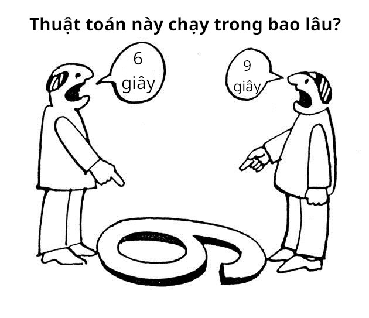

# Độ phức tạp thuật toán

Khi viết chương trình giải quyết các bài toán, ta cần phải tuân thủ những giới hạn mà bài toán đặt ra về thời gian và bộ nhớ. Vậy làm sao để biết được chương trình của ta chạy trong bao lâu, và sử dụng bao nhiêu bộ nhớ?

Để ước tính thời gian và bộ nhớ mà một thuật toán sử dụng, ta cần phải biết về *độ phức tạp của thuật toán*.

## Giới thiệu

Các máy tính khác nhau sẽ có tốc độ xử lí khác nhau - một số máy thì chạy nhanh, một số khác thì chậm, còn lại chạy vừa vừa. Có những trường hợp như \\(2\\) anh A và B cùng chạy một chương trình máy tính, cùng một thuật toán, nhưng máy của anh A lại chạy trong \\(6\\) giây, còn máy của anh B lại mất tới \\(9\\) giây.

<center>

</center>

Để có được một sự thống nhất trong việc xác định độ hiệu quả của một thuật toán, ta thực hiện việc tính độ phức tạp của thuật toán.

## Độ phức tạp thời gian 

Độ phức tạp thời gian của một thuật toán sẽ ước tính thời gian chạy của một thuật toán dựa vào kích thước đầu vào để biết được nếu độ hiệu quả của thuật toán. Độ phức tạp thời gian được biểu diễn dưới dạng Big-O với kí hiệu \\(O(...)\\).

Thông thường, \\(n\\) dùng để tượng trưng cho kích thước dữ liệu đầu vào. Vì thời gian thực hiện thuật toán có thể thay đổi tùy vào những giá trị khác nhau trong dữ liệu đầu vào, dẫu cho chúng có cùng kích thước \\(n\\), nên điều mà ta nên quan tâm chính là các trường hợp tệ nhất của thuật toán.

### Cách tính độ phức tạp thời gian

Các câu lệnh đơn giản như phép cộng, trừ,... các số nguyên thường không đáng kể, có độ phức tạp \\(O(1)\\).

```c++
int a = 2;
int b = 3;
int c = a + b;
```

Một vòng lặp có độ phức tạp \\(O(n)\\).

```c++
for(int i = 1; i <= n; ++i){
	// code
}
```

Hai vòng lặp lồng nhau có độ phức tạp \\(O(n^{2})\\).

```c++
for(int i = 1; i <= n; ++i){
	for(int j = 1; j <= n; ++j){
		// code
	}
}
```

Từ đây, \\(k\\) vòng lặp lồng nhau có độ phức tạp thời gian là \\(O(n^k)\\).

Việc tính độ phức tạp thời gian chỉ thể hiện qua độ lớn của đầu vào và bỏ qua các hằng số, nên các vòng lặp như:

```c++
for(int i = 1; i <= 5 * n; ++i){
	// code
}
```

```c++
for(int i = 1; i <= n; i += 2){
	// code
}
```

Lặp với số lần lần lượt là \\(5 \times n\\), \\(\left\lceil \frac{n}{2} \right\rceil \\) vẫn có độ phức tạp thời gian là \\(O(n)\\).

Nếu chương trình có nhiều giai đoạn với các độ phức tạp khác nhau, ta sẽ chọn giai đoạn có độ phức tạp lớn nhất trong tất cả các giai đoạn làm độ phức tạp thời gian của cả thuật toán.

```c++
for(int i = 1; i <= n; ++i){
	// code
}

for(int i = 1; i <= n; ++i){
	for(int j = 1; j <= n; ++j){
		// code
	}
}
```

Chương trình trên có \\(2\\) giai đoạn với độ phức tạp lần lượt là \\(O(n)\\) và \\(O(n^{2})\\). Vậy độ phức tạp thời gian của chương trình là \\(O(n^2) + O(n) = max(O(n^2), O(n)) = O(n^{2})\\).

Nên nhớ rằng độ phức tạp thời gian chỉ ước tính thời gian của thuật toán dựa trên kích thước đầu vào nên các chương trình như:

```C++
for(int i = 1; i <= 100'000; ++i){
	// code
}
```

Sẽ có độ phức tạp thời gian là \\(O(1)\\), mặc dù đang thực hiện một vòng lặp khá lớn.

Đối với các thuật toán có độ phức tạp có logarit (\\(O(\log_{a}{b}), O(n\log_a{n}),\cdots\\)), ta không ghi hệ cơ số của các logarit, tức là các độ phức tạp có logarit sẽ chỉ ghi \\(O(\log{n})\\). Lí do là bởi \\(\log_a{b} = \frac{\log{b}}{\log{a}}\\), và vì \\(\frac{1}{\log{a}}\\) số rất nhỏ nên ta bỏ qua.

#### Các yếu tố khác

Việc tính độ phức tạp thời gian còn phụ thuộc vào nhiều yếu tố khác. Ví dụ với đoạn dưới đây có độ phức tạp thời gian \\(O(nm)\\).

```c++
for(int i = 1; i <= n; ++i){
	for(int j = 1; j <= m; ++j){
		// code
	}
}
```

#### Đệ quy 

Độ phức tạp của một hàm đệ quy được tính bằng số lần gọi đệ quy và độ phức tạp của mỗi lần gọi.

Hàm dưới đây sẽ in ra các số từ \\(1\\) đến \\(n\\):

```c++
void print(int n){
	if(n == 0) return;
	print(n - 1);
	cout << n << '\n';
}
```

Dễ thấy hàm này được gọi \\(n\\) lần và mỗi lần gọi có độ phức tạp thời gian là \\(O(1)\\). Từ đó ta suy ra được độ phức tạp thời gian của hàm sẽ là \\(O(n)\\).

Xét hàm dưới đây:

```c++
void f(int n){
	if(n == 1) return;
	f(n - 1);
	f(n - 1);
}
```

Hàm \\(f(n)\\) sẽ được gọi \\(1\\) lần, \\(f(n - 1)\\) được gọi \\(2\\) lần, ..., \\(f(1)\\) được gọi \\(2^{n - 1}\\) lần.

Từ đó, độ phức tạp thời gian của thuật toán sẽ là:

\\[1 + 2 + 4 + ... + 2^{n - 1} = 2^n - 1 = O(2^n)\\]

### Một số tên gọi của các độ phức tạp phổ biến

|Độ phức tạp|Tên gọi tiếng Anh|Tên gọi tiếng Việt|
|---|---|---|
|\\(O(1)\\)| Constant | Hằng số |
|\\(O(\log{n})\\)| Logarithmic | Logarit|
|\\(O(\sqrt{n})\\)| Square root | Căn bậc hai (căn)|
|\\(O(n)\\)| Linear | Tuyến tính |
|\\(O(n\log{n})\\)| Linearithmic |  |
|\\(O(n^2)\\)| Quadratic | Bậc hai |
|\\(O(n^3)\\)| Cubic | Bậc ba |
|\\(O(n^k)\\)| Polynomial |  Luỹ thừa|
|\\(O(C^n)\\)| Exponential | Hàm mũ |

### Ước tính độ phức tạp thời gian

Ta có thể ước tính độ phức tạp thời gian để xác định xem thuật toán của ta có thể chạy được trong giới hạn thời gian hay không. Máy chấm thường sẽ thực hiện \\(10^8\\) phép tính/giây. Nếu bài toán cho ta giới hạn \\(1\\) giây và ta chạy một thuật toán \\(O(n^2)\\) với \\(n = 10^5\\) thì máy chấm sẽ phải xử lí ít nhất \\((10^5)^{2}\\) = \\(10^{10}\\) phép tính và thời gian chạy sẽ tương đương \\(\frac{10^{10}}{10^8} = 100\\) giây. Vậy là chương trình của ta đã chạy quá thời gian và máy chấm trả về kết quả TLE.

Khi biết được giá trị \\(n\\), ta có thể ước tính được độ phức tạp của thuật toán ta cần áp dụng:

|Giá trị của \\(n\\)|Ước tính độ phức tạp|
|---|---|
|\\(n \leq 10\\)|\\(O(n!)\\)|
|\\(n \leq 20\\)|\\(O(2^n), O(n^6)\\)|
|\\(n \leq 100\\)|\\(O(n^4)\\)|
|\\(n \leq 500\\)|\\(O(n^3)\\)|
|\\(n \leq 5000\\)|\\(O(n^2)\\)|
|\\(n \leq 5 \times 10^5\\)|\\(O(n\sqrt{n}), O(n \log^2{n})\\)|
|\\(n \leq 10^6\\)|\\(O(n), O(n \log{n})\\)|
|\\(10^9 \le n \le 10^{18}\\)|\\(O(1), O(\log{n})\\)|

## Độ phức tạp bộ nhớ

Tương tự độ phức tạp thời gian, độ phức tạp bộ nhớ ước tính lượng bộ nhớ được sử dụng khi thực hiện thuật toán. 

Những gì được nói ở phần độ phức tạp bộ nhớ cũng tương tự với độ phức tạp thời gian: các [kiểu dữ liệu cơ bản](../programming/variables-data-types.md) (trừ `string`) có độ phức tạp \\(O(1)\\), và một mảng \\(n\\) phần tử có độ phức tạp bộ nhớ \\(O(n)\\).

Không giống với độ phức tạp thời gian, độ phức tạp bộ nhớ thường khá "thoáng", với giới hạn bộ nhớ của bài thường không quá khắt khe, thế nên ta không cần tìm hiểu quá chi tiết như độ phức tạp thời gian.
