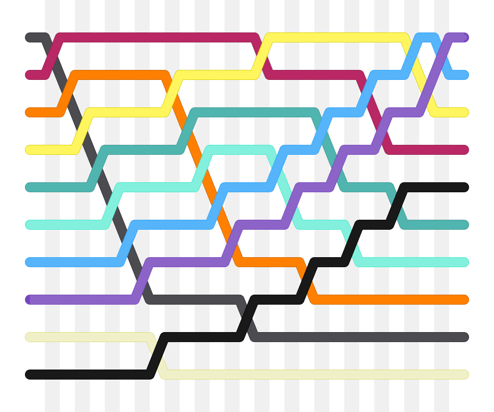

# Thuật toán sắp xếp

Thuật toán sắp xếp là thuật toán tối quan trọng trong lập trình thi đấu. Thuật toán sắp xếp là nền tảng để tối ưu các thuật toán khác, khi việc thực hiện các thao tác sẽ dễ dàng hơn khi các phần tử của một danh sách đã được sắp xếp.

## Khái niệm

Một bài toán sắp xếp là khi ta một mảng chứa \\(n\\) phần tử và nhiệm vụ của ta là sắp xếp và trả về các phần tử của mảng theo thứ tự tăng dần theo giá trị.

Ta có mảng sau:

\\[[2, 5, 7, 9, 1, 4, 6, 3, 8]\\] 

Sau khi sắp xếp, ta có mảng mới với các phần tử tăng dần theo giá trị:

\\[[1, 2, 3, 4, 5, 6, 7, 8, 9]\\]

## Các thuật toán sắp xếp \\(O(n^{2})\\)

Các thuật toán sắp xếp \\(O(n^{2})\\) thường khá đơn giản - thường khá ngắn và sử dụng \\(2\\) vòng lặp lồng nhau. Ta sẽ tìm hiểu một số thuật toán sắp xếp \\(O(n^{2})\\) phổ biến.

### Sắp xếp nổi bọt (Bubble sort)

Thuật toán sắp xếp nổi bọt hoạt động như sau: duyệt các phần tử, nếu phần từ hiện tại nhỏ hơn phần tử trước đó thì ta hoán đổi vị trí của hai phần tử. Sau \\(n-1\\) lần duyệt, ta có một mảng đã được sắp xếp. 

```C++
for(int i = 1; i <= n; ++i){
	for(int j = 1; j < n; ++j){
		if(a[j] > a[j + 1]){
			swap(a[j], a[j + 1]);
		}
	}
}
```

Tên gọi "nổi bọt" là bởi các phần tử lớn hơn sẽ từ từ "nổi bọt" lên cuối mảng, còn các phần tử nhỏ hơn thì "chìm" xuống.

<center>


<sup> Minh hoạ thuật toán sắp xếp nổi bọt - [Pmdumuid](https://commons.wikimedia.org/wiki/File:Bubblesort-edited-color.svg) - [CC0](https://creativecommons.org/publicdomain/zero/1.0/deed.en)</sup>
</center>

### Sắp xếp chọn (Selection sort)

Thuật toán sắp xếp chọn hoạt động như sau: thuật toán chia mảng làm hai phần - phần bên trái là một mảng con được sắp xếp tăng dần - phần bên phải là các phần tử còn lại. Thuật toán lần lượt tìm phần tử nhỏ nhất ở bên phải và thêm nó vào cuối phần bên trái.

```C++
for(int i = 1; i < n; ++i){
	int id = i;
	for(int j = i; j <= n; ++j){
		if(a[id] > a[j]){
			id = j;
		}
	}
	swap(a[i], a[id]);
}
```

### Sắp xếp chèn (Insertion sort)

Thuật toán sắp xếp chèn sẽ lần lượt sắp xếp \\(1\\) phần tử đầu tiên, sau đó là \\(2\\) phần tử, \\(3\\) phần tử, ..., cho tới khi toàn bộ \\(n\\) phần tử đã được sắp xếp.

Với mỗi phần tử có chỉ số \\(i\\) từ \\(2\\) đến \\(n\\), ta tìm chỉ số của phần tử lớn nhất không lớn hơn phần tử có chỉ số \\(i\\), gọi là \\(j\\). Sau đó, chèn phần tử có chỉ số \\(i\\) vào vị trí \\(j\\) trong mảng.

```C++
for(int i = 2; i <= n; ++i){
	int j = i;
	while(j >= 2 && a[j] > a[j - 1]) {
		swap(a[j], a[j - 1]);
		--j;
	}
}
```

## Các thuật toán sắp xếp \\(O(n \log{n})\\)

Thuật toán sắp xếp có thể được tối ưu xuống còn \\(O(n \log{n})\\). Ta sẽ tìm hiểu một số thuật toán sắp xếp phổ biến.

### Sắp xếp trộn (Merge sort)

Thuật toán sắp xếp trộn (Merge sort) là một thuật toán sắp xếp áp dụng mô hình [chia để trị](../paradigms/dnc.md).

Thuật toán chia đôi mảng cần sắp xếp thành hai mảng con có kích thước bằng nhau (nếu số phần tử chẵn) hoặc chênh nhau một phần tử (nếu số phần tử lẻ). Sau khi sắp xếp các mảng con một cách đệ quy, thuật toán kết hợp hai mảng con lại để tạo thành mảng gốc với các phần tử đã được sắp xếp.

```C++
int arr[N];
int tmp[N];
void mergesort(int l, int r){
	if(l >= r) return;
	// chia đổi mảng
	int k = (l + r) >> 1;


	// sắp xếp hai mảng con
	mergesort(l, k); 
	mergesort(k + 1, r);

	int i = l, j = k + 1;
	int id = 1;

	// kết hợp hai mảng con
	while(i <= k && j <= r){
		if(arr[i] < arr[j]){
			tmp[id] = arr[i];
			++i;
		}else {
			tmp[id] = arr[j];
			++j;
		}
		++id;
	} 
	while(i <= k){
		tmp[id] = arr[i];
		++i; ++id;
	}
	while(j <= r){
		tmp[id] = arr[j];
		++j; ++id;
	}
	for(int idx = l; idx <= r; ++idx){
		arr[idx] = tmp[idx - l + 1];
	}
}
```

Minh hoạ bằng ảnh:


### Sắp xếp nhanh (QuickSort)

Thuật toán sắp xếp nhanh là một thuật toán áp dụng mô hình chia để trị. 

Thuật toán sẽ chọn phần tử bất kì trong mảng làm "chốt", sau đó thuật toán sẽ sắp xếp lại các phần tử trong mảng như sau: các phần tử nhỏ hơn chốt sẽ ở bên trái, các phần tử còn lại sẽ ở bên phải chốt.

Sau khi sắp xếp lại vị trí các phần tử theo chốt, ta sắp xếp các phần tử ở hai bên mảng một cách đệ quy.

Mặc dù độ phức tạp của thuật toán chậm nhất là \\(O(n^{2})\\) thuật toán lại có độ phức tạp trung bình là \\(O(n \log{n})\\), và khi so sánh trên máy thì nhanh hơn sắp xếp trộn trong nhiều trường hợp.

```C++
int a[N];
void quickSort(int l, int r) {
	if(l >= r) return;
    int i = l, j = r;
    int pivot = a[(l + r) >> 1]; // chọn phần tử ở chính giữa mảng làm chốt

    // chia đôi mảng
    while (i <= j) {
        while (a[i] < pivot) ++i;
        while (a[j] > pivot) --j;
        if (i <= j) {
            swap(a[i], a[j]);
            ++i;
            --j;
        }
    }

    // sắp xếp hai mảng con
    if (l < j) quickSort(l, j);
    if (i < r) quickSort(i, r);
}
```

## Thuật toán sắp xếp nhỏ hơn \\(O(n \log {n})\\)?

Đến đây, ta tự hỏi rằng liệu có thuật toán sắp xếp nào có độ phức tạp còn nhỏ hơn \\(O(n \log {n})\\) không? Nếu như ta giới hạn ở việc so sánh giá trị giữa các phần tử thì điều này là không thể.

Một mảng chứa \\(n\\) phần tử sẽ có tất cả \\(n!\\) cách sắp xếp. Với mỗi lần thực hiện một bước so sánh, số lượng cách sắp xếp giảm đi một nửa, suy ra số bước so sánh cần thực hiện để mảng được sắp xếp tăng dần sẽ là \\(O(\log{n!})\\).

Sử dụng [công thức Stirling](https://vi.wikipedia.org/wiki/X%E1%BA%A5p_x%E1%BB%89_Stirling), ta có: \\(\log{n!} = n \log{n} - n + O(\log{n})\\). Suy ra: \\(O(\log{n!}) = O(n\log{n})\\).

### Sắp xếp đếm (Counting sort)

Giới hạn \\(O(n\log{n})\\) ở trên sẽ chỉ áp dụng với các thuật toán so sánh các giá trị của phần tử. Nếu ta sử dụng phương pháp khác, độ phức tạp có thể thay đổi.

Một trong những thuật toán sắp xếp ấy chính là sắp xếp đếm.

Thuật toán sắp xếp đếm là một thuật toán sắp xếp nhanh các phần tử trong mảng, với các phần tử trong mảng là các số nguyên. Thuật toán sẽ đếm số lần xuất hiện của các giá trị có trong mảng, từ đấy sắp xếp lại các giá trị.

Độ phức tạp của thuật toán sắp xếp này là \\(O(n + k)\\), với \\(k\\) là khoảng giá trị của các phần tử trong mảng. Dễ thấy, nếu \\(k\\) đủ nhỏ, độ phức tạp của sắp xếp nhanh sẽ hơn nhiều so với các thuật toán sắp xếp được nói ở trên. 

## Thuật toán sắp xếp trong C++

Việc tự tay viết cả một thuật toán sắp xếp rất tốn thời gian và rất dễ xảy ra sai sót. Vì vậy ta có thể dùng hàm `sort` có sẵn trong thư viện C++.

Hàm `sort` của C++ sẽ sắp xếp các số trong khoảng \\([l, r)\\).

VD: sắp xếp các phần tử trong mảng `a` từ vị trí \\(0\\) đến \\(n - 1\\).
```C++
sort(a, a + n);
```

Hàm sort cũng có thể sắp xếp được `string`, với các kí tự được sắp xếp theo giá trị ASCII tương ứng:

```C++
string s = "sorting";
sort(s.begin(), s.end());
cout << s; // 'ginorst'
```

### Phép so sánh trong hàm sort C++

Hàm `sort` trong C++ yêu cầu một thao tác so sánh để có thể thực hiện việc so sánh các phần tử. Hầu hết các kiểu dữ liệu trong C++ đều có phép so sánh, ví dụ như `int` sắp xếp theo giá trị của nó. 

Kiểu dữ liệu `pair` sẽ được sắp xếp theo giá trị của giá trị đầu tiên trong cặp giá trị: `first`. Nếu các `first` bằng nhau thì sẽ sắp xếp theo giá trị của `second`.

```C++
vector<pair<int, int>> v;
v.push_back({1, 5});
v.push_back({2, 3});
v.push_back({1, 2});
sort(v.begin(), v.end());
```

Sau khi sắp xếp xong mảng `v` sẽ có các phần tử được xắp xếp theo thứ tự lần lượt là `(1, 2)`, `(1, 5)`, `(2, 3)`.

### Hàm so sánh

Ta có thể viết hàm so sánh để sắp xếp các phần tử:

Ví dụ:

```C++
// Cấu trúc `phân số`
struct phanso {
	int x, y;
};

bool cmp(const phanso &a, const phanso &b){ // hàm so sánh
	return a.x * b.y < a.x * b.y;
}

int main(){
	vector<phanso> a = {{1, 2}, {2, 3}, {4, 2}};
	sort(a.begin(), a.end(), cmp);
}
```

Mảng `a` sau khi sắp xếp xong sẽ cho ta các phần tử theo thứ tự: `(1, 2)`, `(2, 3)`, `(4, 2)`.
