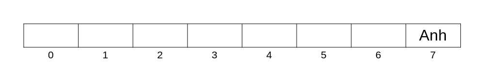
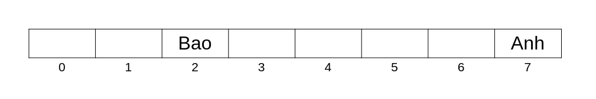
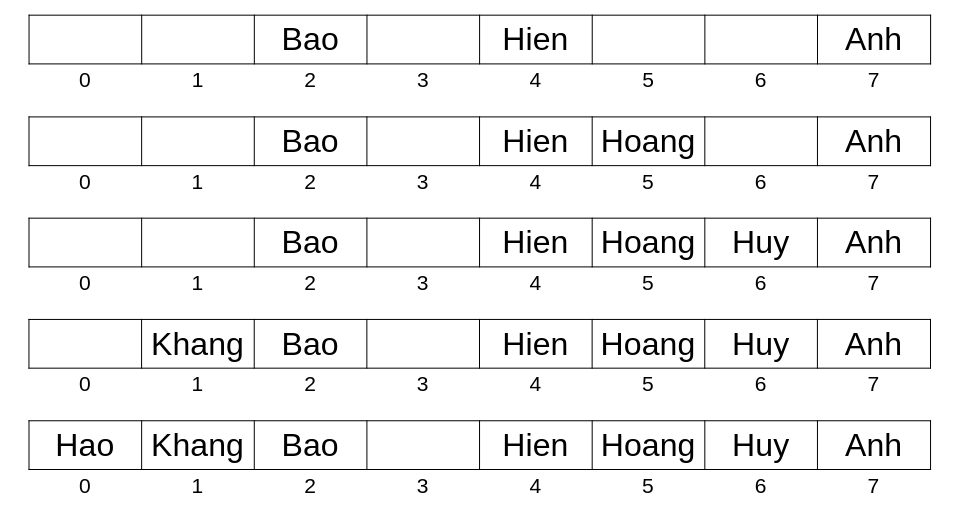
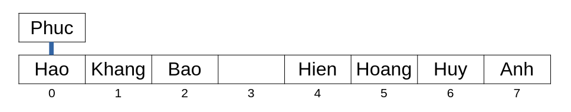
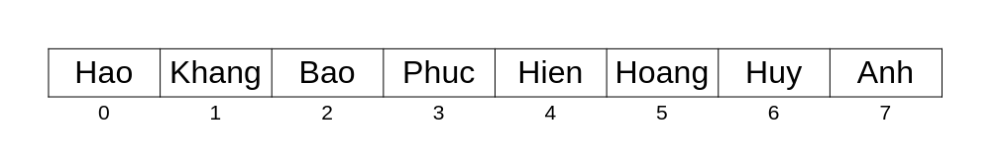

# Bảng băm (Hash Table)

**Bảng băm (Hash Table)** là một CTDL cho phép ta lưu trữ và truy cập thông tin một cách nhanh chóng, dẫu cho dữ liệu có lớn cỡ nào đi nữa.

## Ý tưởng

Giả sử ta được cho một mảng giá trị, và ta muốn lưu giá trị trên mảng này. Nếu ta muốn lưu một giá trị của một số, ta có thể lưu bằng cách gán giá trị cho phần tử tại chỉ số bằng số ấy. Thế nhưng giả dụ nếu mà ta muốn lưu giá trị của một *xâu kí tự*, thì cách làm trên sẽ không thực hiện được.

Ý tưởng chính của *bảng băm* chính là hô biến xâu thành chỉ số bằng một *hàm băm (hash function)*, và sử dụng chỉ số ấy để lưu giá trị mà ta cần lưu trên phần tử có chỉ số ấy. Đồng thời, việc tìm lại giá trị về xâu cũng sẽ nhanh chóng hơn khi ta chỉ cần sử dụng hàm băm tìm chỉ số từ xâu và lấy thông tin từ phần tử ở chỉ số đó.

## Bảng băm

Bảng băm là một CTDL lưu các cặp dữ liệu \\(key, value\\). Các \\(key\\) sẽ là thứ quyết định các \\(value\\) được lưu ở đâu trong bảng băm. Ở ví dụ dưới đây, ta sẽ cho \\(k = value\\) để dễ minh họa giải thích.

<br>

Ta có mảng `h` gồm \\(8\\) có thể lưu xâu kí tự (zero-indexed), và ta muốn lưu \\(8\\) xâu sau vào mảng: *Anh*, *Bao*, *Hien*, *Hoang*, *Huy*, *Khang*, *Hao*, *Phuc* (các tên không dấu).

Ta có hàm băm `getHash` băm các xâu để tạo chỉ số để lưu xâu trên mảng `h`. `getHash` sẽ tạo chỉ số bằng cách tính tổng ASCII của các kí tự trong xâu, modulo cho kích thước mảng.

```C++
int getHash(string &s){
	int sum = 0;
	for(char c : s){
		sum += int(c);
	}
	return sum % 8;
}
```

Như xâu *Anh* khi đưa vào hàm `getHash` sẽ trả về chỉ số \\((65 + 110 + 104) \mod{8} = 7\\). Vì vậy, xâu *Anh* sẽ được lưu tại chỉ số \\(7\\) của mảng `h`.

<center>

</center>

Tiếp theo với xâu *Bao*, `getHash` trả về chỉ số \\((66 + 97 + 111) \mod{8} = 2\\), ta lưu `Bao` tại phần tử có chỉ số \\(2\\).

<center>

</center>

Và tiếp tục với *Hien*, *Hoang*, *Huy*, *Khang*, *Hao*.

<center>

</center>

Đến xâu cuối cùng *Phuc*, `getHash` sẽ băm xâu *Phuc* ra và cho ta chí số \\(0\\), nhưng tại chỉ số \\(0\\) đã có *Hao* rồi. Xử lí sao bây giờ?

## Hash collision

**Va chạm băm (Hash collision)** xảy ra khi hai giá trị có cùng giá trị băm, giống như trường hợp đã xảy ra giữa *Phuc* và *Hao*. Để khắc phục vẫn đề này khi lưu trên bảng băm, ta có hai phương pháp chính: phương pháp tạo dây chuyền (seperate chaining) và phương pháp địa chỉ mở (open addressing).

### Phương pháp chuỗi (separate chaining)

**Phương pháp chuỗi (separate chaining)** thay đổi các phần tử trong bảng băm - thay vì chỉ lưu một giá trị, các phần tử có thể lưu một *chuỗi* các giá trị khác nhau.

<center>

</center>


### Phương pháp địa chỉ mở (open addressing)

**Phương pháp địa chỉ mở (open addressing)** xử lí va chạm băm bằng cách dịch giá trị băm đến vị trí bên phải gần nhất sao cho phần tử ở vị trí ấy chưa lưu giá trị nào. 

Ở ví dụ này, vì \\(3\\) là chỉ số gần chỉ số \\(0\\) về phía bên phải mà phần tử chưa lưu giá trị nào nên ta lưu *Phuc* tại vị trí đó.

<center>

</center>

## Hệ số tải

**Hệ số tải (load factor)** \\(\alpha\\) cho biết độ hiệu quả của hàm băm khi lưu các giá trị, được tính bằng công thức:

\\[\alpha = \frac{n}{m}\\]

Trong đó, \\(n\\) là số giá trị được lưu trong bảng băm, còn \\(m\\) là số lượng phần tử mà bảng băm có.

## Tìm kiếm

Để tìm kiếm các giá trị mà ta đã lưu trong bảng băm, ta sẽ lấy giá trị của hàm băm và kiểm tra nếu vị trí đó có lưu giá trị cần tìm hay không. Nếu bảng băm áp dụng phương pháp chuỗi thì kiểm tra các giá trị trong chuỗi, nếu là phương pháp địa chỉ mở thì kiểm tra các giá trị ở bên phái. 

## Cài đặt

Dưới đây là cách cài đặt hàm băm để lưu các xâu kí tự, sử dụng phương pháp địa chỉ mở nếu có va chạm băm.

```C++
struct HashTable{
	vector<vector<string>> h; // các chuỗi
	int m;
	HashTable(int _m){ // m
		m = _m;
		h.resize(_m);
	}
	// băm xâu
	int getHash(string &s){
		int sum = 0;
		for(char c : s){
			sum += int(c);
		}
		return sum % m;
	}
	// thêm xâu vào bảng băm
	void insert(string &s){
		h[getHash(s)].emplace_back(s);
	}
	// tìm xâu trong bảng băm
	bool find(string &s){
		int idx = getHash(s);
		for(auto &str : p[idx]){
			if(str == s) return 1;
		}
		return 0;
	}
};
```

## Bảng băm trong C++

Trong C++, `unordered_map` và `unordered_set` là hai container trong thư viện STL của C++ được cài đặt dựa trên ý tưởng của bảng băm - trong khi `unordered_map` lưu cả \\(key\\) và \\(value\\) thì `unordered_set` chỉ lưu các \\(key\\). 

Ví dụ với `unordered_map`:

```C++
unordered_map<string, int> ump;
ump["a"] = 1;
ump["b"] = 2;
ump["c"] = 3;
cout << (ump.find("a") != ump.end()) << '\n'; // nếu "a" có trong ump -> 1
ump.erase("a"); // xóa "a"
cout << ump["b"] + ump["c"] << '\n'; // 5
```

Ngoài ra còn có `unordered_multimap` với `unordered_multiset` cho phép ta có nhiều \\(key\\) thay vì chỉ \\(1\\) như cai cái trên.