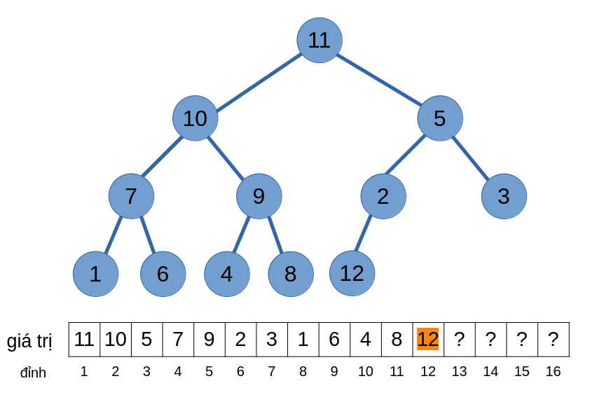
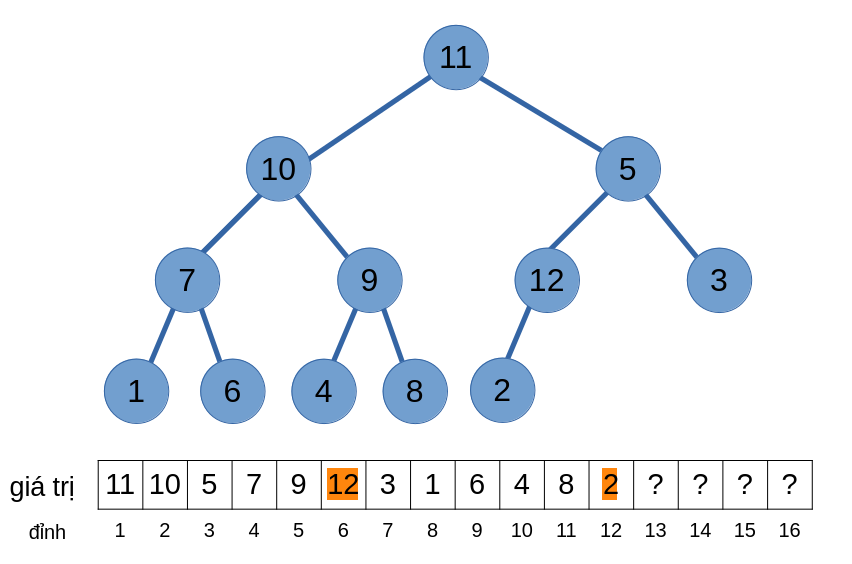
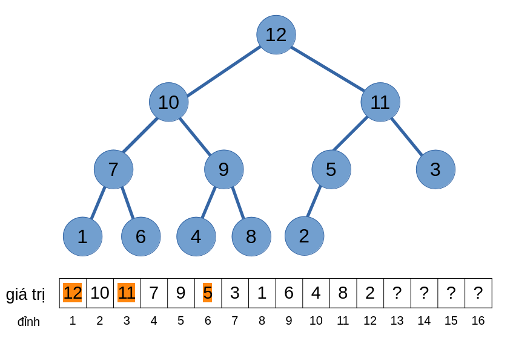
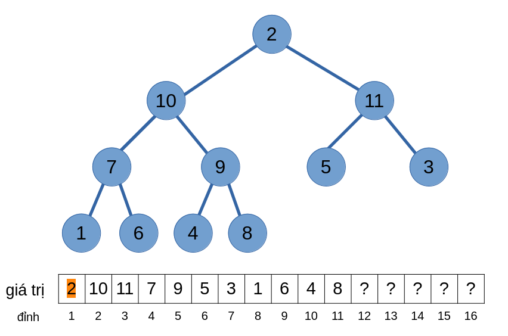
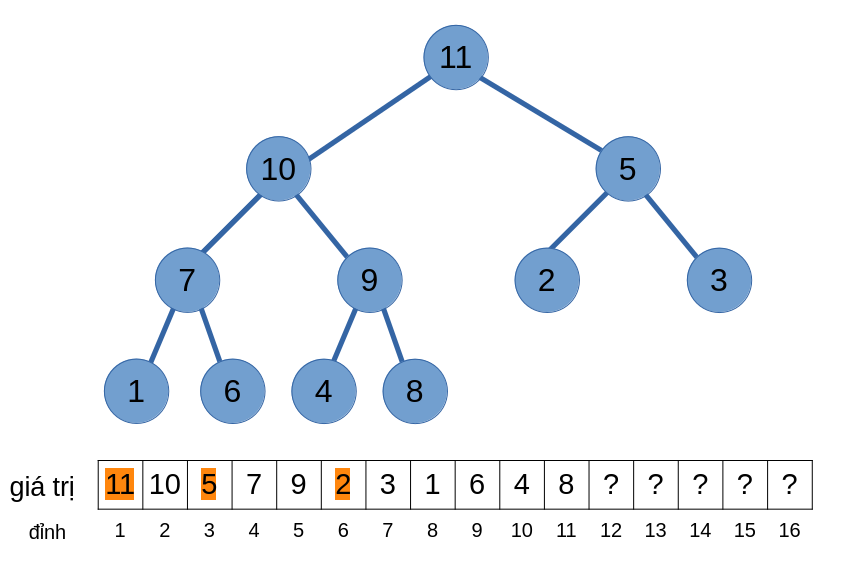

# Heap

**Heap** là một cấu trúc dữ liệu lưu các giá trị trên [cây](../graph-theory/tree.md). Các giá trị được lưu trên heap phải thoả mãn *tính chất heap (heap property)*:
- Các đỉnh cha có *thứ tự ưu tiên* lớn hơn các đỉnh con của nó (TC1)

Ta có heap *max* với các giá trị *lớn hơn* sẽ có thứ tự ưu tiên *lớn hơn*, và heap *min* thì ngược lại.

**Heap nhị phân (binary heap)**, là một heap với thêm một điều kiện nữa:
- Cây của heap phải là [cây nhị phân hoàn chỉnh](../graph-theory/tree.md#cây-nhị-phân-hoàn-chỉnh) (TC2)

Ta sẽ tập trung vào heap nhị phân max. Qua bài viết, ta sẽ biết về các hàm cần thiết khi xây dựng một heap và các thao tác của nó. 

## Thêm phần tử

Giả sử ta có một heap sau chứa \\(11\\) phần tử:

<center>

</center>

Và ta muốn thêm một phần tử có giá trị \\(12\\) vào heap.

Đầu tiên, để việc thêm phần tử thoả mãn TC2, ta sẽ thêm phần tử này vào vị trí \\(12\\).

<center>

</center>

Mặc dù đã thoả mãn TC2 nhưng TC1 lại không thoả mãn (đỉnh cha của đỉnh \\(12\\) (đỉnh \\(6\\)) có thứ tự ưu tiên nhỏ hơn). 

Để giải quyết vấn đề này, ta cần cho giá trị này "nổi" lên - Vì đỉnh cha của đỉnh \\(12\\) có giá trị với thứ tự ưu tiên nhỏ hơn, ta hoán đổi giá trị của hai đỉnh \\(12\\) và \\(6\\).

<center>

</center>

Tuy nhiên, TC1 vẫn chưa thoả mãn! Ta sẽ tiếp tục nổi bọt cho tới khi TC1 thoả mãn thì dừng lại.

<center>

</center>

Độ phức tạp của thao tác thêm phần tử là \\(O(\log{n})\\) tương ứng với chiều cao của một cây nhị phân hoàn chỉnh. 

Để xây dựng một heap từ một mảng có \\(n\\) phần tử, ta sẽ lần lượt thêm từng đỉnh một vào heap. Độ phức tạp trung bình sẽ bằng \\(O(n)\\), nhưng trường hợp xấu nhất xảy ra khi các phần tử phải nổi bọt lên đỉnh heap, độ phức tạp cho trường hợp này sẽ bằng \\(O(\log{1} + \log{2} + \dots \log{n}) = O(n\log{n})\\).

## Xoá phần tử

Ta sẽ thực hiện việc xoá giá trị có thứ tự lớn nhất trong heap. 

Để thoả mãn TC2, ta sẽ hoán đổi giá trị của đỉnh gốc và đỉnh cuối cùng của cây, sau đó xoá đỉnh cuối cùng này ra khỏi heap

<center>

</center>

Thế nhưng TC1 lại không thoả mãn! Giống với việc thêm phần tử, ta cũng sẽ hoán đổi các giá trị của các đỉnh, nhưng thay vì "nổi lên", nó lại "chìm xuống".

Ta sẽ hoán đổi giá trị ấy với giá trị có thứ tự ưu tiên lớn hơn trong các đỉnh con, và cứ tiếp tục cho tới khi không thể chìm được nữa. 

<center>

</center>

Độ phức tạp của thao tác xoá phần tử cũng bằng \\(O(\log{n})\\).

## Tìm phần tử

Để tìm phần tử có thứ tự ưu tiên lớn nhất trong heap, ta sẽ lấy giá trị của gốc cây - ở đây gốc cây có giá trị là \\(11\\).

<center>

</center>

Độ phức tạp của thao tác tìm phần tử bằng \\(O(1)\\).

## Hàng đợi ưu tiên (priority queue)

Một **hàng đợi ưu tiên (priority queue)** sẽ khác với một [hàng đợi](queue.md) thông thường, nó sẽ sắp xếp các phần tử bên trong theo một *thứ tự ưu tiên*. Nó giống như việc một bệnh nhân cần cấp cứu khẩn cấp sẽ được ưu tiên chữa trị hơn là một bệnh nhân bị cảm nhẹ.

Hàng đợi ưu tiên sẽ có các thao tác thêm phần tử và tìm/xoá phần tử có thứ tự ưu tiên lớn nhất.

Ta có thể cài đặt hàng đợi ưu tiên theo heap giống như trên trên hoặc sử dụng `priority_queue` có sẵn trong thư viện STL.

Ta khai báo một `priority_queue` `pq` lưu các số nguyên, ta viết: `priority_queue<int> pq`.

Mặc định, `priority_queue` sẽ cho phần tử có giá trị lớn hơn thứ tự ưu tiên lớn hơn. Để các phần tử nhỏ hơn có thứ tự ưu tiên lớn hơn có thể viết: `priority_queue<int, vector<int>, greater<int>> pq` hoặc đổi dấu các số nguyên khi lưu trên `priority_queue` mặc đỉnh, lúc lấy phần tử thì đổi dấu trở lại để lấy kết quả.

```C++
priority_queue<int> pq;
pq.push(1); // thêm phần tử vào pq 
pq.push(3); 
pq.push(2); 

cout << pq.top(); << '\n'; // phần tử có thứ tự ưu tiên lớn nhất - 3

pq.pop(); // xoá phần tử có thứ tự ưu tiên lớn nhất

cout << pq.top() << '\n'; // 2
```

`priority_queue` được sử dụng trong các thuật toán như [Prim](../graph-theory/mst.md#thuật-toán-prim), [Dijkstra](../graph-theory/dijkstra.md#dijkstra--priority_queue),...