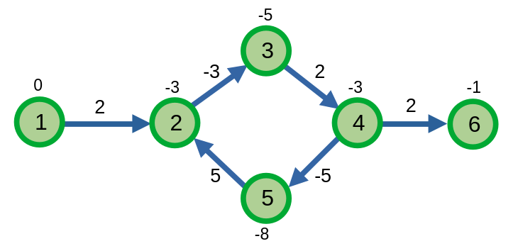
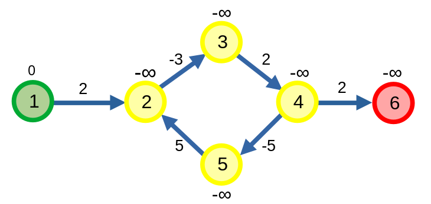

# Thuật toán Bellman-Ford

**Thuật toán Bellman-Ford** là thuật toán tìm đường đi ngắn nhất từ một đỉnh. Thuật toán này thường bị lép vế so với thuật toán Dijkstra khi nó có thể giải được bài toán với độ phức tạp nhỏ hơn - \\(O((|V| + |E|)\log{|V|})\\) - so với \\(O(|V||E|)\\) của Bellman-Ford. 

Tuy nhiên, thuật toán Bellman-Ford có thể giải quyết được trường hợp đồ thị có chu trình âm thay vì rơi vào một vòng lặp vô hạn như Dijkstra.

## Thuật toán

Ban đầu, thuật toán sẽ gán khoảng cách đến đỉnh bắt đầu \\(s\\) là \\(0\\), và \\(\infty\\) cho khoảng cách đến các đỉnh còn lại. 

Ta sẽ duyệt các cạnh của đồ thị và bắt đầu cập nhật khoảng cách của các đỉnh: với mỗi cạnh \\(uv\\) có trọng số \\(w\\) trong đồ thị, ta cập nhật \\(dist_v\\) thành \\(dist_u + w\\) nếu \\(dist_u + w < dist_v\\). 

Ta chỉ cần duyệt các cạnh trong danh sách cạnh nhiều nhất \\(|V| - 1\\) lần để tìm được đường đi ngắn nhất từ đỉnh \\(s\\) đến các đỉnh còn lại. Thứ tự duyệt các cạnh không làm ảnh hưởng đến kết quả cuối cùng.

```C++
vector<tuple<int, int, int>> edges; // Danh sách cạnh
//            u    v    w

void BellmanFord(int s){
	for(int i = 1; i <= n; ++i)	dist[i] = INF;
	dist[s] = 0;
	for (int i = 0, u, v, w; i < n - 1; ++i){
		for (auto &e : edges){
			tie(u, v, w) = e;
			if (dist[u] != INF){
				if(dist[v] > dist[u] + w){
					dist[v] = dist[u] + w;
					p[v] = u;
				}
			}
		}
	}
}
```

Độ phức tạp của thuật toán là \\(O(|V||E|)\\).

Ta có thể tối ưu thuật toán bằng cách kết thúc thuật toán sớm nếu sau khi duyệt các cạnh mà không có đỉnh nào được cập nhật. 

```C++
void BellmanFord(int s){
	for(int i = 1; i <= n; ++i)	dist[i] = INF;
	dist[s] = 0;
	for (int i = 0, u, v, w; i < n - 1; ++i){
		bool upd = 0;
		for (auto &e : edges){
			tie(u, v, w) = e;
			if (dist[u] != INF){
				if(dist[v] > dist[u] + w){
					dist[v] = dist[u] + w;
					p[v] = u;
					upd = 1;
				}
			}
		}
		if(!upd) break;
	}
}
```

## Phát hiện chu trình âm

Ta biết được rằng nếu đồ thị tồn tại chu trình âm, ta có thể "gian lận" bằng cách đi vòng tròn trên chu trình âm ấy để có được đường đi ngắn nhất đến một đỉnh. 

Ta biết rằng thuật toán Bellman-Ford của ta sẽ tìm được đường đi ngắn nhất sau \\(|V| - 1\\) duyệt các cạnh. 

<center>

</center>

Ta nhận xét rằng nếu đồ thị có chu trình âm thì sau khi thực hiện thuật toán Bellman-Ford, khi ta duyệt các cạnh thì ta có thể cập nhật khoảng cách ngắn nhất.

<center>

</center>

Các đỉnh tô màu vàng là các đỉnh nằm trong một chu trình âm. Các đỉnh tô màu đỏ là các đỉnh được cập nhật bằng chu trình âm.

```C++
bool negCycle(){
	BellmanFord(s);
	int u, v, w;
	bool upd = 0;
	for (auto &e : edges){
		tie(u, v, w) = e;
		if(dist[v] > dist[u] + w){
			dist[v] = -INF;
			p[v] = u;
			upd = 1;
		}
	}
	return upd;
}
```

## Tìm con đường ngắn nhất

Quá trình tìm các đỉnh của (một) con đường ngắn nhất đối với thuật toán Bellman-Ford cũng tương tự [Dijkstra](dijkstra.md#tìm-con-đường-ngắn-nhất).

```C++
void printpath(int s, int u){
	if(s != u) printpath(s, p[u]);
	cout << u << ' ';
}
```

### Tìm chu trình âm

Nếu muốn tìm chu trình âm trong đồ thị, ta cần xác định sự tồn tại của một nó. Nếu nó có tồn tại, ta chọn một đỉnh bất kì thuộc chu trình âm và in các đỉnh thuộc chu trình ấy.

Để tìm một đỉnh nằm trong chu trình âm, ta chọn một đỉnh có đường đi ngắn nhất bằng \\(-\infty\\), sau đó ta truy vết ngược lại cho tới khi ta đến được một chu trình. Lí do ta cần phải truy vết ngược lại là với các đỉnh được cập nhật bởi một chu trình âm cũng có đường đi ngắn nhất bằng \\(-\infty\\) giống như đỉnh \\(6\\) ở hình trên.

```C++
void printNegCycle(){
	if(!negCycle()) {
		cout << "-1\n"; // không có chu trình âm
		return;
	}
	int u = 1;
	for(int i = 1; i <= n; ++i){
		if(dist[i] == -INF) u = i;
	}
	for(int i = 1; i <= n; ++i) u = p[u];

	// u giờ đây là một đỉnh nằm trong chu trình âm

	cout << u << ' ';
	printpath(u, p[u]);
	cout << '\n';
}
```

## Thuật toán Bellman–Ford–Moore - Thuật toán SPFA

**Thuật toán Bellman–Ford–Moore**, hay **thuật toán SPFA - Shortest Path Faster Algorithm**, là thuật toán cải tiến từ thuật toán Bellman-Ford.

Một nhận xét từ thuật toán Ballman-Ford để có thuật toán SPFA là nếu giá trị khoảng cách của đỉnh \\(v\\) đã được tìm thấy một trong lần duyệt cạnh thì ta không cần xét các cạnh đi đến \\(v\\) ở các lượt sau. 

Nhận xét này vô cùng quan trọng bởi nếu số lượng các đỉnh tìm được khoảng cách lớn nhất ngày càng tăng thì số lượng cạnh ta cần duyệt sẽ giảm đi, giúp tối ưu thuật toán. 

Ta có cài đặt thuật toán: Tạo một `queue` lưu các đỉnh. Ban đầu `queue` sẽ chứa đỉnh \\(s\\). Sau đó, với mỗi lần lấy và loại bỏ đỉnh \\(u\\) ở đầu `queue`, với mỗi cung \\(uv\\) có trọng số \\(w\\), nếu \\(dist_v\\) có thể được cập nhật thì ta sẽ cập nhật \\(dist_v\\) và thêm đỉnh \\(v\\) vào cuối `queue` nếu \\(v\\) chưa nằm trong `queue`.

```C++
void SPFA(){
	for(int i = 1; i <= n; ++i)	dist[i] = INF;

	queue<int> q;
	bitset<N> inq; // nếu đỉnh u nằm trong queue
	
	dist[s] = 0;
	q.push(s);
	inq[s] = 1;
	
	while(q.size()){
		int u = q.front(); q.pop(); inq[u] = 0;
		int v, w;
		for(auto it : adj[u]){
			tie(v, w) = it;
			if(dist[u] + w < dist[v]){
				p[v] = u;
				dist[v] = dist[u] + w;
				if(!inq[v]){
					inq[v] = 1;
					q.push(v);
				}
			}
		}
	}
}
```

Độ phức tạp thuật toán tương tự với Bellman-Ford \\(O(|V||E|)\\). Tuy nhiên, trên thực tế, thuật toán sẽ chạy nhanh hơn nhiều trong hầu hết các trường hợp. 

Khác với Bellman-ford, thuật toán SPFA không thể xét trường hợp đồ thị có chu trình âm và sẽ rơi vào trường hợp cập nhật khoảng cách vô hạn lần giống [Dijkstra](dijkstra.md#dijkstra-trên-đồ-thị-có-chu-trình-âm).