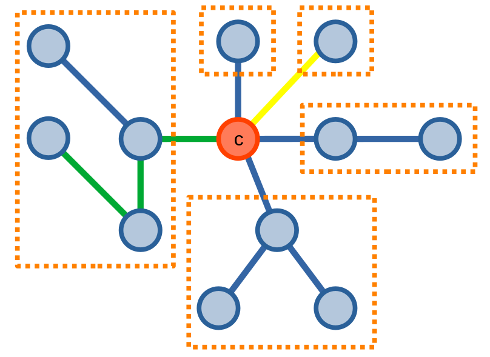
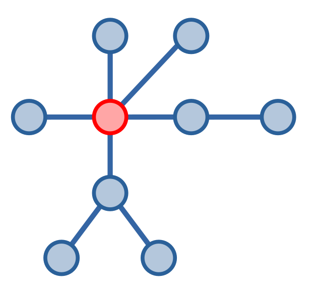
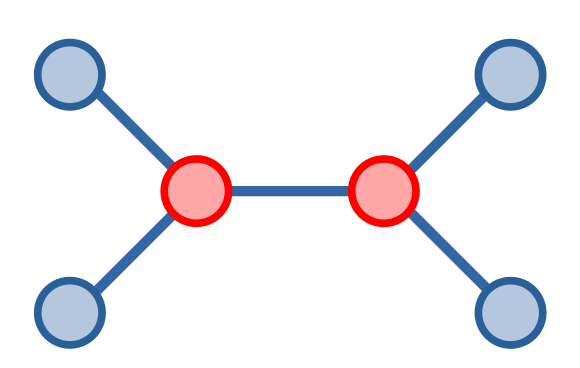
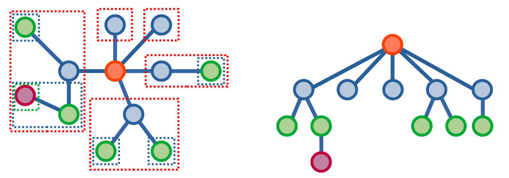

# Kĩ thuật phân tách trọng tâm (centroid decomposition)

Kĩ thuật **phân tách trọng tâm (centroid decomposition)** là kĩ thuật tối ưu xử lí các bài toán trên cây. Đây là một kĩ thuật [chia để trị](../paradigms/dnc.md) khi nó sẽ tách cây thành nhiều cây con và xử lí các cây con một cách đệ quy để giải quyết bài toán.

Ta sẽ xem cách kĩ thuật này hoạt động qua bài toán ví dụ sau: cho một cây có \\(n\\) đỉnh, đếm số lượng đường đi giữa hai đỉnh có khoảng cách bằng \\(k\\).

## Phân tách cây

Ta sẽ giải quyết bài toán trên theo phương pháp [chia để trị](../paradigms/dnc.md).

Giả sử ta chọn một đỉnh \\(c\\) bất kì trên cây, khi này ta đã chia các đường đi giữa các cặp đỉnh \\(u, v\\) thành \\(2\\) trường hợp:
- Trường hợp \\(1\\): các đường đi giữa các cặp đỉnh **_có_** đi qua đỉnh \\(c\\).
- Trường hợp \\(2\\): các đường đi giữa các cặp đỉnh **_không_** đi qua đỉnh \\(c\\).

Ta có thể đếm số lượng các đường đi thuộc trường hợp \\(1\\) thoả mãn yêu cầu bằng cách kết hợp các đường đi từ đỉnh \\(c\\), tức là kết hợp các đường đi của các cặp đỉnh \\(u, c\\) với các đường đi của các cặp đỉnh \\(c, v\\). Một đường đi đơn lẻ từ đỉnh \\(c\\) đến một đỉnh bất kì cũng có thể là một đường đi thoả mãn.

Nếu ta xoá đỉnh \\(c\\), các đường đi thuộc trường hợp \\(2\\) sẽ tập trung lại với nhau để hình thành nên các cây con. Khi này, ta có thể xử lí các cây con này một cách đệ quy theo phương pháp mà ta đã nói ở trên.

Ở hình dưới đây, ta có các đỉnh được nhóm trong ô hình chữ nhật thuộc các cây con có đường đi giữa các cặp đỉnh thuộc trường hợp \\(2\\), còn đường đi kết hợp từ hai đường đi từ \\(c\\) có màu vàng và xanh lục là ví dụ về một đường đi thuộc trường hợp \\(1\\).

<center>

</center>

Độ phức tạp của thuật toán này phụ thuộc vào việc chọn đỉnh \\(c\\). Nếu ta chọn một đỉnh sao cho các cây con có kích thước gần như tương đương nhau thì độ phức tạp có thể nhỏ bằng \\(O(n\log{n})\\), nhưng nếu ta không may chọn đỉnh không phù hợp thì độ phức tạp của thuật toán sẽ rất lớn, có thể lên tới \\(O(n^2)\\).

## Trọng tâm của cây 

Để tìm đỉnh phù hợp để phân tách cây giúp giảm độ phức tạp của kĩ thuật phân tách trọng tâm, ta sẽ chọn **trọng tâm (centroid)** của cây để phân tách.

*Trọng tâm* của cây là đỉnh nằm trên cây mà khi xoá đỉnh này, ta sẽ có một rừng cây với mỗi cây con trong rừng cây có kích thước không quá hơn một nửa kích thước cây ban đầu.

<center>

</center>

Ta thấy đỉnh màu đỏ chính là trọng tâm của cây trên.

Một cây có thể có nhiều trọng tâm, như cây dưới đây có hai đỉnh màu đỏ là hai đỉnh trọng tâm.

<center>

</center>

Ta có thể dễ dàng tìm được trọng tâm của cây chỉ với một lần duyệt cây. Xuất phát từ một đỉnh bất kì, ta sẽ kiểm tra kích thước của từng cây con có gốc là đỉnh con của đỉnh ấy: 
- Nếu không tồn tại cây con nào có kích thước lớn hơn một nửa kích thước cây, thì trọng tâm của cây chính là đỉnh ta đang xét, và ta kết thúc duyệt cây.
- Nếu tồn tại cây con có kích thước bằng quá nửa kích thước cây, ta có thể khẳng định rằng trọng tâm của cây nằm trong cây con đó, và ta sẽ thực hiện duyệt trên cây con này. Có thể dễ dàng thấy rằng chỉ có nhiều nhất một cây con có kích thước lớn hơn một nửa kích thước cây.

Độ phức tạp của việc tìm trọng tâm của cây sẽ bằng \\(O(n)\\).

```C++
// tìm kích thước các cây con 
int dfs_sz(int u, int p){
	sz[u] = 1;
	for(int v : adj[u]){
		if(v == p) continue;
		sz[u] += dfs_sz(v, u);
	}
	return sz[v];
}

int centroid(int u, int p, int st) { // st là kích thước cây
	for(auto v : adj[u]){
		if(v == p) continue;
		if(sz[v] > (st >> 1)) return centroid(v, u, st);
	}
	return u;
}
```

Để tìm trọng tâm, ta gọi hàm `centroid` như sau: `centroid(1, 1, dfs_sz(1, 1))`. 

## Phân tách trọng tâm

Sử dụng định nghĩa về trọng tâm của cây, ta sẽ viết lại thuật toán phân tách cây. Với đỉnh \\(c\\) được chọn là trọng tâm \\(u\\), các cây con của cây sẽ có kích thước không quá một nửa kích thước của cây. Khi này, thuật toán của ta sẽ có độ phức tạp là \\(O(n\log{n})\\).

```C++
bool vst[N]; // đỉnh u đã được chọn/xoá hay chưa
int d[N]; // số lượng đường đi từ c có khoảng cách bằng x
ll ans = 0; // số lượng đường đi thoả mãn

int dfs_sz(int u, int p){
	sz[u] = 1;
	for(int v : adj[u]){
		if(v == p || vst[v]) continue;
		sz[u] += dfs_sz(v, u);
	}
	return sz[v];
}

int centroid(int u, int p, int st) {
	for(auto v : adj[u]){
		if(v == p || vst[v]) continue;
		if(sz[v] > (st >> 1)) return centroid(v, u, st);
	}
	return u;
}

void calc(int u, int p, int dist){
	if(dist > k) return;
	ans += d[k - dist];
	for(int v : adj[u]){
		if(v == p || vst[v]) continue;
		calc(v, u, dist + 1);
	}
}

void upd(int u, int p, int dist){
	if(dist > k) return;
	++d[dist];
	for(int v : adj[u]){
		if(v == p || vst[v]) continue;
		upd(v, u, dist + 1);
	}
}

void cd(int u, int p){
	u = centroid(u, u, dfs_sz(u, u));
	vst[u] = 1;

	d[0] = 1;

	for(int v : adj[u]){
		calc(v, u, 1);
		upd(v, u, 1);
	}

	for(int i = 0; d[i]; ++i) d[i] = 0;

	for(int v : adj[u]){
		if(v == p || vst[v]) continue;
		cd(v, u);
	}
}
```

Để giải bài toán, ta chỉ cần gọi hàm `cd` như sau: `cd(1, 0)`.

## Cây trọng tâm

Một định nghĩa hữu ích cho kĩ thuật phân tách trọng tâm chính là **cây trọng tâm (centroid tree)**. Một cây trọng tâm được hình thành khi ta lần lượt xoá trọng tâm của cây và thêm vào một cây trọng tâm, đồng thời thêm cạnh nối trọng tâm này với trọng tâm của các cây con được hình thành. Các cây con cũng thực hiện quá trình tương tự và cây trọng tâm sẽ được hình thành sau khi ta xoá hết các đỉnh từ cây gốc.

<center>

</center>

Cây trọng tâm sẽ có \\(3\\) tính chất chính:

1. Cây bao gồm tất cả các đỉnh từ cây gốc.
1. Chiều cao của cây sẽ không quá \\(\log{n}\\).
1. LCA của hai đỉnh \\(u, v\\) bất kì trên cây sẽ thuộc đường đi giữa hai đỉnh trên cây gốc.

LCA của hai đỉnh bất kì trên cây trọng tâm có thể dễ dàng được tìm bằng [phương pháp 1](lca.md#phương-pháp-1) trong \\(O(\log{n})\\) mà không cần đến [nâng nhị phân](lca.md#nâng-nhị-phân) nhờ vào tính chất \\(2\\) của cây.

Dựa vào tính chất \\(2\\) và \\(3\\), ta có thể lưu thông tin của \\(O(n\log{n})\\) đường đi từ một đỉnh tới các đỉnh hậu duệ. Sử dụng thông tin này, ta có thể tính giá trị của đường đi giữa hai đỉnh \\(u, v\\) bất kì trên cây gốc bằng cách tìm LCA của \\(u, v\\) trên cây trọng tâm và kết hợp thông tin về hai đường đi \\((u, LCA)\\) và \\((v, LCA)\\) để tìm giá trị của đường đi gốc.