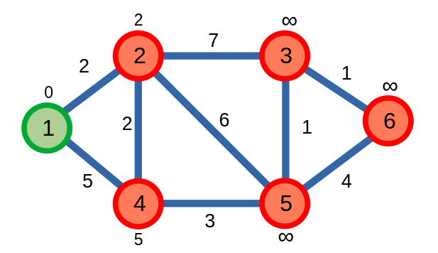

# Thuật toán Dijkstra

*"What is the shortest way to travel from Rotterdam to Groningen. It is the algorithm for the shortest path, which I designed in about 20 minutes. One morning I was shopping in Amsterdam with my young fiancée, and tired, we sat down on the café terrace to drink a cup of coffee and I was just thinking about whether I could do this, and I then designed the algorithm for the shortest path. As I said, it was a 20-minute invention. In fact, it was published in 1959, three years later. The publication is still quite nice. One of the reasons that it is so nice was that I designed it without pencil and paper. (...). Eventually, that algorithm became to my great amazement, one of the cornerstones of my fame."*

*- Thomas J. Misa, [An interview with Edsger W. Dijkstra](https://dl.acm.org/doi/pdf/10.1145/1787234.1787249)*

<sup> Comment: Mê cái cách ông ấy nhấn mạnh việc thiết kế một thuật toán chỉ trong vòng \\(20\\) phút. **Tận 2 LẦN!!!** <sup>

**Thuật toán Dijkstra** là thuật toán [*tham lam*](../algo-paradigms/greedy.md) tìm đường đi ngắn nhất từ một đỉnh trên đồ thị.

## Thuật toán

Ban đầu, thuật toán sẽ gán khoảng cách đến đỉnh bắt đầu \\(s\\) là \\(0\\), và \\(\infty\\) cho khoảng cách đến các đỉnh còn lại. Ở mỗi bước, thuật toán sẽ tìm đỉnh có khoảng cách ngắn nhất chưa được xét đến trên đồ thị, và cập nhật khoảng cách của các đỉnh kề cạnh với nó.

Ta sẽ chạy thuật toán Dijkstra trên đồ thị, với đỉnh bắt đầu \\(s = 1\\):

<center>

</center>

Ta thấy, đỉnh \\(1\\) là đỉnh chưa được xét đến có khoảng cách nhỏ nhất là \\(0\\). Từ đỉnh \\(1\\), ta sẽ cập nhật khoảng cách của các đỉnh \\(2\\), \\(4\\) kề với nó.

<center>

</center>

Tiếp theo, đỉnh \\(2\\) là đỉnh chưa được xét đến có khoảng cách nhỏ nhất là \\(2\\). Từ đỉnh \\(2\\), ta sẽ cập nhật khoảng cách của các đỉnh \\(3\\), \\(4\\) kề với nó.

<center>

</center>

Ta tiếp tục cho tới khi tất cả các đỉnh đã được xét.

<center>

</center>

Kết thúc thuật toán, ta tính được khoảng cách ngắn nhất từ đỉnh \\(1\\) đến các đỉnh còn lại.

|Đỉnh|\\(1\\)|\\(2\\)|\\(3\\)|\\(4\\)|\\(5\\)|\\(6\\)|
|---|---|---|---|---|---|---|
|Khoảng cách|\\(0\\)|\\(2\\)|\\(8\\)|\\(4\\)|\\(7\\)|\\(9\\)|

Để cài đặt thuật toán, ta sử dụng `set` trong việc tìm đỉnh chưa xét có khoảng cách ngắn nhất.

```C++
const int INF = 1e9; // vô cực
vector<pair<int, int>> adj[N]; // danh sách cạnh lưu đồ thị có trọng số 
int dist[N], p[N];
bitset<N> vst;
int n; 

void dijkstra(int s){
	for(int i = 1; i <= n; ++i)	dist[i] = INF;
	dist[s] = 0;
	set<pair<int, int>> pq;
	for(int i = 1; i <= n; ++i){
		pq.insert({dist[i], i});
	}
	int v, w;

	while(pq.size()){
		int u = (*pq.begin()).second;
		pq.erase(pq.begin());
		vst[u] = 1;

		for(auto it : adj[u]){
			tie(v, w) = it;
			if(vst[v]) continue;

			if(dist[u] + w < dist[v]){			
				pq.erase({dist[v], v});
				dist[v] = dist[u] + w;
				pq.insert({dist[v], v});
				p[v] = u;
			}
		}
	}
}
```

Độ phức tạp thuật toán: \\(O((|E| + |V|) \log {|V|})\\).

## Dijkstra + `priority_queue`

Một cách cài đặt phổ biến khác có sử dụng `priority_queue` để tìm đỉnh chưa xét có khoảng cách ngắn nhất.

Không giống `set`, ta không thể xóa một phần tử bất kì trong `priority_queue`. Vì thế, ta sẽ áp dụng phương pháp "xóa lười". Giả sử ta thành công cập nhật \\(v_{dist}\\), ta sẽ thêm vào `pq` một cặp \\(\\{v_{dist}, v\\}\\) mới, có \\(v_{dist}\\) nhỏ hơn so với cặp \\(\\{v_{dist}, v\\}\\) cũ ở trong `pq`. Giả sử khi ta xét đến cặp \\(\\{v_{dist}, v\\}\\) cũ trong `pq`, ta có thể bỏ qua cặp giá trị này. 

```C++
void dijkstra(int s){
	for(int i = 1; i <= n; ++i)	dist[i] = INF;
	dist[s] = 0;
	priority_queue<pair<int, int>, 
				   vector<pair<int, int>>, 
				   greater<pair<int, int>>> pq;

	// Ta có thể viết: priority_queue<pair<int, int>> pq 
	// và lưu theo dạng: {-dist[u], u}

	pq.push({0, s});
	int u, d;
	int v, w;
	while(pq.size()){
		tie(d, u) = pq.top(); pq.pop();
		if(d > dist[u]) continue; // xóa lười
		if(vst[u]) continue;

		for(auto it : adj[u]){
			tie(v, w) = it;
			if(vst[v]) continue;
			if(dist[u] + w < dist[v]){
				dist[v] = dist[u] + w;
				pq.push({dist[v], v});
				p[v] = u;
			}
		}
	}
}
```

Độ phức tạp thuật toán tương tư cách cài đặt sử dụng `set`: \\(O((|E| + |V|) \log {|E|})\\).

## Dijkstra trên đồ thị có trọng số âm

Thuật toán Dijkstra không thể thực hiện việc tìm kiếm đường đi ngắn nhất trên đồ thị có trọng số âm.

Ta ví dụ với đồ thị sau:

<center>

</center>

Dijkstra sẽ tính sai giá trị đường đi ngắn nhất từ đỉnh \\(1\\) đến hai đỉnh \\(4\\) và \\(5\\). 

Ta có thể khắc phục vấn đề này bằng cách vẫn cho phép các đỉnh được ghé thăm cập nhật khoảng cách ngắn nhất của nó, kể cả khi đỉnh đã được xét. Nếu một đỉnh được xét được cập nhật đường đi ngắn nhất, ta sẽ xem nó như là một đỉnh chưa xét. Điều này sẽ giúp thuật toán của ta chạy được với cả các đồ thị có trọng số âm.

<center>

</center>

```C++
// vst đã được loại bỏ
// 
// Có thể làm điều tương tự với đoạn code sử dụng set

void dijkstra(int s){
	for(int i = 1; i <= n; ++i)	dist[i] = INF;
	dist[s] = 0;
	priority_queue<pair<int, int>, 
				   vector<pair<int, int>>, 
				   greater<pair<int, int>>> pq;

	pq.push({0, s});
	int u, d;
	int v, w;
	while(pq.size()){
		tie(d, u) = pq.top(); pq.pop();
		if(d > dist[u]) continue; 

		for(auto it : adj[u]){
			tie(v, w) = it;
			if(dist[u] + w < dist[v]){
				dist[v] = dist[u] + w;
				pq.push({dist[v], v});
				p[v] = u;
			}
		}
	}
}
```

Độ phức tạp thuật toán của ta sẽ giữ nguyên bằng \\(O((|E| + |V|) \log {|E|})\\) nếu đồ thị không có trọng số âm.

Độ phức tạp thuật toán của ta sẽ lớn hơn \\(O((|E| + |V|) \log {|E|})\\) nếu đồ thị có trọng số âm do sẽ có nhiều đỉnh phải cập nhật lại giá trị.

## Dijkstra trên đồ thị có chu trình âm

Nếu đồ thị có chu trình âm, tức là có một chu trình với khoảng cách âm, thì thuật toán Dijkstra được sửa đổi để có thể chạy trên đồ thị trọng số âm sẽ chạy trong một vòng lặp vô hạn khi thuật toán cố gắng xây dựng đường đi ngắn nhất bằng cách đi trên chu trình âm ấy vô hạn lần để cho ra kết quả nhỏ nhất.

<center>

</center>

Ở ví dụ trên, thuật toán vẫn chưa xét đỉnh \\(5\\) vì nó vẫn mải mê cập nhật đường đi ngắn nhất của các đỉnh còn lại.

## Tìm con đường ngắn nhất

Nếu ta để ý thì sẽ thấy một mảng `p` bí ẩn ở trong các đoạn code. Mảng `p` này mang ý nghĩa: Để tìm được đường đi ngắn nhất từ \\(s\\) đến \\(u\\), ta cần tìm đường đi ngắn nhất từ \\(s\\) đến \\(p[u]\\), cộng thêm trọng số của cạnh \\({u, p[u]}\\).

Sử dụng thông tin này ta có thể tìm được các đỉnh của (một) đường đi ngắn nhất từ đỉnh \\(s\\) đên một đỉnh bất kì.

Hàm `printpath` dưới đây sẽ tìm một con đường ngắn nhất từ đỉnh \\(s\\) đến đỉnh \\(u\\) bằng cách gọi `printpath(s, u)`.

```C++
void printpath(int s, int u){
	if(s != u) printpath(s, p[u]);
	cout << u << ' ';
}
```

## BFS \\(0/1\\)

Ta biết được rằng BFS có thể giải được đường đi ngắn nhất trên đồ thị không trọng số. Nếu đồ thị có trọng số, ta cần phải sử dụng các thuật toán khác như Dijkstra. Thế nhưng nếu giá trị của các trọng số chỉ là \\(0\\) hoặc \\(1\\), thì đấy sẽ là một câu chuyện khác.

Giả sử ta chạy thuật toán Dijkstra trên một đồ thị có trọng số \\(0/1\\).

<center>

</center>

Thuật toán của ta sẽ có độ phức tạp thuật toán bằng \\(O((|E| + |V|) \log {|V|})\\). 

Hãy nhìn vào các đỉnh trong `pq` trong quá trình chạy thuật toán:

\\[pq = \underbrace{u, \dots, u}\_{u_{dist}}, \underbrace{v, \dots, v}\_{u_{dist} + 1}\\]

Từ đây, ta có thể rút gọn việc thêm các cặp giá trị \\(\\{v_{dist}, v\\}\\) vào `pq` sau mỗi lần cập nhật như sau:
- Nếu \\(v_{dist} = u_{dist} + 1\\), hay cạnh \\(uv\\) có trọng số là \\(1\\), thêm đỉnh \\(v\\) vào cuối `pq`.
- Nếu \\(v_{dist} = u_{dist} + 0\\), hay cạnh \\(uv\\) có trọng số là \\(0\\), thêm đỉnh \\(v\\) vào đầu `pq`.

Ta có thể bỏ giá trị \\(dist\\) và chỉ lưu các đỉnh vào trong `pq`. 

Vì cách thêm các đỉnh được thực hiện một cách đơn giản nên ta không cần một `priority_queue` hay `set` để lưu các đỉnh mà chỉ cần một CTDL đơn giản như [deque](../data-structures/deque.md).

Ta gọi thuật toán này là BFS \\(0/1\\).

```C++
void bfs01(int s){
	for(int i = 1; i <= n; ++i)	dist[i] = INF;
	dist[s] = 0;
	deque<int> dq;
	dq.push_back(s);

	int v, w;

	while(pq.size()){
		int u = dq.front(); dq.pop_front();
		for(auto it : adj[u]){
			tie(v, w) = it;
			if(dist[u] + w < dist[v]){
				dist[v] = dist[u] + 1;
				p[v] = u;
				if(w == 0) dq.push_front(v);
				else dq.push_back(v); 
			}
		}
	}
}
```

Độ phức tạp thuật toán của BFS \\(0/1\\) bằng với BFS thông thường: \\(O(|V| + |E|)\\) - loại bỏ được \\(\log{|V|}\\) so với Dijkstra.