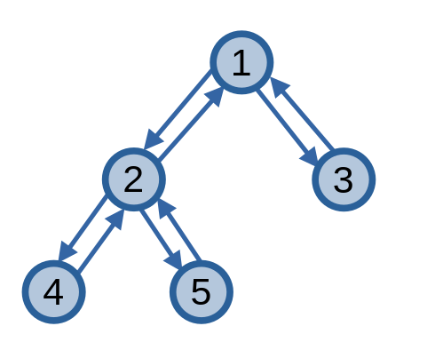
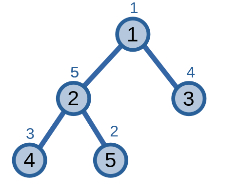

# Kĩ thuật chu trình Euler

**Kĩ thuật chu trình Euler (Euler tour technique - ETT)** là kĩ thuật biểu diễn một [cây](tree.md) dưới dạng [chu trình Euler](eulerian-trail.md).

## Tìm chu trình Euler trên cây

Cây không có chu trình Euler, nếu may mắn thì ta có thể tìm được một đường đi Euler trên [cây tre](tree.md#cây-suy-biến), nhưng nhìn chung thì điều đấy là không thể. Để cây của ta xuất hiện chu trình Euler, ta sẽ biến đổi các cạnh vô hướng \\(uv\\) trong cây thành hai cạnh có hướng \\(uv\\) và \\(vu\\). Khi này, cây sẽ xuất hiện chu trình Euler.

Bắt đầu từ đỉnh gốc, ta xây dựng chu trình Euler trên cây bằng cách duyệt DFS trên cây và ghi lại các đỉnh khi duyệt DFS. Sẽ có tổng cộng \\(2n - 1\\) lần ghi đỉnh khi duyệt DFS, với \\(n\\) là số đỉnh của cây.

<center>

</center>

Từ cây trên, ta có chu trình Euler sau: \\((1, 2, 4, 2, 5, 2, 1, 3, 1)\\).

Ngoài ra, ta cũng sẽ lưu trữ thêm một số thông tin khác trên chu trình Euler này. 

Ta có \\(v_{st}\\) và \\(v_{en}\\) lần lượt là vị trí đầu tiên và cuối cùng của đỉnh \\(v\\) trên chu trình Euler. Ví dụ: với đỉnh \\(2\\), ta có \\(2_{st} = 2\\) và \\(2_{en} = 6\\). 

Ta cũng lưu \\(euler_i\\) đỉnh ở vị trí thứ \\(i\\) trong chu trình Euler của ta. Ví dụ: \\(euler_6 = 2\\).

```C++
int st[N << 1 | 1], en[N << 1 | 1], euler[N << 1 | 1];
int tdfs = 0;

void dfs(int u, int p){
	st[u] = ++tdfs;
	euler[tdfs] = u;
	for(int v : adj[u]){
		if(v == p) continue;
		dfs(v, u);
		en[u] = ++tdfs;
		euler[tdfs] = u;
	}
}
```

## Ứng dụng

Việc lưu trứ một cây thành một mảng bằng kĩ thuật chu trình Euler giúp ta giải quyết hiệu quả một số dạng bài toán.

### Truy vấn các cây con

Giả sử ta được cho một cây, với mỗi đỉnh được gán với một giá trị. Các truy vấn sẽ là một trong hai dạng:
- Cập nhật giá trị trên đỉnh.
- Tính tổng giá trị của một cây con.

<center>

</center>

Ta có giải quyết bài toán này bằng kĩ thuật chu trình Euler.

Ta sẽ chỉ lưu lần *đầu tiên* của các đỉnh khi tìm chu trình Euler. 

|Chỉ số|\\(1\\)|\\(2\\)|\\(3\\)|\\(4\\)|\\(5\\)|
|---|---|---|---|---|---|
|Đỉnh|\\(1\\)|\\(2\\)|\\(4\\)|\\(5\\)|\\(3\\)|
|Giá trị|\\(1\\)|\\(5\\)|\\(3\\)|\\(2\\)|\\(4\\)|

Khi này, với \\(u_i\\) và \\(u_{sz}\\) lần lượt là chỉ số của đỉnh \\(u\\) trong chu trình và kích thước của cây con gốc \\(u\\), ta có thể xác đỉnh cây con của đỉnh \\(u\\) có các đỉnh có chỉ số trong khoảng \\([u_i, u_i + u_{sz})\\).

Như ví dụ ở trên, với đỉnh \\(2\\) có chỉ số \\(2\\) và kích thước của cây con gốc \\(2\\) là \\(3\\), ta xác đỉnh các đỉnh thuộc cây con gốc \\(2\\) là các đỉnh \\(2, 4, 5\\) với các chỉ số lần lượt là \\(2, 3, 4\\). Tổng giá trị của cây con gốc \\(2\\) sẽ có thể tính được bằng cách tính tổng giá trị của các phần tử liên tiếp nhau này.

Ta có thể sử dụng [segment tree](../data-structures/segment-tree.md) hoặc [cây Fenwick](../data-structures/fenwick.md) để giải quyết bài toán trên, với ý tưởng mà ta đã nêu.

### Truy vấn các đường đi

Đối với truy vấn các đường đi, ta cũng được cho một cây, và ta sẽ xử lí các truy vấn:
- Cập nhật giá trị trên đỉnh.
- Tính giá trị đường đi từ đỉnh đến gốc.
 
Để giải quyết bài toán này, ta cũng áp dụng tương tự như truy vấn các cây con.

|Chỉ số|\\(1\\)|\\(2\\)|\\(3\\)|\\(4\\)|\\(5\\)|
|---|---|---|---|---|---|
|Đỉnh|\\(1\\)|\\(2\\)|\\(4\\)|\\(5\\)|\\(3\\)|
|Giá trị đường đi|\\(1\\)|\\(6\\)|\\(9\\)|\\(8\\)|\\(5\\)|

Ta cần đặt câu hỏi: chuyện gì sẽ xảy ra khi ta cập nhật của một đỉnh? Đáp án là các đỉnh của cây con sẽ được cập nhật giá trị đường đi một cách tương ứng. Giả sử ta tăng giá trị của đỉnh \\(2\\) lên \\(2\\), thì giá trị đường đi đến đỉnh \\(2, 4, 5\\) cũng tăng lên \\(2\\).

Từ đây, ta có thể sử dụng [segment tree](../data-structures/segment-tree.md) hoặc [cây Fenwick](../data-structures/fenwick.md) để giải quyết bài toán.

### Tổ tiên chung gần nhất

Kĩ thuật chu trình Euler còn được sử dụng để tìm [tổ tiên chung gần nhất](lca.md#phương-pháp-2) của đỉnh đỉnh \\(u\\) và \\(v\\) trên cây.