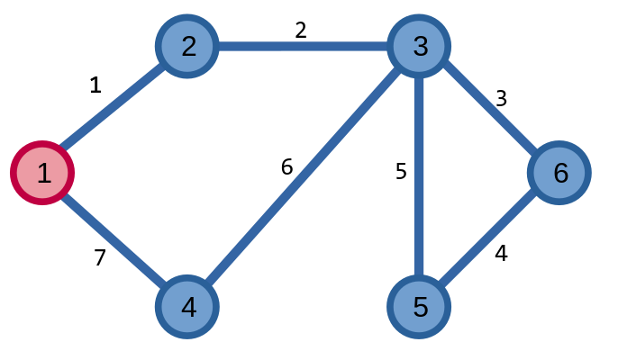

# Đường đi Euler

Cho một đồ thị \\(G = (V, E)\\), **đường đi Euler (Eulerian trail)** của đồ thị là một đường đi đi qua tất cả các cạnh đúng một lần. Tương tự, **chu trình Euler (Eulerian circuit/tour)** của một đồ thị là một đường đi đi qua tất cả các cạnh, và đỉnh bắt đầu và kết thúc của đường đi là cùng một đỉnh.

Dưới đây là ví dụ của một đường đi Euler trên đồ thị, với các số trên mỗi cạnh là thứ tự của các cạnh trên đường đi, đỉnh màu đỏ là đỉnh bắt đầu, đỉnh màu xanh là đỉnh kết thúc của đường đi:

<center>

</center>

Còn đây là ví dụ của một chu trình Euler:

<center>

</center>

<br>

Ta gọi một đồ thị có chu trình Euler là **đồ thị Euler (Eulerian graph)**, đồ thị có đường đi Euler thì được gọi là **đồ thị nửa Euler (semi-eulerian graph)**.

## Xác định đường đi Euler

Để xác định đường đi Euler và chu trình Euler của một đồ thị liên thông, ta dựa vào [bậc](overview.md#Đỉnh-kề-cạnh-liền-thuộc-đỉnh) của các đỉnh trong đồ thị: 
- Nếu đồ thị có các đỉnh có bậc chẵn thì đồ thị tồn tại chu trình Euler. 
- Nếu đồ thị có hai đỉnh có bậc lẻ, các đỉnh còn lại có bậc chẵn thì đồ thị tồn tại đường đi Euler. 

Đối với đồ thị có hướng, ta xác định đường đi và chu trình Euler trong đồ thị như sau:
- Nếu đồ thị có bán bậc vào bằng bán bậc ra thì đồ thị tồn tại chu trình Euler. 
- Nếu đồ thị có một đỉnh có bán bậc vào lớn hơn bán bậc ra một đơn vị, một đỉnh có bán bậc ra lớn hơn bán bậc vào một đơn vị, các đỉnh còn lại có bán bậc vào bằng bán bậc ra thì tồn tại đường đi Euler. Đỉnh có bán bậc ra nhiều hơn là đỉnh đầu của đường đi Euler, còn đỉnh có bán bậc vào nhiều hơn là đỉnh cuối của đường đi.

### Bài toán \\(7\\) cây cầu

Sử dụng thông tin trên, ta có thể giải được **bài toán \\(7\\) cầu ở Königsberg** ở [đầu chương](.).

Ta hình dung thành phố Königsberg như một đồ thị, với hai bên bờ sông và hai hòn đảo là các đỉnh \\(A, C\\) và \\(B, D\\), những cây cầu là các cạnh. 

<center>

</center>

Ta thấy, các đỉnh \\(A, B, C, D\\) có bậc lần lượt là \\(3, 5, 3, 3\\) - không đỉnh nào có bậc chẵn.

Từ đây, ta kết luận rằng không tồn tại con đường đi qua tất cả các cây cầu chỉ một lần duy nhất. 

### Bài toán vẽ

Áp dụng những hiểu biết về đường đi/chu trình Euler, ta có thể giải quyết bài toán vẽ hình với một nét liền.

<center>


<sup>Một số lời giải cho các hình vẽ - [Cmglee](https://commons.wikimedia.org/wiki/File:Eulerian_path_puzzles.svg) - [CC BY-SA 4.0](https://creativecommons.org/licenses/by-sa/4.0/deed.en)</sup>
</center>

## Tìm đường đi Euler

Ta có thể sử dụng hai thuật toán Fleury và Hierholzer để tìm đường đi/chu trình Euler của đồ thị Euler/nửa Euler. Ta sẽ tập trung vào thuật toán Hierholzer.

### Thuật toán Hierholzer

Thuật toán Hierholzer là thuật toán tìm đường đi/chu trình Euler của đồ thị Euler/nửa Euler.

Giả sử đồ thị là đồ thị Euler, thuật toán Hierholzer sẽ tìm chu trình Euler như sau:
- Chọn một đỉnh bắt đầu \\(u\\) bất kì, ta tìm một chu trình bất kì bắt đầu từ đỉnh \\(u\\).
- Với mỗi đỉnh \\(v\\) trong chu trình \\(u\\), nếu từ đỉnh \\(v\\) có thể xây dựng một chu trình khác bằng các cạnh còn lại, ta mở rộng chu trình \\(u\\) bằng chu trình \\(v\\) ấy.
- Lặp lại bước trên đến khi không còn có thể thực hiện được nữa, thành công tìm một chu trình Euler của đồ thị.

Nếu đồ thị là nửa Euler, ta chọn đỉnh xuất phát là một trong hai đỉnh có bậc lẻ, hoặc nếu là đồ thị có hướng thì chọn đỉnh có bán bậc ra nhiều hơn. 

Ta có đồ thị ví dụ:

<center>

</center>

Vì tất cả các đỉnh có bậc chẵn nên đồ thị tồn tại chu trình Euler. Ta chọn đỉnh \\(1\\) làm đỉnh xuất phát.

Từ đỉnh \\(1\\), ta có thể đi trên chu trình \\((1, 2, 3, 1)\\).

<center>

</center>

Ở chu trình ban đầu, ta thấy đỉnh \\(2\\) có thể hình thành chu trình \\((2, 4, 5, 2)\\). Ta mở rộng chu trình của ta được mở rộng lên thành \\((1, 2, 4, 5, 2, 3, 1)\\).

<center>

</center>

Ta thấy, từ đỉnh \\(2\\), có thể hình thành chu trình \\((4, 1, 5, 3, 4)\\). Chu trình giờ đây mở rộng lên thành \\((1, 2, 4, 1, 5, 3, 4, 5, 2, 3, 1)\\). Chu trình này chính là chu trình Euler của đồ thị.

<center>

</center>

```C++
// đồ thị Euler
// cạnh thứ x trong đồ thị: (u, v)
//          v/u   x       u/v
vector<pair<int, int>> adj[N];
int idx[N]; // cạnh thứ idx[i] trong danh sách adj[i]
bitset<M> vst; // cạnh thứ x đã được đi qua chưa

void hierholzer(){
	int s = 1; // đỉnh xuất phát
	stack<int> st;
	st.push(s);
	while(st.size()){
		int u = st.top();
		// circuit = 1 nếu từ đỉnh u có thể đi đến 
		// một đỉnh v bất kì bằng các cạnh còn lại

		bool circuit = 0;
		for(int &i = idx[u]; i < (int)adj[u].size(); ++i){
			if(!vst[adj[u][i].second]) {
				vst[adj[u][i].second] = 1; // đánh dấu cạnh x
				st.push(adj[u][i].first);
				circuit = 1;
				break;
			}
		}

		// không thể đi đến đỉnh v
		if(!circuit){
			st.pop();
			cout << u << ' ';
		}
	}
}
```

Độ phức tạp của thuật toán là \\(O(|V| + |E|)\\).