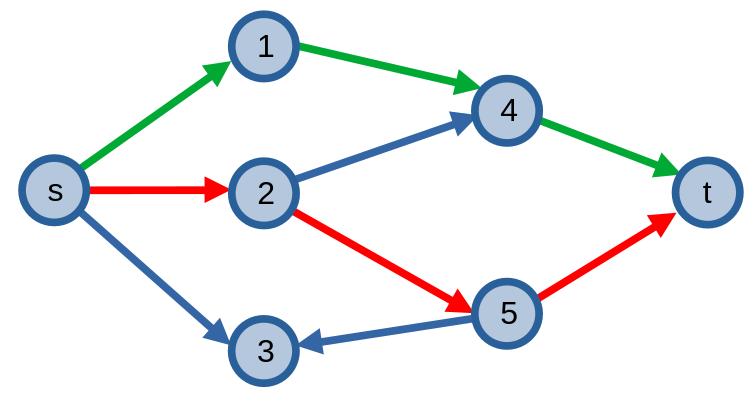
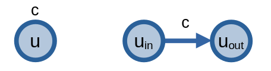
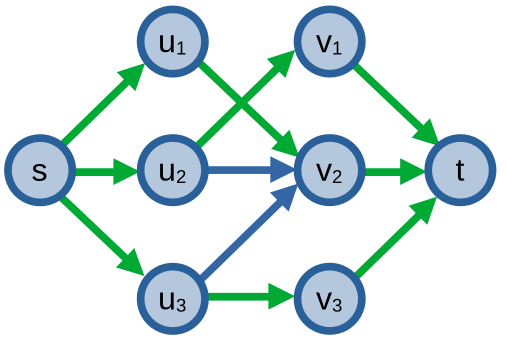
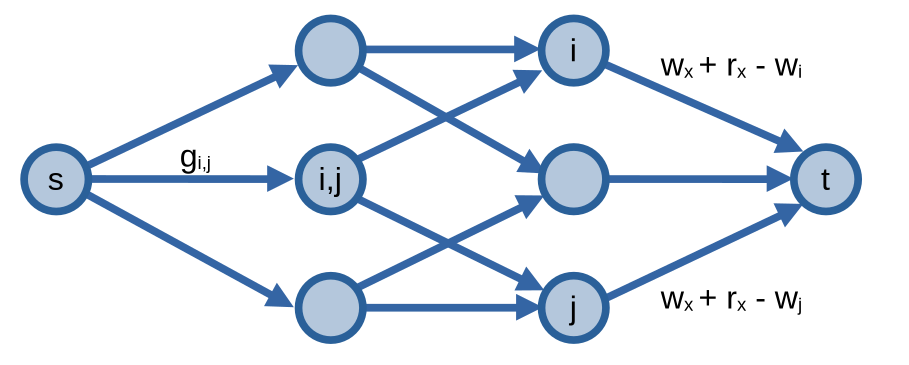
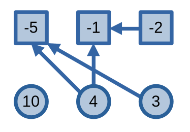
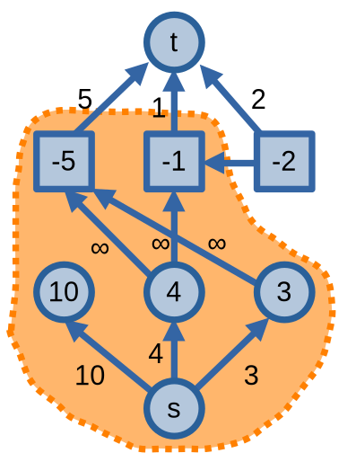

# Ứng dụng của luồng trên mạng

Ta cùng điểm qua một số ứng dụng và mở rộng của bài toán luồng trên mạng. 

## Nhiều đỉnh nguồn, đỉnh thu

Giả sử ta được cho một mạng \\(G = (V, E)\\) với vô số đỉnh nguồn (\\(s_1, s_2, \dots, s_n\\)) và đỉnh nguồn (\\(t_1, t_2, \dots, t_m\\)) và ta được yêu cầu phải tìm luồng cực đại trên mạng này. Ta có thể thay đổi bài toán trên thành bài toán tìm luồng cực đại trên mạng bình thường bằng cách thêm hai đinh có tên gọi là đỉnh **siêu nguồn (supersource)** \\(S\\) và đỉnh **siêu thu (supersink)** \\(T\\). Sau đó, ta thêm các cung nối \\(S\\) với \\(s_1, s_2, \dots, s_n\\) và \\(t_1, t_2, \dots, t_m\\) với \\(T\\) với sức chứa \\(\infty\\) và thực hiện tìm luồng cực đại trên mạng mới này.

## Tìm các đường đi phân biệt cạnh

Ta có một đồ thị có hướng, và nhiệm vụ của ta là tìm \\(k\\) đường đi từ đỉnh \\(s\\) đến đỉnh \\(t\\) sao cho các đường đi phân biệt cạnh (các cung trên đồ thị xuất hiện nhiều nhất một lần trong tất cả các đường đi). Ở ví dụ dưới đây, ta có thể có hai đường đi phân biệt cạnh được tô hai màu lục và đỏ trên đồ thị sau:

Để giải quyết bài toán, ta xây dựng *mạng đơn vị* từ đồ thị có hướng trên (mạng đơn vị là mạng với các cạnh có sức chứa \\(1\\)). Nếu ta có thể cho \\(k\\) luồng đi qua mạng này thì tức là ta đã tìm được \\(k\\) đường đi phần biệt cạnh. 

Nếu ta được yêu cầu in ra các đường đi thì sau khi cho \\(k\\) luồng \\(0 - 1\\) (mỗi cạnh hoặc là không có luồng đi qua, hoặc là có đúng \\(1\\) đơn vị luồng) đi qua mạng, ta có thể sử dụng các cạnh \\(e\\) có \\(f(e) = 1\\) để tìm các đường đi phân biệt cạnh:
- Bắt đầu từ đỉnh nguồn, chọn cạnh \\(uv\\) có \\(f(uv) = 1\\) và di chuyển đến \\(v\\).
- Nếu đỉnh hiện tại không phải đỉnh thu, lặp lại bước trên.

Từ giá trị luồng cực đại của mạng đơn vị được xây dựng từ đồ thị gốc, ta có thể biết được số lượng tối đa đường đi phân biệt cạnh trên đồ thị sẽ bằng bao nhiêu. Ta có định lí sau: *Tồn tại \\(k\\) đường đi phân biệt cạnh khi và chỉ khi giá trị luồng cực đại bằng \\(k\\)*.

Giả sử ta có luồng \\(0 - 1\\) \\(f\\). Vì luồng cực đại của \\(f = k\\) nên ta sẽ có một danh sách các cạnh \\(uv\\) với \\(f(uv) = 1\\). Từ danh sách cạnh này, ta có thể tìm được \\(k\\) đường đi phân biệt luồng với phương pháp tìm các đường đi phần biệt luồng đã được nói ở trên.

## Sức chứa đỉnh

Một số mạng không những có sức chứa cạnh mà nó còn có cả sức chứa đỉnh. Khi này, với mỗi đỉnh \\(u\\) trong mạng, ta tạo hai đỉnh mới \\(u_{in}\\), \\(u_{out}\\), sau đó nối hai đỉnh này bằng một cung có sức chứa bằng với sức chứa đỉnh.

Các cạnh \\(uv\\) trong mạng từ đây cũng được nối lại thành các cạnh \\(u_{out}v_{in}\\).

### Tìm các đường đi phân biệt đỉnh

Để tìm các đường đi từ đỉnh \\(s\\) đến đỉnh \\(t\\) trên đồ thị có hướng sao cho mỗi đỉnh xuất hiện nhiều nhất một lần trên tất cả các đường đi, ta sẽ xây dựng một mạng từ đồ thị có hướng. Ta tạo một mạng từ đồ thị và cho sức chứa của các cạnh với các đỉnh bằng \\(1\\), sau đó ta giải bài toán theo cách tương tự với bài toán tìm các đường đi phân biệt cạnh.

## Cặp ghép trên đồ thị hai phía 

Các **bài toán cặp ghép (matching)** trong lí thuyết đồ thị yêu cầu ta tìm một danh sách cạnh sao cho các đỉnh đầu mút của các cạnh không giống nhau.

Ta sẽ tập trung giải quyết một biến thể của bài toán này: tìm cặp phép trên [đồ thị hai phía](graph.md#Đồ-thị-hai-phía).

Để tìm cặp ghép cực đại trên đồ thị hai phía (Max Cardinality Bipartite Maching - MCBM), ta xây dụng một mạng đơn vị như sau:
- Nối đỉnh nguồn \\(s\\) với các đỉnh \\(u \in X\\) bằng một cung.
- Nối các đỉnh \\(u \in X\\) với các đỉnh \\(v \in Y\\) nếu \\(uv\\) là một cạnh trong đồ thị gốc.
- Nối các đỉnh \\(v \in Y\\) với đỉnh thu \\(t\\) bằng một cung.

Khi này, giá trị luồng cực đại của đồ thị bằng giá trị cặp phép cực đại, với các cạnh \\(uv\\) thoả mãn \\(f(uv) = 1\\) là các cạnh trong cặp phép.

Vì sức chứa của các cạnh bằng \\(1\\), ta chỉ cần sử dụng thuật toán đơn giản hơn như [Ford-Fulkerson](max-flow-algorithms.md#phương-pháp-ford-fulkerson) để tìm luồng cực đại. 

## Bài toán phân việc

Bài toán cặp phép cực đại trên đồ thị hai phía là một phần nhỏ của **bài toán phân việc (assignment problem)**.

Một bài toán phân việc không trọng số trên đồ thị hai phía sẽ bao gồm hai tập hợp \\(X\\) và \\(Y\\). Nhiệm vụ của ta là tìm số lượng cặp \\((x, y)\\) nhiều nhất có thể với \\(x \in X, y \in Y\\) với các điều kiện sau:
- Các phần tử \\(x \in X\\) có thể xuất hiện trong tối đa \\(C(x)\\) cặp.
- Các phần tử \\(y \in Y\\) có thể xuất hiện trong tối đa \\(C(y)\\) cặp.
- Các cặp \\((x, y) \in X \times Y\\) có thể xuất hiện tối đa \\(C(x, y)\\) lần.

Bài toán cặp ghép cực đại trên đồ thị hai phía là một dạng đặc biệt của bài toán phân việc với \\(C(x), x(y) = 1\\) và \\(C(x, y)\\) bằng \\(0\\) hoặc \\(1\\) tuỳ vào việc cạnh \\(xy\\) có tồn tại trong đồ thị hay không.

Ta có thể hình dung với bài toán ví dụ sau: có \\(n\\) học sinh đi đến một thư viện, mỗi học sinh có nhu cầu mượn \\(C(x)\\) cuốn sách. Trong thư viện có \\(m\\) đầu sách khác nhau, mỗi đầu sách thì lại có \\(C(y)\\) cuốn sách. Theo quy định của thư viện, mỗi học sinh chỉ được mượn tối đa \\(C(x, y)\\) cuốn sách với mỗi đầu sách. Bạn, với tư cách là một thủ thư, sẽ cho các bạn học sinh mượn sách từ thư viện sao số số cuốn sách được cho mượn là nhiều nhất có thể.

Để giải bài toán này, ta xây dụng một mạng gần giống với bài toán cặp ghép cực đại, với những thay đổi về sức chứa của các cung như sau:
- Tạo các cung \\(sx\\) với sức chứa \\(C(x)\\) với mỗi đỉnh \\(x \in X\\). 
- Tạo các cung \\(yt\\) với sức chứa \\(C(y)\\) với mỗi đỉnh \\(y \in Y\\).
- Tạo các cung \\(xy\\) với sức chứa \\(C(x, y)\\) với mỗi cạnh \\((x, y) \in X \times Y\\).

Sau khi tìm được luồng cực đại của đồ thị, vì các giá trị luồng đi qua các cạnh là một số nguyên, ta có thể biết được các thông tin như sau:
- Các phần tử \\(x \in X\\) xuất hiện trong \\(f(sx)\\) cặp.
- Các phần tử \\(y \in Y\\) xuất hiện trong \\(f(yt)\\) cặp.
- Tồn tại \\(f(x, y)\\) cặp \\((x, y) \in X \times Y\\).

## Vòng loại bóng chày

Bài toán vòng loại bóng chày (baseball elimination) được phát biểu như sau: có một giải đấu bóng chày bao gồm \\(n\\) đội, mỗi đội có \\(w_i\\) trận thắng, \\(l_i\\) trận thua, \\(r_i\\) trận còn lại cần phải chơi, và \\(g_{i, j}\\) trận với các đội \\(j\\). Nhiệm vụ của ta là xét xem những đội nào không còn khả năng vô địch, tức là dù kết quả ra sao thì đội đó cũng không đứng nhất bảng. Ta giả sử không có trận hoà và tất cả trận đấu đều được diễn ra.

Đối với trường hợp đơn giản, ta có thể xác định đội \\(x\\) không có khả năng vô địch giải đấu nếu tồn tại một đội \\(y\\) sao cho \\(w_x + r_x \lt w_y\\).

Đối với khác trường hợp khác, ta sử dụng luồng trên mạng để kiểm tra. Ta xây dựng một mạng:
- Nối đỉnh nguồn \\(s\\) với các đỉnh \\((i,j)\\) tượng trưng cho trận đấu giữa hai đội bằng một cung có sức chứa \\(g_{i, j}\\). Không tính các trận đấu có sự tham gia của đội \\(x\\). Ta quy ước các đỉnh \\((i, j)\\) thuộc tập \\(X\\).
- Nối các đỉnh \\((i,j)\\) với hai đỉnh \\(i\\) và \\(j\\) bằng một cung có sức chứa \\(\infty\\). Ta quy ước các đỉnh \\(i, j\\) thuộc tập \\(Y\\).
- Nối các đỉnh \\(i\\) với đỉnh thu \\(t\\) bằng một cung có sức chứa \\(w_x + r_x - w_i\\).

Đội \\(x\\) không có khả năng vô địch nếu tập \\(S^\*\\) trong lát cắt cực tiểu \\((S^\*, T^\*)\\) tồn tại một tập con \\(R\\) sao cho \\(R \subseteq Y\\) và điều kiện dưới đây thoả mãn:

\\[ \frac{\sum_{i \in R}w_i + \frac{1}{2} \sum_{i,j \in R, \\ i \neq j} g_{i,j}}{|R|} \gt w_x + r_x\\]

Đơn giản hơn, ta có thể xác định đội \\(x\\) có khả năng vô địch giải đấu nếu giá trị luồng cực đại \\(v(f^\*)\\) bằng tổng sức chứa \\(g_{i, j}\\) các cung \\(\\{s, (i, j)\\}\\) và không thể nếu ngược lại.

Nếu bài toán có điều kiện rằng nhiều đội đồng hạng nhất thì không có nhà vô địch thì ta sửa lại sức chứa các cung \\(it\\) bằng \\(w_x + r_x - w_i - 1\\). 

## Chọn dự án

Bài toán chọn dự án được phát biểu như sau: hiện tại có một công ty đang thực hiện \\(n\\) dự án \\(P\\), mỗi dự án sẽ đem về số tiền \\(p_i\\). Các dự án có thể sinh lời (\\(p_i > 0\\) - các khoá học, khu vui chơi, mở cửa hàng, v.v.) hoặc thu lỗ (\\(p_i < 0\\) - xây dựng cơ sở hạ tầng, cập nhật trang thiết bị, v.v.). Các dự án có thể phụ thuộc lẫn nhau, được biểu thị bằng các cặp trong \\(E\\), ví dụ: nếu \\(uv \in E\\), thì nếu thực hiện dự án \\(u\\) thì trước tiên ta cần phải thực hiện dự án \\(v\\). Nhiệm vụ của ta là chọn các dự án sao cho thoả mãn điều kiện, đồng thời số tiền thu được từ các dự án phải lớn nhất có thể.

Các dự án sinh lời là các ô tròn, các dự án thu lỗi là các ô vuông, các mũi tên chỉ sự phụ thuộc của các dự án

Ta sẽ xây dựng mạng để giải quyết bài toán trên:
- Nối đỉnh nguồn \\(s\\) với các dự án \\(u\\) sinh lời \\(p_u > 0\\) bằng một cung với sức chứa \\(p_u\\).
- Nối các dự án \\(v\\) thu lỗ \\(p_v < 0\\) với đỉnh thu \\(t\\) bằng một cung với sức chứa \\(-p_v\\).
- Nối các cặp dự án phụ thuộc lẫn nhau \\(uv \in E\\) bằng một cung với sức chứa \\(\infty\\).

Ta quy ước \\(p_s = p_t = 0\\).

Số tiền ta thu được, đồng thời cũng là lợi nhuận tối đa, bằng:
- \\(C - c(S^\*, T^\*)\\) với \\(C = \sum_{p_u > 0} p_u\\) và \\(c(S^\*, T^\*)\\) là giá trị của lát cắt cực tiểu.
- \\(\sum_{u \in S^\*} p_u\\) với \\(S^\*\\) là tập hợp các đỉnh trong lát cắt cực tiểu \\((S^\*, T^\*)\\).

Các dự án sinh lời là các ô tròn, các dự án thu lỗi là các ô vuông, các mũi tên chỉ sự phụ thuộc của các dự án 
Ta có \\(C = 17\\), \\(c(S^\*, T^\*) = 6\\), suy ra lợi nhuận tối đa sẽ bằng \\(11\\).

Ta có thể chứng minh lí do vì sao lợi nhuận tối đa của các dự án được chọn lại có giá trị bằng \\(C - c(S^\*, T^\*)\\) và \\(\sum_{u \in S^\*} p_u\\):

- Đầu tiên, vì mạng tồn tại các cạnh có sức chứa \\(\infty\\), nên lát cắt cực tiểu sẽ chỉ bao gồm các cung \\(su\\) và \\(vt\\). Khi này, \\(c(S^\*, T^\*)\\) sẽ bằng: \\[\sum_{u \in T^\*, p_u > 0} p_u + \sum_{u \in S^\*, p_u < 0} (-p_u)\\]
- Từ đây, với \\(C = \sum_{p_u > 0} p_u\\), ta suy ra: 

\\[
\begin{align}
C - c(S^\*, T^\*) &= \sum_{p_u > 0} p_u - (\sum_{u \in T^\*, p_u > 0} p_u + \sum_{u \in S^\*, p_u < 0} (-p_u)) \\\\
&= (\sum_{p_u > 0} p_u - \sum_{u \in T^\*, p_u > 0} p_u) - \sum_{u \in S^\*, p_u < 0} (-p_u) \\\\
&= \sum_{u \in S^\*, p_u > 0} p_u - \sum_{u \in S^\*, p_u < 0} p_u \\\\
&= \sum_{u \in S^\*} p_u
\end{align}
\\]
