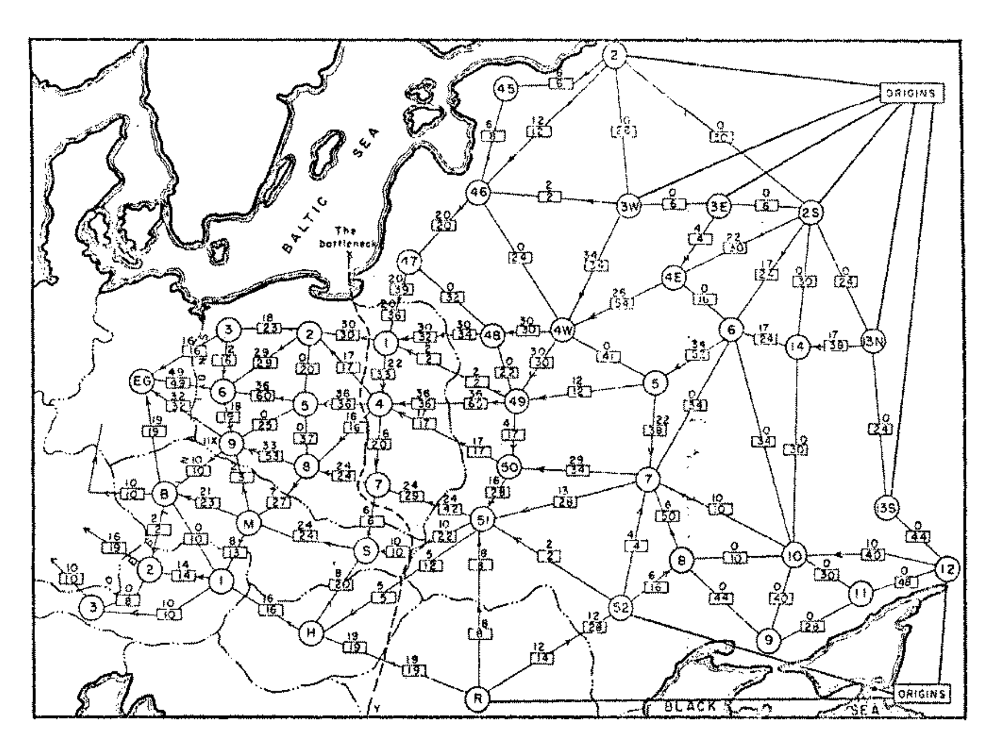
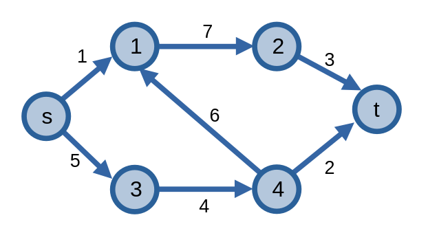
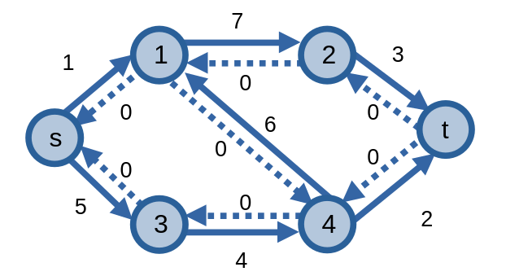
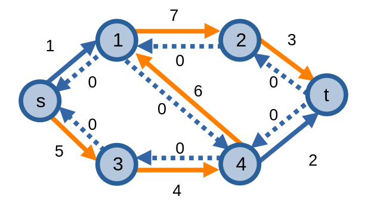
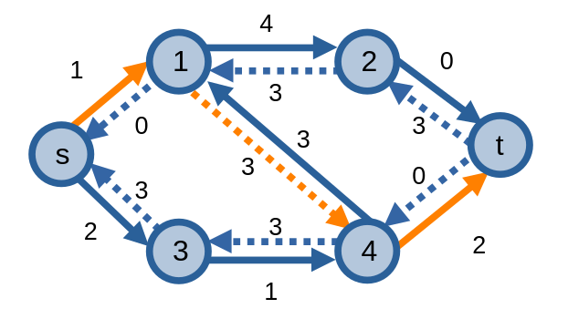
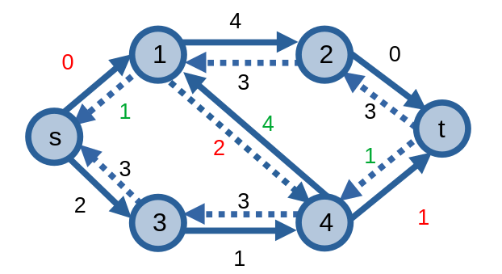
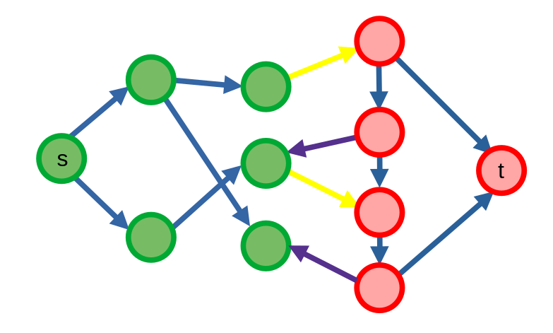
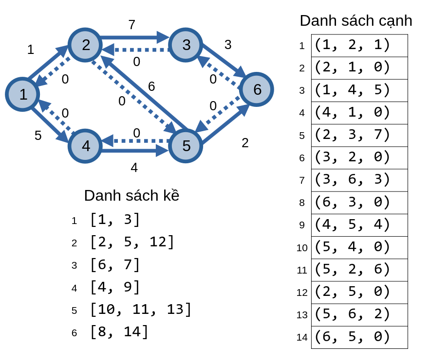

# Luồng trên mạng

Luồng trên mạng là một bài toán mà ta cần giải quyết việc di chuyển các luồng trên một đồ thị có hướng có trọng số hay một mạng. Những ứng dụng của luồng trên mạng là nhiều vô số kể, từ việc kiểm tra mức độ tối ưu của hệ thống ống nước, cho đến những thứ tưởng chừng như không liên quan như kiểm tra nếu một đội bóng có khả năng vô địch giải đấu hay không.

## Mạng

Một **mạng (network)** là một đồ thị có hướng \\(G = (V, E)\\) với đỉnh **nguồn (source)** \\(s\\) và đỉnh **thu (target)** \\(t\\). Mỗi cung \\(e = uv\\) trên mạng có trọng số \\(c(e)\\) dương biểu thị cho khả năng thông qua hay sức chứa của cạnh, cho ta viết lượng **luồng (flow)** có thể đi qua. Ngoài ra, đối với các cạnh \\(uv \notin E\\), ta có thể xem nó như một cạnh có sức chứa bằng \\(0\\): \\(c(uv) = 0\\). 

Ở ví dụ dưới đây, ta có một mạng biểu thị hệ thống đường ray Xô viết kết nối với các nước Đông Âu vào những năm 1955. Ở các cung trong mạng, ta thấy các ô có nhãn là một số thể hiện sức chứa của cung, và con số ở trên nó thể hiện lượng luồng đi qua nó.

<center>

</center>

## Luồng

Ta có **luồng s-t (s-t flow)** là một hàm \\(f : E \rightarrow \mathbb{R}^+\\) gán các số thực cho các cung trong mạng. Mỗi giá trị \\(f(e)\\) sẽ tượng trưng cho lượng luồng đi qua cung \\(e\\).

\\(f\\) cần thỏa mãn các rằng buộc:
- Sức chứa: không thể có lượng luồng đi qua cung mà lớn hơn sức chứa của nó: \\(0 \le f(e) \le c(e)\\).
- Cân bằng: Ngoại trừ hai đỉnh \\(s\\) và \\(t\\), lượng luồng đi vào một đỉnh phải bằng lượng luồng đi ra đỉnh đó. Với mỗi đỉnh \\(u\\) thuộc mạng không phải \\(s, t\\), ta có: 
\\[\sum_{v \in V} f(vu) = \sum_{v \in V} f(uv)\\]

Ta định nghĩa **giá trị luồng** \\(v(f)\\) của đồ thị là tổng số luồng đi ra từ đỉnh phát: \\(v(f) = \sum_{v \in V} f(sv)\\).

Ta có kí hiệu về lượng luồng đi vào và đi ra một đỉnh lần lượt là:
- \\(f^{in}(u) = \sum_{v \in V} f(vu)\\)
- \\(f^{out}(u) = \sum_{v \in V} f(uv)\\)

Từ hai kí hiệu này, ta có thể viết lại rằng buộc cân bằng: \\(f^{in}(u) = f^{out}(u)\\) với mọi \\(u \notin \\{s, t\\}\\), và giá trị luồng: \\(v(f) = f^{out}(s)\\).

## Định nghĩa

### Đồ thị thặng dư

Một **đồ thị thặng dư (residual graph)** \\(G^f\\) của một mạng \\(G\\) là một đồ thị có hướng sao cho:
- **Đỉnh**: Các đỉnh có trong \\(G\\) đều có trong \\(G^f\\), hay \\(G^f(V) = G(V)\\).
- **Cạnh xuôi**: Với mỗi cung \\(uv\\) có trong \\(G\\), sẽ tồn tại một cạnh có hướng \\(uv\\) trong \\(G^f\\) có trọng số chỉ **sức chứa thặng dư (residual capacity)** bằng \\(c(uv) - f(uv)\\). 
- **Cạnh ngược**: Với mỗi cung \\(uv\\) có trong \\(G\\), sẽ tồn tại một cạnh có hướng \\(vu\\) trong \\(G^f\\) có trọng số chỉ sức chứa thặng dư bằng \\(f(uv)\\). 

Ở ví dụ dưới đây, ta có một mạng và đồ thị thặng dư của nó.

<center>

<p>Mạng</p>
</center>

<center>

<p>Đồ thị thặng dư. Các cạnh gạch nối là các cạnh ngược</p>
</center>

Ta có thể hiểu sức chứa thặng dư của các cạnh xuôi và ngược trong đồ thị thặng dư biểu thị lượng luồng *còn lại* mà nó có thể chứa. Vai trò của cạnh ngược sẽ được hiểu rõ khi ta đi đến phần *đường tăng luồng*.

### Đường tăng luồng

Một **đường tăng luồng (augmenting path)** trên đồ thị thặng dư là một đường đi từ đỉnh nguồn đến đỉnh thu sao cho các cặp cạnh trên đường đi có sức chứa thặng dư dương. Ta có một đường tăng luồng \\(P = (u_1, u_2, \dots, u_k)\\) với \\(u_1 = s\\) và \\(u_k = t\\) thỏa mãn \\(c(u_iu_{i + 1}) > 0\\) với mọi \\(i \lt k\\). 

**Điểm nghẽn** \\(bottleneck(P, f)\\) của đường tăng luồng \\(P\\) bằng sức chứa thặng dư nhỏ nhất trong tất cả các cạnh của đường đi.

Ta có thể tăng luồng trên đồ thị thặng dư bằng cách tăng một lượng luồng trên các cạnh của đường tăng luồng một lượng bằng với điểm nghẽn của đường tăng luồng ấy. Khi thực hiện tăng luồng trên cạnh \\(uv\\) của đường tăng luồng \\(P\\), ta tăng \\(c(uv)\\) một khoảng bằng \\(bottleneck(P, f)\\) và giảm \\(c(vu)\\) một khoảng tương tự. 

<center>

</center>

<center>

</center>

Mục đích của cạnh ngược trong đồ thị thặng dư là để cho phép ta *hủy* những luồng đã gửi qua cạnh này. Giả sử như nếu ta gửi một lượng luồng \\(X\\) đi từ \\(u\\) sang \\(v\\), thì việc gửi một lượng luồng \\(Y\\) qua cạnh ngược đi từ \\(v\\) sang \\(u\\) giống như việc hủy \\(Y\\) luồng đi từ \\(u\\) sang \\(v\\) vậy.

<center>

</center>

<center>

</center>

## Lát cắt

Một **lát cắt s-t** \\((S, T)\\) là khi ta chia các đỉnh trong mạng thành hai tập hợp đỉnh rời nhau \\(S\\) và \\(T\\), với \\(s \in S\\) và \\(t \in T\\). Ta đã được thấy một lát cắt ở hệ thống đường ray, với đường nét đứt \\(the bottleneck\\) chia các đỉnh thành hai phần trái và phải.

Giá trị của lát cắt s-t: \\(c(S, T)\\) bằng tổng trọng số các cung có hai đầu mút là hai đỉnh ở hai tập khác nhau. 

\\[c(S, T) = \sum_{u \in A}\sum_{v \in B} c(uv)\\]

Ở hình ví dụ về mạng, ta sẽ tạo một lát cắt s-t bằng cách chia thành hai tập hợp \\(S = \\{s, 3\\}\\) và \\(T = \\{t, 1, 2, 4\\}\\). Giá trị của lát cắt này sẽ bằng tổng trọng số của các cung \\(\\{s, 1\\}\\) và \\(\\{3, 4\\}\\).

\\[c(S, T) = c(\\{s, 1\\}) + c(\\{3, 4\\}) = 1 + 4 = 5\\]

Ta định nghĩa với tập \\(U \subseteq V\\):
- \\(f^{in}(U)\\) là tổng lượng luồng của các cạnh \\(vu\\) với \\(u \in U\\) và \\(v \notin U\\): \\(f^{in}(U) = \sum_{u \in U}\sum_{v \notin U} f(vu)\\).
- \\(f^{out}(U)\\) là tổng lượng luồng của các cạnh \\(uv\\) với \\(u \in U\\) và \\(v \notin U\\): \\(f^{out}(U) = \sum_{u \in U}\sum_{v \notin U} f(uv)\\).

### Luồng và lát cắt

Với luồng s-t \\(f\\) và lát cắt s-t \\((S, T)\\) bất kì, ta có: 

\\[v(f) = f^{out}(S) - f^{in}(S)\\]

Từ công thức trên, ta có thể kết luận

\\[v(f) \le c(S, T)\\]

Điều này là bởi:

\\[v(f) = f^{out}(S) - f^{in}(S) \\\ \le f^{out}(S) - 0 = f^{out}(S) = \sum_{u \in S}\sum_{v \notin S} f(uv) \\\ \le \sum_{u \in S}\sum_{v \notin S} c(uv) = c(S, T)\\]

Từ đây, ta có định lí: \\(v(f) \le c(S, T)\\) - mọi lát cắt đều lớn hơn hoặc bằng mọi luồng.


## Luồng cực đại và lát cắt cực tiểu

**Luồng cực đại trên mạng (maximum flow - maxflow)** là bài toán tìm giá trị của luồng sau khi gửi nhiều luồng nhất có thể trên mạng. 

Ở ví dụ dưới đây, luồng cực đại của mạng này là \\(5\\), và đồ thị thặng dư của nó có dạng như sau.

<center>

</center>

**Lát cắt cực tiểu (minimum cut - mincut)** là bài toán tìm lát cắt có giá trị nhỏ nhất trên mạng. 

Ta đã được thấy ví dụ về lát cắt cực tiểu trong phần tính giá trị của một lát cắt.

Một mối liên hệ thú vị về luồng cực đại và lát cắt cực tiểu chính là việc giá trị của chúng bằng nhau. Làm sao ta có thể khằng định được điều này?

<center>

</center>

Ta có \\(f^\*\\) là luồng sau khi tìm được luồng cực đại trên mạng. Ta có lát cắt cực tiểu \\((S^\*, T^\*)\\) với tập \\(S^\*\\) là các đỉnh màu xanh chỉ các đỉnh có thể đi đến được từ đỉnh \\(s\\) bằng các cạnh có trọng số dương trong đồ thị thặng dư, còn tập \\(T^\*\\) là các đỉnh còn lại có màu đỏ.

Ta có các cạnh màu vàng \\(e = uv\\) có \\(u \in S^\*\\) và \\(v \in T^\*\\). Ta nhận xét rằng \\(f(e) = c(e)\\) bởi nếu điều này là sai vì nếu không thì sẽ có một cạnh xuôi \\(uv\\) có trọng số dương và \\(v\\) sẽ thuộc \\(S^\*\\).

Ta cũng có các cạnh màu tím \\(e = vu\\) có \\(u \in S^\*\\) và \\(v \in T^\*\\). Ta nhận xét rằng \\(f(e) = 0\\) bởi nếu điều này là sai vì nếu không thì sẽ có một cạnh ngược \\(uv\\) có trọng số dương và \\(v\\) sẽ thuộc \\(S^\*\\).

Từ đây, ta có:

\\[v(f^\*) = f^{out}(S^\*) - f^{in}(S^\*) \\\ = \sum_{u \in S^\*}\sum_{v \notin S^\*} f(uv) - \sum_{u \in S^\*}\sum_{v \notin S^\*} f(vu) \\\ = \sum_{u \in S^\*}\sum_{v \notin S^\*} c(uv) - \sum_{u \in S^\*}\sum_{v \notin S^\*} 0 \\\ = c(S^\*, T^\*)\\]

Vậy giá trị của luồng cực đại bằng giá trị của lát cắt cực tiểu.

## Tổ chức dữ liệu

Để có thể tổ chức dữ liệu cho mạng, cụ thể hơn là ở dạng đồ thị thặng dư, ta sử dụng lẫn [danh sách cạnh](overview.md#danh-sách-cạnh-edge-list) và [danh sách kề](overview.md#danh-sách-kề-adjacency-list).

Ta có một danh sách cạnh lưu trữ các cung \\(uv\\) có \\(c(uv) = c\\), và lưu chỉ số của cạnh ấy vào danh sách cạnh ở mảng giá trị thứ \\(u\\).

Ví dụ với đồ thị thặng dư sau, ta có cách tổ chức dữ liệu:

<center>

</center>

```C++
struct NetworkFlow{
	struct Edge{
		int u, v; ll c; // cung (u, v), c(uv) = c
		Edge(){}
		Edge(int _u, int _v, ll _c) : u(_u), v(_v), c(_c) {}
	};

	vector<vector<int>> adj; // danh sách kề, các đỉnh có chỉ số từ 0 đến n - 1
	vector<Edge> edge; // danh sách cạnh, chỉ số bắt đầu từ 0
	int n; // số lượng đỉnh
	int s, t; // đỉnh nguồn - đỉnh thu
	
	NetworkFlow(){}
	NetworkFlow(int _n, int _s, int _t): n(_n), s(_s), t(_t), adj(_n) {
		edge.clear();
	}

	void addEdge(int u, int v, ll c, ll bc = 0){ // Thêm cạnh
		adj[u].emplace_back(edge.size()); edge.emplace_back(Edge(u, v, c)); // cạnh xuôi
		adj[v].emplace_back(edge.size()); edge.emplace_back(Edge(v, u, bc)); // cạnh ngược
	}

    void edgeflow(int id, ll flow){ // cập nhật khi có flow luồng đi qua cạnh id
        edge[id].c -= flow; // cạnh uv
        edge[id ^ 1].c += flow; // cạnh vu
    }
};
```