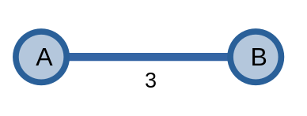
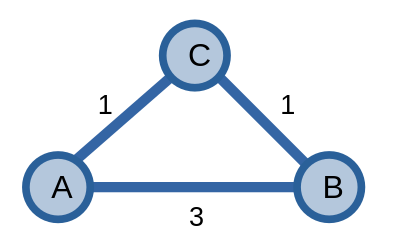
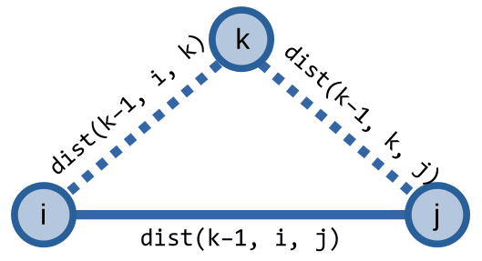

# Thuật toán Floyd-Warshall

**Thuật toán Floyd-Warshall** là thuật toán tìm đường đi ngắn nhất của *mọi cặp đỉnh* thay vì từ một đỉnh như hai thuật toán tìm đường đi ngắn nhất được nói ở phần trước - [Dijkstra](dijkstra.md) và [Bellman-Ford](bellman-ford.md). 

## Thuật toán

Giả sử ta có khoảng cách ngắn nhất giữa hai đỉnh \\(A\\) và \\(B\\) bằng \\(3\\).

<center>

</center>

Thuật toán Floyd-Warshall sẽ tận dụng những đỉnh trung gian để có thể tối ưu kết quả đường đi ngắn nhất giữa hai đỉnh bất kì.

<center>

</center>

Như ví dụ trên, với sự xuất hiện của đỉnh \\(C\\), đường đi ngắn nhất từ \\(A\\) đến \\(B\\) có thể được giảm xuống thành \\(2\\) bằng cách đi qua đỉnh trung gian \\(C\\).

Thuật toán Floyd-Warshall không chỉ sử dụng một đỉnh làm trung gian mà sử dụng nhiều đỉnh để có thể tìm được kết quả tối ưu.

Từ đây, ta có mô tả thuật toán như sau:

Ta có \\(dist(k, i, j)\\) bằng giá trị đường đi ngắn nhất từ \\(i\\) đến \\(j\\), sử dụng \\(k\\) đỉnh đầu tiên làm các đỉnh trung gian. Với \\(k = 0\\), ta có:

\\[dist(k, i, j) = mat[i][j]\\]

Với \\(mat\\) là một ma trận kề lưu thông tin về đồ thị:
- \\(mat[i][j]\\) là trọng số của cạnh \\(ij\\) trong đồ thị. 
- Nếu đồ thị không có cạnh \\(ij\\), ta có: \\(mat[i][j] = \infty\\)
- Nếu \\(i = j\\) thì ta có \\(mat[i][j] = 0\\).

Với \\(1 \le k \le |V|\\), ta có công thức:

\\[dist(k, i, j) = min(dist(k - 1, i, j), dist(k - 1, i, k) + dist(k - 1, k, j))\\]

Để tìm khoảng cách ngắn nhất từ \\(u\\) đến \\(v\\), ta trả về giá trị của \\(dist(|V|, u, v)\\).

Nếu ta hình dung theo hướng giống đồ thị \\(ABC\\) ở hình trên thì công thức này giống với đồ thị dưới đây:

<center>

</center>

Để lưu \\(3\\) trạng thái của \\(dist\\) thì thuật toán của ta cần sử dụng \\(O(|V|^3)\\) bộ nhớ. Để tối ưu bộ nhớ, ta sẽ loại bỏ trạng thái \\(k\\), giảm độ phức tạp bộ nhớ còn \\(O(|V|^2)\\).

Công thức của ta bây giờ được rút gọn thành:

\\[dist(i, j) = min(dist(i, j), dist(i, k) + dist(k, j))\\]

```C++
const int INF = 1e9;
int mat[N][N]; // ma trận kề
int p[N][N];
int dist[N][N];
int n;

void FloydWarshall(){
	for(int i = 1; i <= n; ++i){
		for(int j = 1; j <= n; ++j){
			dist[i][j] = mat[i][j];
			if(mat[i][j] == 0) dist[i][j] = INF;
			p[i][j] = i;
		}
		dist[i][i] = 0;
	}
	for(int k = 1; k <= n; ++k){
		for(int i = 1; i <= n; ++i){
			for(int j = 1; j <= n; ++j){
				if(dist[i][j] > dist[i][k] + dist[k][j]){
					dist[i][j] = dist[i][k] + dist[k][j];
					p[i][j] = p[k][j];
				}
			}
		}
	}
}
```

Độ phức tạp thuật toán là \\(O(|V|^3)\\).

Sẽ có những lúc mà ta viết nhầm các vòng lặp lồng nhau trong thuật toán Floyd-Warshall - thay vì viết \\(k \rightarrow i \rightarrow j\\) thì lại viết nhầm thành \\(i \rightarrow j \rightarrow k\\) - cho ra kết quả sai. Dẫu vậy, lỗi này vẫn có thể cho ra kết quả đúng bằng cách lặp lại vòng lặp \\(3\\) lần [^1].

## Phát hiện chu trình âm

Giống như [Bellman-Ford](bellman-ford.md#phát-hiện-chu-trình-âm), thuật toán Floyd-Warshall cũng có thể phát hiện sự tồn tại của chu trình âm trong đồ thị.

Ta sẽ chạy thuật toán thêm một lần nữa nhằm xác định xem có khoảng cách giữa hai cặp đỉnh nào được cập nhật không. Nếu có cập nhật thì đồ thị có chu trình âm, nếu không thì không có.

```C++
bool negCycle(){
	bool upd = 0;
	FloydWarshall();
	for(int k = 1; k <= n; ++k){
		for(int i = 1; i <= n; ++i){
			for(int j = 1; j <= n; ++j){
				if(dist[i][j] > dist[i][k] + dist[k][j]){
					dist[i][j] = -INF;
					upd = 1;
				}
			}
		}
	}
	return upd;
}
```

## Tìm con đường ngắn nhất
	
Ta cũng có thể tìm được đường đi ngắn nhất giữa hai cặp đỉnh bất kì.

Hàm `printpath` dưới đây sẽ tìm một con đường ngắn nhất từ đỉnh \\(u\\) đến đỉnh \\(v\\) bằng cách gọi `printpath(u, v)`.

```C++
void printpath(int u, int v) {
	if (u != v) printpath(u, p[u][v]);
	cout << v << ' ';
}
```

## So sánh với các thuật toán khác

Để giải quyết được bài toán tìm đường đi ngắn nhất giữa các cặp đỉnh, ta ưu tiên sử dụng thuật toán Floyd-Warshall vì độ đơn giản và hiệu quả của nó so với hai thuật toán kia.

Để tìm đường đi ngắn nhất giữa các cặp đỉnh bằng Dijkstra hoặc các thuật toán tìm đường đi ngắn nhất từ một đỉnh khác, ta chạy thuật toán với mỗi đỉnh, và độ phức tạp của mỗi thuật toán sẽ như sau:
- BFS (đồ thị không trọng số, trọng số \\(0/1\\)): \\(O(|V|\times(|V| + |E|)) \approx O(|V|^3)\\) với \\(|E| = O(|V|^2)\\). 
- Dijkstra: \\(O(|V| \times ((|E| + |V|) \log {|V|})) \approx O(|V|^3\log{|V|})\\) với \\(|E| = O(|V|^2)\\). 
- Bellman-Ford/SPFA: \\(O(|V| \times (|V||E|)) \approx O(|V|^4)\\) với \\(|E| = O(|V|^2)\\). 

Ta thấy, các thuật toán khác nếu không chậm hơn Floyd-Warshall thì độ dài các đoạn code cũng sẽ dài hơn Floyd-Warshall một cách đáng kể. 

[^1]: [Ikumi Hide, Soh Kumabe, Takanori Maehara, Incorrect implementations of the Floyd--Warshall algorithm give correct solutions after three repeats, 2019](https://arxiv.org/abs/1904.01210)