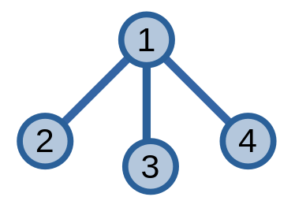
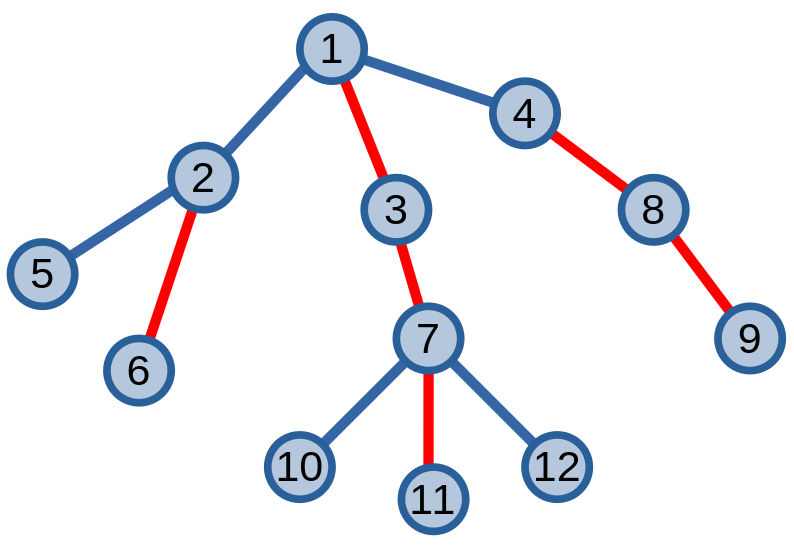

# Kĩ thuật phân tách nặng-nhẹ (Heavy-Light Decomposition)

Kĩ thuật **phân tách nặng-nhẹ (Heavy-Light Decomposition - HLD)**, từ giờ sẽ gọi là **HLD**, là kĩ thuật tối ưu xử lí các bài toán trên cây. 

Ta có bài toán ví dụ: cho một cây có \\(n\\) đỉnh, các đỉnh được gán một giá trị. Ta cần giải quyết các truy vấn tìm tổng giá trị các đỉnh trên đường đi từ \\(u\\) đến \\(v\\). 

Ta có thể dễ dàng giải quyết bài toán này bằng cách sử dụng [LCA](lca.md) - [nâng nhị phân](lca.md#nâng-nhị-phân). Tuy nhiên, nếu giá trị các cạnh thay đổi thì phương pháp này sẽ không hiệu quả khi ta phải xây dựng lại mảng để nâng nhị phân cho ra kết quả đúng. Khi này, HLD sẽ giúp ta giải quyết bài toán một cách tối ưu.

## HLD

Trước khi giải quyết bài toán trên, ta sẽ xét một trường hợp cụ thể. Giả sử cây của ta là một [cây tre](tree.md#cây-suy-biến). 

<center>

</center>

Khi này, việc giải quyết bài toán là vô cùng dễ dàng: ta lưu giá trị các đỉnh vào các CTDL như [cây phân đoạn](../data-structures/segment-tree.md) hoặc [cây Fenwick](../data-structures/fenwick.md), sau đó giải quyết các truy vấn bằng cách tìm giá trị của các phân đoạn.

Ý tưởng chính của HLD là phiên bản mở rộng từ ý tưởng cây tre. Nó sẽ phân tách cây ra thành các đường đi. Sau đó, từ các đường đi này, ta có thể tìm được đáp án của bài toán. HLD phân tách các cây bằng cách sử dụng các cạnh nặng và nhẹ. 

Ta định nghĩa **cạnh nặng** là các cạnh \\(uv\\) nối đỉnh \\(u\\) và đỉnh con \\(v\\) khi cây con gốc \\(v\\) có kích thước ít nhất là hơn một nửa kích thước cây con gốc \\(u\\), các cạnh còn lại là **cạnh nhẹ**.

Từ các cạnh nặng ta có thể tạo thành các đường đi trên đỉnh giúp giải bài toán. Ta gọi các đường đi được tạo thành bởi các cạnh nặng là một **đường đi nặng**. Đối với các đỉnh không được nối bởi bất đường đi nặng nào, ta có thể coi đỉnh đó là một đường đi nặng có \\(1\\) đỉnh.

Để có thể có nhiều cạnh nặng, ta có thể cho phép cạnh \\(uv\\) là cạnh nặng nếu đỉnh \\(v\\) là đỉnh có cây con lớn nhất trong tất cả các đỉnh con của \\(u\\), nếu có nhiều đỉnh thoả mãn thì chọn một đỉnh bất kì.

Ở ví dụ dưới đây, nếu áp dụng định nghĩa cũ thì sẽ không xuất hiện cạnh nặng, còn nếu áp dụng định nghĩa mới thì ta sẽ có một cạnh nặng \\(\\{1, 2\\}\\) hoặc \\(\\{1, 3\\}\\), \\(\\{1, 4\\}\\).

<center>

</center>

Ta có ví dụ về việc phân tách cây. Các đỉnh màu đỏ là các cạnh nặng (theo định nghĩa mới), các cạnh còn lại là cạnh nhẹ.	

<center>

</center>

Từ trong hình ta có \\(6\\) đường đi khác nhau: \\((1, 3, 7, 11), (2, 6), (4, 8, 9), (5), (10), (12)\\).

Ta có thể chứng minh rằng việc phân tách theo các cạnh nặng nhẹ sẽ giúp kĩ thuật của ta trở nên tối ưu. Giả sử ta có một đỉnh \\(u\\) nằm trong cây, ta nhận định rằng đường đi từ \\(u\\) đến đỉnh gốc sẽ không đi qua quá \\(O(\log{n})\\) cạnh nhẹ.

> [!NOTE]
> Xét đỉnh \\(u\\) có cạnh \\(up\\) nối với đỉnh cha \\(p\\) của nó là một cạnh nhẹ. Vì \\(up\\) không phải là cạnh nặng nên ta có thể suy luận ra rằng tồn tại một đỉnh \\(v\\) và cạnh \\(pv\\) là cạnh nặng. 
> 
> Gọi \\(size(u), size(v)\\) là kích thước của cây con gốc \\(u\\) và \\(v\\). Từ nhận định trên ta có: \\(size(u) + size(v) \ge 2 \times size(u)\\). Vì cây chỉ có \\(n\\) đỉnh nên điều này chỉ xảy ra không quá \\(O(\log{n})\\) lần.
>
> Từ đây ta kết luận việc di chuyển từ \\(u\\) đến đỉnh gốc thì sẽ không đi qua nhiều hơn \\(O(\log{n})\\) cạnh nhẹ.

Dưới đây là cài đặt tìm các cạnh nặng nhẹ và nhóm các đỉnh trong cùng một đường đi nặng vào một nhóm. Các đường đi nặng sẽ được lưu vào một mảng như trong [kĩ thuật chu trình Euler](euler-tour-technique.md#truy-vấn-các-cây-con).

```C++
int sz[N], par[N], h[N]; // kích thước, đỉnh cha, chiều cao các đỉnh
int euler[N], idx[N], tdfs = 0; // kĩ thuật chu trình Euler
int heavy[N]; // cạnh (u, heavy[u]) là cạnh nặng
int group[N]; // nhóm các đỉnh thuộc cùng một đường đi nặng

// gọi hàm trong hàm main: hld([đỉnh gốc bất kì], 0)
void hld(int u, int p){
	sz[u] = 1;
	int node = 0;
	for(int v : adj[u]){
		if(v == p) continue;
		par[v] = u;
		h[v] = h[u] + 1;
		hld(v, u);
		if(sz[v] > sz[node]) node = v; // tìm cạnh nặng
		sz[u] += sz[v];
	}
	heavy[u] = node; // cạnh (u, node) là cạnh nặng
					 // node = 0 khi u là đỉnh lá
}
// gọi hàm trong hàm main: decompose([đỉnh gốc bất kì], [đỉnh gốc bất kì])
void decompose(int u, int p){
	idx[u] = ++tdfs; 
	euler[idx[u]] = u;
	
	group[u] = p; // đại diện của đường đi nặng là đỉnh thấp nhất
	
	if(heavy[u]) decompose(heavy[u], p); // duyệt các đỉnh thuộc đường đi nặng
	
	// duyệt các đỉnh thuộc các đường đi còn lại
	for(int v : adj[u]){
		if(v == par[u] || v == heavy[u]) continue;
		decompose(v, v);
	}
}
```

Độ phức tạp của chương trình trên là \\(O(|V| + |E|)\\).

## Ứng dụng

Ta điểm qua một số ứng dụng cơ bản của HLD.

### Tìm LCA

Sau khi phân tách cây, ta có thể dùng các đường đi nặng để tìm LCA của hai đỉnh bất kì trên cậy.

```C++
int lca(int u, int v){
	while(group[u] != group[v]){
		if(h[group[u]] > h[group[v]]) u = par[group[u]];
		else v = par[group[v]];
	}
	if(h[u] < h[v]) return u;
	return v;
}
```

Độ phức tạp khi sử dụng HLD để tìm LCA là \\(O(\log{n})\\).

### Bài toán ví dụ

Để giải quyết bài toán ví dụ, ta cho mỗi đường đi nặng trên cây một [cây phân đoạn](../data-structures/segment-tree.md). Trong quá trình di chuyển hai đỉnh đến LCA, ta tổng hợp kết quả từ các đường đi nặng và tính kết quả cho từng truy vấn. 

Để tối ưu, ta kết hợp các cây phân đoạn từ các đường đi nặng thành một cây phân đoạn duy nhất khi cài đặt.

```C++
int v[N]; // giá trị đỉnh i
/*
Cây phân đoạn tính tổng trên các phân đoạn
Ở các phân đoạn id [l, r], các phân đoạn có l == r sẽ có giá trị bằng v[euler[l]]
*/
int query(int a, int b){
	int res = 0;
	while(group[a] != group[b]) {
		if(h[group[a]] < h[group[b]]) swap(a, b);
		if(idx[group[a]] != idx[a]) res = max(res, ans(1, 1, n, idx[group[a]], idx[a]));
		else res = max(res, v[a]); // tối ưu chương trình bằng cách 
								   // lấy giá trị trực tiếp nếu chỉ có 1 phần từ
		a = par[group[a]];
	}
	if(idx[a] > idx[b]) swap(a, b);
	res = max(res, ans(1, 1, n, idx[a], idx[b]));
	return res;
}
```

Hai đỉnh \\(a, b\\) đi đến LCA đi qua \\(O(\log{n})\\) đường đi nặng, mỗi đường đi nặng cần \\(O(\log{n})\\) thời gian lấy giá trị nên độ phức tạp cho từng truy vấn là \\(O(\log^2{n})\\).

Khi cập nhật giá trị một đỉnh \\(u\\) bất kì, ta sẽ thay đổi giá trị `v[u]` trên cây phân đoạn. Đô phức tạp sẽ là \\(O(\log{n})\\).
