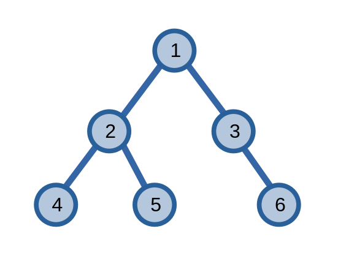

# Tổ tiên chung gần nhất

Cho hai đỉnh \\(u\\) và \\(v\\) trên một cây, **tổ tiên chung gần nhất (lowest common ancestor - LCA)** từ giờ sẽ gọi là **LCA**, của hai đỉnh này là một đỉnh xa đỉnh gốc nhất là tổ tiên của cả \\(u\\) và \\(v\\).

<center>

</center>

Ở ví dụ trên, ta thầy LCA của hai đỉnh \\(4\\) và \\(9\\) là đỉnh \\(3\\).

Ta cũng định nghĩa một đỉnh là tổ tiên của chính nó, để nếu \\(u\\) là hậu duệ của đỉnh \\(v\\) thì tổ tiên chung gần nhất của hai đỉnh sẽ là \\(v\\).

Ta sẽ bàn về một số phương pháp để tìm LCA.

## Phương pháp 1

Đâu là một phương pháp đơn giản để tìm LCA của hai đỉnh \\(u\\) và \\(v\\).

Ta có hai con trỏ chỉ vào hai đỉnh của cây. Đầu tiên, ta di chuyển con trỏ ở đỉnh có chiều cao lớn hơn lên trên sao cho nó chỉ đến đỉnh có chiều cao bằng con trỏ còn lại. Sau đó, ta đồng thời di chuyển hai con trỏ cho tới khi cả hai con trỏ đều chỉ vào một đỉnh. Đỉnh này sẽ là LCA của hai đỉnh \\(u\\) và \\(v\\).

<center>

</center>

```C++
int lca(int u, int v){
	if(h[u] < h[v]) swap(u, v);
	while(h[u] != h[v]) u = par[u];
	while(u != v) u = par[u], v = par[v];
	return u;
}
```

Độ phức tạp của thuật toán này là \\(O(k)\\) với \\(k\\) là số lần di chuyển của con trỏ. Trường hợp tệ nhất của phương pháp này là \\(O(n)\\) khi nó có thể phải di chuyển cả một đoạn tương đương với số lượng đỉnh có trong cây.

Ta sẽ sử dụng phương pháp **nâng nhị phân (binary lifting)** để tối ưu việc di chuyển của con trỏ.

### Nâng nhị phân

Kĩ thuật **nâng nhị phân (binary lifting)** là một kĩ thuật được dùng để giải quyết bài toán *tìm tổ tiên thứ \\(k\\)* của một đỉnh \\(u\\). Ta có một hàm chỉ tổ tiên thứ \\(k\\) của một đỉnh \\(u\\) là \\(ancestor(u, k)\\). Ở hình ví dụ ở trên, ta có \\(ancestor(8, 2) = 4\\), \\(ancestor(3, 1) = 2\\),...

Ta có thể áp dụng kĩ thuật chia \\(k\\) ra thành các luỹ thừa của \\(2\\) giống như ở [bảng thưa](../data-structures/sparse-table.md), từ đó giúp tìm kiếm nhanh hơn, ví dụ.

\\[ancestor(u, 7) = ancestor(ancestor(ancestor(u, 1), 2), 4)\\]

```C++
sp[K][N]; // sp[k][u] = ancestor(u, 2^k)
          // nếu 2^k > h[u] thì sp[k][u] = 0
int n;

// xây dựng bảng thưa
void build(){
	for(int i = 1; i <= n; ++i){
		sp[0][i] = par[i]; // par[i] là đỉnh cha của đỉnh i
	}
	for(int k = 1; (1 << k) <= n; ++k){
		for(int i = 1; i <= n; ++i) {
			sp[k][i] = sp[k - 1][sp[k - 1][i]];
		}
	}
}


int ancestor(int u, int k){
	for(int i = 0; (1 << i) <= k; ++i){
		if((k >> i) & 1) u = sp[i][u];
	}
	return u;
}
```

Áp dụng kĩ thuật nâng nhị phân, ta có thể giảm độ phức tạp của phương pháp tìm LCA xuống còn \\(O(n \log{n})\\) cho việc xây dựng bảng thưa và \\(O(\log{n})\\) cho việc xử lí mỗi truy vấn tìm LCA.

```C++
int lca(int u, int v){
	if(h[u] < h[v]) swap(u, v);
	u = ancestor(u, h[u] - h[v]); 

	// h[u] == h[v]
	if(u == v) return u;

	// nhảy đến đỉnh gần nhất không phải LCA
	for(int i = __lg(h[u]); i >= 0; --i){
		// nhảy lên đỉnh có chiều cao lớn hơn LCA
		if(sp[i][u] != sp[i][v]){ 
			u = sp[i][u];
			v = sp[i][v];
		}
	}

	return par[u]; // LCA
}
```

## Phương pháp 2

Ta có thể tìm LCA của hai đỉnh bằng cách sử dụng [kĩ thuật chu trình Euler](euler-tour-technique.md).

<center>

</center>

Ta sẽ liệt kê các đỉnh trong chu trình Euler, và chiều cao của nó. 

|Chỉ số|\\(1\\)|\\(2\\)|\\(3\\)|\\(4\\)|\\(5\\)|\\(6\\)|\\(7\\)|\\(8\\)|\\(9\\)|\\(10\\)|\\(11\\)|
|---|---|---|---|---|---|---|---|---|---|---|---|
|Đỉnh|\\(1\\)|\\(2\\)|\\(4\\)|\\(2\\)|\\(5\\)|\\(2\\)|\\(1\\)|\\(3\\)|\\(6\\)|\\(3\\)|\\(1\\)|
|Chiều cao|\\(1\\)|\\(2\\)|\\(3\\)|\\(2\\)|\\(3\\)|\\(2\\)|\\(1\\)|\\(2\\)|\\(3\\)|\\(2\\)|\\(1\\)|


Ta có LCA của hai đỉnh \\(2\\) và \\(6\\) là đỉnh \\(1\\). Một điều nữa mà ta có thể rút ra từ đỉnh \\(1\\) chính là đây là đỉnh thấp nhất trên đường đi từ đỉnh \\(2\\) đến đỉnh \\(6\\) trong chu trình Euler.

Từ đây, ta có thể kết luận rằng ta có thể tìm LCA của hai đỉnh \\(u\\) và \\(v\\) bất kì bằng cách tìm đỉnh có chiều cao nhỏ nhất trong khoảng \\([u_{st}, v_{st}]\\) (nếu \\(v_{st} > u_{st}\\) thì ta đảo lại: \\([v_{st}, u_{st}]\\)).

Ta có thể sử dụng [cây phân đoạn](../data-structures/segment-tree.md), hoặc nếu đồ thị không thay đổi, ta có thể áp dụng [kĩ thuật bảng thưa](../data-structures/sparse-table.md). 

```C++
pair<int, int> sp[K][N];
void build(){
    for(int i = 1; i <= n << 1 | 1; ++i){
        sp[0][i] = {h[euler[i]], euler[i]};
    }
    for(int k = 1; (1 << k) <= n << 1 | 1; ++k){
        for(int i = 1; i + (1 << k) - 1 <= n << 1 | 1; ++i){
            sp[k][i] = min(sp[k - 1][i], sp[k - 1][i + (1 << (k - 1))]);
        }
    }
}

int lca(int u, int v){
	int l = st[u], r = st[v];
	if(l > r) swap(u, v);
    int lg = __lg(r - l + 1);
    return min(sp[lg][l], sp[lg][r - (1 << lg) + 1]).second;
}
```

Độ phức tạp của phương pháp \\(2\\) với cách áp dụng bảng thưa là \\(O(n \log{n})\\) cho việc xây dựng bảng thưa và \\(O(1)\\) cho việc xử lí mỗi truy vấn tìm LCA.

## Thuật toán offline tìm LCA của Tarjan

Thuật toán offline tìm LCA của Tarjan, như tên gọi của nó, là một thuật toán offline, tức là thuật toán phải biết trước được rằng nó sẽ phải tìm LCA của các cặp đỉnh nào.

Trước tiên, thuật toán sẽ tạo \\(n\\) tập hợp, mỗi tập hợp sẽ chứa một đỉnh trên cây. Sau đó, thuật toán duyệt cây bằng [DFS](dfs.md). Với mỗi đỉnh \\(u\\), ta đánh dấu đỉnh \\(u\\) là đã được duyệt qua. Sau đó, ta thực hiện \\(2\\) quy trình chính:
- Duyệt cây: với mỗi đỉnh con \\(v\\) của \\(u\\), ta duyệt cây con gốc \\(v\\) và thực hiện hợp hai tập hợp chứa hai đỉnh \\(u, v\\). Lưu ý rằng phần tử đại diện của tập hợp chứa đỉnh \\(u\\) bất kì là đỉnh gần đỉnh gốc nhất.
- Xử lí truy vấn: với mỗi truy vấn \\((u, v)\\) chứa đỉnh \\(u\\), nếu đỉnh \\(v\\) đã được duyệt qua, ta biết được LCA của truy vấn là phần tử đại diện của tập hợp chứa đỉnh \\(v\\).

Giả sử ta có một cây sau, và ta muốn tìm LCA của các cặp đỉnh \\((4, 5)\\) và \\((5, 6)\\).

<center>

</center>

Khi duyệt DFS đến đỉnh \\(5\\), cây sẽ có dạng sau: các đỉnh màu xanh dương là các đỉnh chưa được duyệt còn các đỉnh màu xanh lục là các đỉnh đã thăm duyệt, các đỉnh nằm trong mỗi ô có đường màu đỏ là các đỉnh thuộc cùng một tập hợp. 

<center>

</center>

Ta có phần tử đại diện của tập hợp chứa đỉnh \\(4\\) là đỉnh \\(2\\) nên LCA của \\((4, 5)\\) sẽ là đỉnh \\(2\\).

<center>

</center>

Cũng với lập luận tương tự, khi duyệt tới đỉnh \\(6\\), ta có LCA của \\((5, 6)\\) sẽ là đỉnh \\(1\\).

<br>

Một số cách cài đặt DSU ở trên sẽ **không** đảm bảo việc sau khi hợp hai tập hợp, phần tử đại diện của tập hợp chứa đỉnh \\(u\\) sẽ là đỉnh gần gốc nhất. Để khắc phục điều này, ta cần một biến `ancestor` để khắc phục điều này. `ancestor` của một đỉnh \\(u\\) là đỉnh gần gốc nhất trong tất cả các đỉnh nằm trong tập hợp chứa đỉnh \\(u\\). Ở phần duyệt các cây con của \\(u\\), sau khi hợp hai tập hợp, Ta sẽ gán `ancestor` của đỉnh đại diện là đỉnh gần gốc nhất, ở đây là đỉnh \\(u\\). Đoạn code dưới đây thực hiện điều này có dạng: `ancestor[dsu.find(u)] = u`.

```C++
UnionFind dsu;
vector<pair<int, int>> queries; // các truy vấn
vector<int> qry[N]; // truy vấn sau tiền xử lí
int ancestor[N]; // đỉnh gần gốc nhất trong tập hợp chứa đỉnh u
bitset<N> vst; // đỉnh đã được duyệt hay chưa
int n; // số lượng đỉnh

void OLCA(int u, int p){
    vst[u] = 1; // đã thăm đỉnh u
    ancestor[u] = u;

    // duyệt cây
    for(int v : adj[u]){
        if(v == p) continue;
        OLCA(v, u); // xử lí cây con
        dsu.Union(u, v); // Union tập hợp chứa đỉnh cha và tập hợp chứa đỉnh con
        ancestor[dsu.find(u)] = u;
    }
	
	// xử lí truy vấn
    for(int v : qry[u]){
        if(vst[v]){
            cout << "LCA(" << u << ", " << v << "): " << ancestor[dsu.find(v)] << '\n';
        }
    }
}

void lca(){
    // tiền xử lí các truy vấn
    for (auto [u, v] : queries){
        qry[u].push_back(v);	
        qry[v].push_back(u);	
    }

    dsu = UnionFind(n);

    // các đỉnh được đánh số từ 0 đến n - 1
    OLCA(0, -1);
}
```

### Chứng minh

Có lẽ điều làm bạn lăn tăn nhất về thuật toán này chính là phần in ra LCA của cặp đỉnh \\((u, v)\\). 

Giả sử \\(LCA(u, v) = w\\), ta có thể thấy: khi ta duyệt đỉnh \\(w\\), hai đỉnh \\(u\\), \\(v\\) sẽ nằm trong hai cây con khác nhau của đỉnh \\(w\\).

Sau khi duyệt cây con của \\(w\\) chứa đỉnh \\(u\\) (giả sử cây con chứa đỉnh \\(u\\) được duyệt trước), toàn bộ các đỉnh của cây con sẽ chỉ đến đỉnh \\(w\\) là đỉnh đại diện của tập hợp chứa các đỉnh ấy cho tới khi chương trình duyệt xong đỉnh \\(w\\). Khi này, lúc duyệt sang cây con chứa đỉnh \\(v\\), đỉnh đại diện của tập hợp chứa đỉnh \\(u\\) (tức là đỉnh \\(w\\)) sẽ là LCA của cặp đỉnh \\((u, v)\\).

Sử dụng lập luận trên, ta cũng có thể kết luận được rằng việc in \\(LCA(u, v)\\) của truy vấn \\((u, v)\\) chỉ xảy ra đúng một lần mặc dù truy vấn sẽ được xét \\(2\\) lần trong thuật toán.

### Độ phức tạp thuật toán

Quá trình duyệt cây có độ phức tạp \\(O(n)\\). Với mỗi đỉnh, ta duyệt các truy vấn tổng cộng là \\(2m\\) lần nên có độ phức tạp \\(O(m)\\). Độ phức tạp của DSU rất nhỏ nên ta cho nó bằng \\(O(1)\\). 

Độ phức tạp của thuật toán bằng \\(O(n + m)\\), với \\(m\\) là số truy vấn.

Mặc dù thuật toán của Tarjan có độ phức tạp nhỏ hơn các phương pháp đã được nói ở trên, trên thực tế, nếu dữ liệu nhập không đủ lớn, thuật toán của Tarjan sẽ chậm hơn do những hạn chế về việc cài đặt thuật toán.