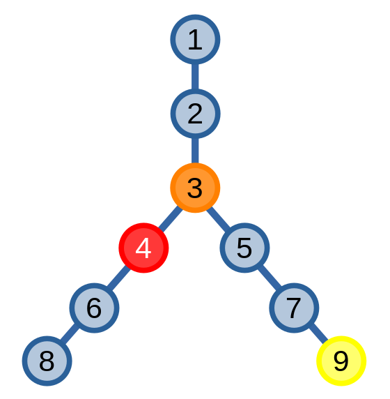
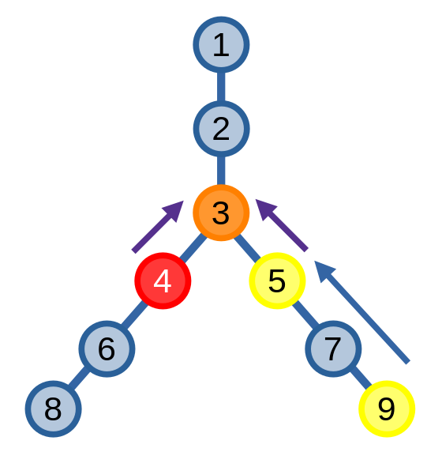
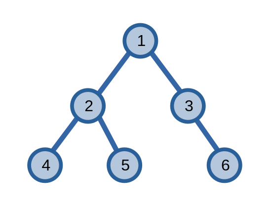
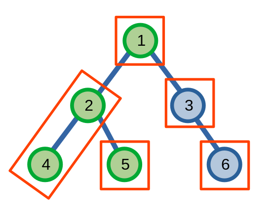
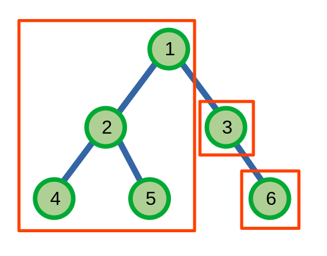

# Tổ tiên chung gần nhất

Cho hai đỉnh \\(u\\) và \\(v\\) trên một cây, **tổ tiên chung gần nhất (lowest common ancestor - LCA)** từ giờ sẽ gọi là **LCA**, của hai đỉnh này là một đỉnh xa đỉnh gốc nhất là tổ tiên của cả \\(u\\) và \\(v\\).

<center>

</center>

Ở ví dụ trên, ta thầy LCA của hai đỉnh \\(4\\) và \\(9\\) là đỉnh \\(3\\).

Ta cũng định nghĩa một đỉnh là tổ tiên của chính nó, để nếu \\(u\\) là hậu duệ của đỉnh \\(v\\) thì tổ tiên chung gần nhất của hai đỉnh sẽ là \\(v\\).

Ta sẽ bàn về một số phương pháp để tìm LCA.

## Phương pháp 1

Đâu là một phương pháp đơn giản để tìm LCA của hai đỉnh \\(u\\) và \\(v\\).

Ta có hai con trỏ chỉ vào hai đỉnh của cây. Đầu tiên, ta di chuyển con trỏ ở đỉnh có chiều cao lớn hơn lên trên sao cho nó chỉ đến đỉnh có chiều cao bằng con trỏ còn lại. Sau đó, ta đồng thời di chuyển hai con trỏ cho tới khi cả hai con trỏ đều chỉ vào một đỉnh. Đỉnh này sẽ là LCA của hai đỉnh \\(u\\) và \\(v\\).

<center>

</center>

```C++
int lca(int u, int v){
	if(h[u] < h[v]) swap(u, v);
	while(h[u] != h[v]) u = par[u];
	while(u != v) u = par[u], v = par[v];
	return u;
}
```

Độ phức tạp của thuật toán này là \\(O(k)\\) với \\(k\\) là số lần di chuyển của con trỏ. Trường hợp tệ nhất của phương pháp này là \\(O(n)\\) khi nó có thể phải di chuyển cả một đoạn tương đương với số lượng đỉnh có trong cây.

Ta sẽ sử dụng phương pháp **nâng nhị phân (binary lifting)** để tối ưu việc di chuyển của con trỏ.

### Nâng nhị phân

Kĩ thuật **nâng nhị phân (binary lifting)** là một kĩ thuật được dùng để giải quyết bài toán *tìm tổ tiên thứ \\(k\\)* của một đỉnh \\(u\\). Ta có một hàm chỉ tổ tiên thứ \\(k\\) của một đỉnh \\(u\\) là \\(ancestor(u, k)\\). Ở hình ví dụ ở trên, ta có \\(ancestor(8, 2) = 4\\), \\(ancestor(3, 1) = 2\\),...

Ta có thể áp dụng kĩ thuật chia \\(k\\) ra thành các lũy thừa của \\(2\\) giống như ở [bảng thưa](../data-structures/sparse-table.md), từ đó giúp tìm kiếm nhanh hơn, ví dụ.

\\[ancestor(u, 7) = ancestor(ancestor(ancestor(u, 1), 2), 4)\\]

```C++
sp[K][N]; // sp[k][u] = ancestor(u, 2^k)
          // nếu 2^k > h[u] thì sp[k][u] = 0
int n;

// xây dựng bảng thưa
void build(){
	for(int i = 1; i <= n; ++i){
		sp[0][i] = par[i]; // par[i] là đỉnh cha của đỉnh i
	}
	for(int k = 1; (1 << k) <= n; ++k){
		for(int i = 1; i <= n; ++i) {
			sp[k][i] = sp[k - 1][sp[k - 1][i]];
		}
	}
}


int ancestor(int u, int k){
	for(int i = 0; (1 << i) <= k; ++i){
		if((k >> i) & 1) u = sp[i][u];
	}
	return u;
}
```

Áp dụng kĩ thuật nâng nhị phân, ta có thể giảm độ phức tạp của phương pháp tìm LCA xuống còn \\(O(\log{n})\\).

```C++
int lca(int u, int v){
	if(h[u] < h[v]) swap(u, v);
	u = ancestor(u, h[u] - h[v]); 

	// h[u] == h[v]
	if(u == v) return u;

	// nhảy đến đỉnh gần nhất không phải LCA
	for(int i = __lg(h[u]); i >= 0; --i){
		// nhảy lên đỉnh có chiều cao lớn hơn LCA
		if(sp[i][u] != sp[i][v]){ 
			u = sp[i][u];
			v = sp[i][v];
		}
	}

	return par[u]; // LCA
}
```

## Phương pháp 2

## Thuật toán offline tìm LCA của Tarjan

Thuật toán tìm LCA của Tarjan có thể tìm LCA của các cặp đỉnh. Thuật toán của Tarjan là một thuật toán *offline*, tức là thuật toán phải biết trước được rằng nó sẽ phải tìm LCA của các cặp đỉnh nào.

Ta sử dụng [DSU](./data-structures/dsu.md). Đầu tiên, mỗi đỉnh của cây sẽ tương đương với một tập hợp. Sau đó, ta sẽ thực hiện duyêt cây bằng [DFS](dfs.md). Với mỗi lần duyệt DFS một đỉnh \\(u\\), ta sẽ thực hiện DFS trên các cây con gốc \\(x\\). Sau mỗi lần duyệt DFS trên các cây con, ta thực hiện `Union(u, x)`. Khi hoàn tất việc duyệt các cây con, ta có thể tìm được LCA của hai đỉnh \\((u, v)\\) chính là đỉnh có chiều cao nhỏ nhất trong tập hợp chứa đỉnh \\(v\\), nếu đỉnh \\(v\\) đã được thăm khi duyệt DFS.

Giả sử ta có một cây sau, và ta muốn tìm LCA của các cặp đỉnh \\(4, 5\\) và \\(5, 6\\).

<center>

</center>

Khi duyệt DFS đến đỉnh \\(5\\), cây sẽ có dạng sau: các đỉnh màu xanh dương là các đỉnh chưa được duyệt còn các đỉnh màu đỏ là các đỉnh đã thăm duyệt, các đỉnh nằm trong mỗi ô có đường màu đỏ là các đỉnh thuộc cùng một tập hợp. 

<center>

</center>

Ta có đỉnh có chiều cao nhất trong tập hợp chứa đỉnh \\(4\\) là \\(2\\) nên LCA của \\((4, 5)\\) sẽ là đỉnh \\(2\\).

Tiếp theo khi duyệt đến đỉnh \\(6\\), cây sẽ có dạng:

<center>

</center>

Cũng với lập luận tương tự, ta có LCA của \\((5, 6)\\) sẽ là đỉnh \\(1\\).

Độ phức tạp của thuật toán này sẽ bằng độ phức tạp khi duyệt DFS: \\(O(m + n)\\).

```C++
vector<int> qry[N];
int ancestor[N];
bitset<N> vst;
int n;
UnionFind dsu; // CTDL dsu

// hàm dfs: OLCA = Oflline LCA
void OLCA(int u, int p){
	vst[u] = 1;
	ancestor[u] = u;
	for(int v : adj[u]){
		if(v == p) continue;
		OLCA(v, u); // xử lí cây con
		dsu.Union(u, v); // Union tập hợp chứa đỉnh cha và tập hợp chứa đỉnh con
		ancestor[dsu.find(u)] = u; // đỉnh có chiều cao nhỏ nhất trong tập hợp chứa đỉnh u
	}
	for(int v : qry[u]){
		if(vst[v]){
			cout << "LCA(" << u << ", " << v << "): " << ancestor[dsu.find(v)] << '\n';
		}
	}
}
void lca(){
	// for (truy vấn (u, v) : các truy vấn){
	//		qry[u].push_back(v);	
	//		qry[v].push_back(u);	
	// }

	dsu = UnionFind(n);

	// các đỉnh được đánh số từ 0 đến n - 1
	OLCA(0, -1);
}
```