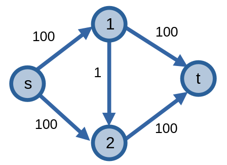
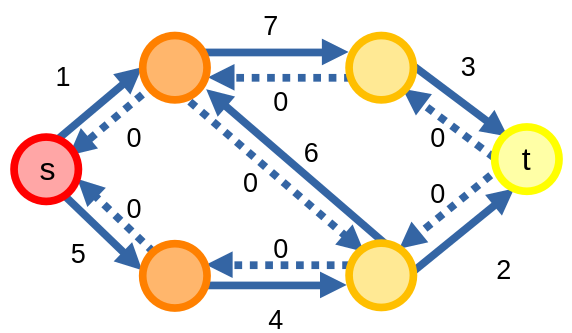

# Các thuật toán tìm luồng cực đại trên mạng

Có rất nhiều thuật toán khác nhau có thể giúp ta giải quyết được bài toán tìm [luồng cực đại trên mạng](flow-network.md#luồng-cực-đại-và-lát-cắt-cực-tiểu). Ta sẽ tập trung vào các thuật toán dựa trên phương pháp Ford-Fulkerson.

Các thuật toán được liệt kê dưới đây thực hiện cho luồng với giá trị nguyên dương đi qua các cạnh.

## Phương pháp Ford-Fulkerson

**Phương pháp Ford-Fulkerson** là một phương pháp [*tham lam*](../paradigms/greedy.md) tìm luồng cực đại trên mạng.

Cách mà phương pháp này tìm luồng cực đại trên mạng khá là đơn giản: nếu mạng tồn tại đường tăng luồng, ta tăng luồng trên mạng. Quá trình này sẽ lặp lại cho tới khi ta không được đường tăng luồng nào trên mạng nữa nữa, và giá trị của luồng cực đại trên mạng đã được tìm thấy.

Phương pháp Ford-Fulkerson không đề cập về cách mà ta tìm được những đường tăng luồng, vì thế ta cần phải tự viết các thuật toán dựa trên phương pháp này để giải quyết bài toán.

Khi cài đặt chương trình tìm luồng cực đại trên mạng bằng phương pháp Ford-Fulkerson, người ta thường dùng thuật toán [DFS](dfs.md) để tìm kiếm các đường tăng luồng. Ta gọi cài đặt dưới đây là *thuật toán* Ford-Fulkerson.

```C++
struct FordFulkerson{
    struct Edge{
        int u, v; ll c;
        Edge(){}
        Edge(int _u, int _v, ll _c) : u(_u), v(_v), c(_c) {}
    };
    vector<vector<int>> adj;
    vector<Edge> edge;
    vector<ll> vst; ll cnt;
    int n;
    int s, t;

    FordFulkerson(){}
    FordFulkerson(int _n, int _s, int _t): n(_n), s(_s), t(_t), adj(_n), vst(_n, 0) {
        edge.clear();
        cnt = 0; // lần tìm đường tăng luồng thứ cnt
    }

    void addEdge(int u, int v, ll c, ll bc = 0){
        adj[u].emplace_back(edge.size()); edge.emplace_back(Edge(u, v, c));
        adj[v].emplace_back(edge.size()); edge.emplace_back(Edge(v, u, bc));
    }

    void edgeflow(int id, ll flow){
        edge[id].c -= flow; 
        edge[id ^ 1].c += flow; 
    }

    ll dfs(int u, ll bottleneck = LLONG_MAX){
        // tìm đường tăng luồng
        if(vst[u] == cnt) return 0;  // đã đi đến đỉnh đã thăm
        if(u == t) return bottleneck; // tìm thấy đường tăng luồng
        vst[u] = cnt; // thăm đỉnh u khi tìm đường tăng luồng thứ cnt
        int v; ll tmp, c;
        for(int id : adj[u]){
            v = edge[id].v, c = edge[id].c;
            if(c > 0){
                tmp = dfs(v, min(bottleneck, c));
                if(tmp > 0){ // tìm thấy đường tăng luồng
                    edgeflow(id, tmp); // tăng luồng
                    return tmp;
                }
            }
        }
        return 0; // không tìm thấy đường tăng luồng
    }

    ll maxflow(){
        ll flow = 0;
        ll bottleneck;
        while((++cnt, bottleneck = dfs(s)) > 0){ // tìm thấy đường tăng luồng thứ cnt
            flow += bottleneck;
        }
        return flow;
    }
};
```

Việc tìm các đường tăng luồng bằng DFS bằng \\(O(|E|)\\), và số lượng đường tăng luồng tối ta có thể tìm được là \\(O(v(f^\*))\\), nên độ phức tạp của phương pháp Ford-Fulkerson là \\(O(v(f^\*)|E|)\\).

Sở dĩ độ phức tạp có dạng như vậy là bởi sẽ có những trường hợp mà thuật toán sẽ chọn những đường tăng luồng không thật sự tối ưu.

Ta có mạng sau.

<center>

</center>

Trong trường hợp này, thuật toán có thể chọn \\(2\\) đường tăng luồng \\(P_1 = (s, 1, t)\\) và \\(P_2 = (s, 2, t)\\), và luồng cực đại trên mạng có thể được tìm thấy bởi hai đường tăng luồng này. Trong những trường hợp xui xẻo hơn, thuật toán có thể chọn \\(2\\) đường tăng luồng \\(P_3 = (s, 1, 2, t)\\) và \\(P_4 = (s, 2, 1, t)\\). Với hai đường tăng luồng này, thuật toán sẽ phải luân phiên chọn một trong hai đường tăng luồng \\(P_3\\) hoặc \\(P_4\\) để tăng luồng mạng, làm số thao tác cần thực hiện.

## Thuật toán Edmonds-Karp

**Thuật toán Edmonds-Karp** là thuật toán tìm luồng cực đại trên mạng, áp dụng phương pháp Ford-Fulkerson. Thuật toán Edmonds-Karp chọn các đường tăng luồng sao cho đường tăng luồng ấy là con đường ngắn nhất trong tất cả các đường tăng luồng tồn tại trên mạng.

Ta sử dụng thuật toán [BFS](bfs.md) để tìm các đường tăng luồng ngắn nhất. 

```C++
struct EdmondsKarp{
    struct Edge{
        int u, v; ll c;
        Edge(){}
        Edge(int _u, int _v, ll _c) : u(_u), v(_v), c(_c) {}
    };
    vector<vector<int>> adj;
    vector<Edge> edge;
    vector<pair<int, int>> p; 
    vector<ll> vst; ll cnt;
    int n;
    int s, t;

    EdmondsKarp(){}
    EdmondsKarp(int _n, int _s, int _t): n(_n), s(_s), t(_t), adj(_n), vst(_n, 0), p(_n) {
        edge.clear();
        cnt = 0;
    }

    void addEdge(int u, int v, ll c, ll bc = 0){
        adj[u].emplace_back(edge.size()); edge.emplace_back(Edge(u, v, c));
        adj[v].emplace_back(edge.size()); edge.emplace_back(Edge(v, u, bc));
    }

    void edgeflow(int id, ll flow){
        edge[id].c -= flow; 
        edge[id ^ 1].c += flow; 
    }

    ll bfs(){
        // tìm đường tăng luồng
        queue<pair<int, ll>> q;
        vst[s] = ++cnt;
        q.push({s, LLONG_MAX});
        int u, v; ll bottleneck, c, tmp;

        while(q.size()){
            tie(u, bottleneck) = q.front(); q.pop();
            for(int id : adj[u]){
                v = edge[id].v;
                c = edge[id].c;
                if(vst[v] != cnt && c > 0){
                    vst[v] = cnt;
                    p[v] = make_pair(u, id);
                    tmp = min(bottleneck, c);
                    if(v == t) return tmp; // tìm thấy đường tăng luồng
                    q.push({v, tmp});
                }
            }
        }

        return 0; // không tìm thấy đường tăng luồng
    }

    ll maxflow(){
        ll flow = 0;
        ll bottleneck;
        while((bottleneck = bfs()) > 0){ // tìm thấy đường tăng luồng
            // tăng luồng
            flow += bottleneck; 
            for(int cur = t; cur != s; cur = p[cur].first) {
                edgeflow(p[cur].second, bottleneck);
            }
        }
        return flow;
    }
};
```

Độ phức tạp của thuật toán Edmonds-Karp sẽ bằng \\(O(|V||E|^2)\\). Lợi thế lớn nhất của thuật toán Edmonds-Karp so với cách cài đặt của phương pháp Ford-Fulkerson chính là thuật toán không còn phụ thuộc vào giá trị luồng cực đại trên mạng nữa, một điều sẽ có lợi cho ta nếu giá trị luồng cực đại trên mạng là vô cùng lớn. 

## Thuật toán Dinic

**Thuật toán Dinitz** hoặc **Dinic** là thuật toán tìm luồng cực đại trên mạng, áp dụng phương pháp Ford-Fulkerson. Trong lập trình thi đấu, thuật toán này được coi là thuật toán *mặc định* để tìm luồng cực đại trên mạng. 

Thuật toán Dinic giống như thuật toán Edmonds-Karp ở chỗ nó sẽ tìm các đường tăng luồng ngắn nhất, nhưng cách mà thuật toán tìm những đường này sẽ khác đi đôi chút.

Đầu tiên, thuật toán sẽ gán các các đỉnh trong mạng một giá trị theo **tầng** của các đỉnh, được xác định bằng khoảng cách từ đỉnh nguồn \\(s\\) đến đỉnh đó, sử dụng các cạnh có sức chứa thặng dư dương trong đồ thị thặng dư. 

<center>

</center>

Tiếp theo, thuật toán sẽ tìm các đường tăng luồng \\(P\\) thỏa mãn điều kiện rằng với mỗi đỉnh trong đường tăng luồng trừ đỉnh cuối, đỉnh tiếp theo sẽ có giá trị tầng lớn hơn \\(1\\).

Thuật toán sẽ tiếp tục tìm các đường tăng luồng cho tới khi xuất hiện **luồng chặn (blocking flow)** - xảy ra khi không còn đường tăng luồng thỏa mãn điều kiện đã nói ở trên. Khi này, thuật toán quay trở lại bước đầu tiên.

Thuật toán sẽ kết thúc khi đã tìm được luồng cực đại trên mạng.

```C++
struct Dinic{
    struct Edge{
        int u, v; ll c;
        Edge(){}
        Edge(int _u, int _v, ll _c) : u(_u), v(_v), c(_c) {}
    };
    vector<vector<int>> adj;
    vector<Edge> edge;
    vector<int> lvl, idx;
    queue<int> q;
    int n;
    int s, t;

    Dinic(){}
    Dinic(int _n, int _s, int _t): n(_n), s(_s), t(_t), adj(_n), idx(_n), lvl(_n) {
        edge.clear();
    }

    void addEdge(int u, int v, ll c, ll bc = 0){
        adj[u].emplace_back(edge.size()); edge.emplace_back(Edge(u, v, c));
        adj[v].emplace_back(edge.size()); edge.emplace_back(Edge(v, u, bc));
    }

    void edgeflow(int id, ll flow){
        edge[id].c -= flow; 
        edge[id ^ 1].c += flow; 
    }

    bool bfs(){
        fill(lvl.begin(), lvl.end(), -1);
        lvl[s] = 0;
        q.push(s);
        int u, v;
        while(q.size()){
            u = q.front(); q.pop();
            
            // một bước tối ưu nhỏ: nếu tầng của đỉnh u
            // lớn hơn tầng của đỉnh t thì bỏ qua đỉnh đó
            if(lvl[t] != -1 && lvl[u] >= lvl[t]) continue;  

            for(int id : adj[u]){
                v = edge[id].v;
                if(lvl[v] == -1 && edge[id].c > 0) { 
                    lvl[v] = lvl[u] + 1;
                    q.push(v);
                }
            }
        }
        return lvl[t] != -1; // trả về nếu tồn tại đường tăng luồng
    }

    ll dfs(int u, ll bottleneck = LLONG_MAX){
        // tìm đường tăng luồng
        if(bottleneck == 0) return 0; // không phải đường tăng luồng
        if(u == t) return bottleneck; // tìm thấy đường tăng luồng
        int v, id; ll tmp;
        for (int& ptr = idx[u]; ptr < (int)adj[u].size(); ++ptr) {
            id = adj[u][ptr]; v = edge[id].v;
            if(lvl[u] + 1 == lvl[v] && edge[id].c > 0){
                tmp = dfs(v, min(bottleneck, edge[id].c));
                if(tmp){ // tìm thấy đường tăng luồng
                    edgeflow(id, tmp); // tăng luồng
                    return tmp;
                }
            }
        }
        return 0; // không tìm thấy đường tăng luồng
    }
    
    ll maxflow(){
        ll flow = 0;
        ll bottleneck;
        while(bfs()) { // tồn tại đường tăng luồng
            fill(idx.begin(), idx.end(), 0);
            while((bottleneck = dfs(s)) > 0){ // tìm thấy đường tăng luồng
                flow += bottleneck;
            }
        }
        return flow;
    }
};
```

Độ phức tạp của thuật toán Dinic là \\(O(|V|^2|E|)\\). 

Thuật toán Dinic sẽ tối ưu hơn so với thuật toán Edmonds-Karp trong nhiều trường hợp, bởi đối với hầu hết các mạng: \\(|E| \gt |V|\\), suy ra \\(O(|V|^2|E|) \lt O(|V||E|^2)\\).

## Capacity scaling

**Capacity scaling** là một phương pháp giải quyết bài toán tìm luồng cực đại trên mạng. 

Quay lại với ví dụ về trường hợp xấu nhất ở phương pháp Ford-Fulkerson, ta thấy rằng thuật toán sẽ có khả năng chọn những đường tăng luồng có điểm nghẽn thấp (như \\(P_3, P_4\\)). Vậy nếu như ta chỉ xét một số đường tăng luồng nhất định thì sao?

<center>

</center>

Ta có một số \\(\Delta\\). Sau khi chọn giá trị của \\(\Delta\\), ta sẽ thực hiện việc tìm những đường tăng luồng có điểm nghẽn lớn hoặc bằng giá trị này, và gửi \\(\Delta\\) luồng qua đường tăng luồng. Khi này, những đường tăng luồng có giá trị lớn hơn sẽ được chọn, và thuật toán của ta sẽ trở nên tối ưu hơn. Ví dụ, nếu ta chọn \\(\Delta = 100\\) và thực hiện tìm đường tăng luồng trên mạng, thì thuật toán chỉ có thể chọn một trong hai đường tăng luồng \\(P_1\\) và \\(P_2\\), và việc tìm luồng cực đại trên mạng cho mạng này sẽ nhanh hơn nhiều.

Sau khi không còn đường tăng luồng nào có điểm nghẽn lớn hơn hoặc bằng \\(\Delta\\), ta giảm \\(\Delta\\) (thường là giảm đi một nửa: \\(\Delta = \frac{\Delta}{2}\\)) và tiếp tục quá trình.

Đối với các mạng có sức chứa các cung là số nguyên, ta chọn \\(\Delta = 2^{\left\lfloor \log_2{U} \right\rfloor}\\), với \\(U\\) là cung có sức chứa lớn nhất, và việc giảm \\(\Delta\\) sẽ tiếp tục cho tới khi \\(\Delta = 1\\).

Độ phức tạp của phương pháp capacity scaling là \\(O(|E|^2 \log{U})\\). Nếu ta áp dụng phương pháp này với các thuật toán như Edmonds-Karp hoặc Dinic thì độ phức tạp sẽ bằng \\(O(|V||E| \log{U})\\).

Dưới đây là thuật toán Ford-Fulkerson áp dụng capacity scaling.

```C++
struct CapacityScaling{
    struct Edge{
        int u, v; ll c;
        Edge(){}
        Edge(int _u, int _v, ll _c) : u(_u), v(_v), c(_c) {}
    };
    vector<vector<int>> adj;
    vector<Edge> edge;
    vector<ll> vst; ll cnt;
    int n;
    int s, t;
    ll U;
    CapacityScaling(){}
    CapacityScaling(int _n, int _s, int _t): n(_n), s(_s), t(_t), adj(_n), vst(_n, 0) {
        edge.clear();
        cnt = 0;
        U = 0;
    }

    void addEdge(int u, int v, ll c, ll bc = 0){
        adj[u].emplace_back(edge.size()); edge.emplace_back(Edge(u, v, c));
        adj[v].emplace_back(edge.size()); edge.emplace_back(Edge(v, u, bc));
        U = max(U, max(c, bc));
    }

    void edgeflow(int id, ll flow){
        edge[id].c -= flow; 
        edge[id ^ 1].c += flow; 
    }

    bool dfs(int u, ll delta){
        // tìm đường tăng luồng
        if(vst[u] == cnt) return false; // đi đến cạnh đã thăm
        if(u == t) return true; // tìm thấy đường tăng luồng
        vst[u] = cnt;
        int v; ll c;
        for(int id : adj[u]){
            v = edge[id].v, c = edge[id].c;
            if(c >= delta && dfs(v, delta)){
                edgeflow(id, delta);
                return true; // tìm thấy đường tăng luồng
            }
        }
        return false; // không tìm thấy đường tăng luồng
    }

    ll maxflow(){
        ll flow = 0;
        for(int i = __lg(U); i >= 0; --i){ // capacity scaling
            while( (++cnt, dfs(s, (1ll << i))) ){ // tìm thấy đường tăng luồng thứ cnt
                flow += (1ll << i);
            }
        }
        return flow;
    }
};
```

Còn đây là thuật toán Dinic áp dụng capacity scaling.

```C++
struct DinicScaling{
    struct Edge{
        int u, v; ll c;
        Edge(){}
        Edge(int _u, int _v, ll _c) : u(_u), v(_v), c(_c) {}
    };
    vector<vector<int>> adj;
    vector<Edge> edge;
    vector<int> lvl, idx;
    queue<int> q;
    int n;
    int s, t;
    ll U;

    DinicScaling(){}
    DinicScaling(int _n, int _s, int _t): n(_n), s(_s), t(_t), adj(_n), idx(_n), lvl(_n) {
        edge.clear();
        U = 0;
    }

    void addEdge(int u, int v, ll c, ll bc = 0){
        adj[u].emplace_back(edge.size()); edge.emplace_back(Edge(u, v, c));
        adj[v].emplace_back(edge.size()); edge.emplace_back(Edge(v, u, bc));
        U = max(U, max(c, bc));
    }

    void edgeflow(int id, ll flow){
        edge[id].c -= flow; 
        edge[id ^ 1].c += flow; 
    }

    bool bfs(ll delta){
        fill(lvl.begin(), lvl.end(), -1);
        lvl[s] = 0;
        q.push(s);
        int u, v;
        while(q.size()){
            u = q.front(); q.pop();
            if(lvl[t] != -1 && lvl[u] >= lvl[t]) continue;  

            for(int id : adj[u]){
                v = edge[id].v;
                if(lvl[v] == -1 && edge[id].c >= delta) { 
                    lvl[v] = lvl[u] + 1;
                    q.push(v);
                }
            }
        }
        return lvl[t] != -1;
    }

    bool dfs(int u, ll delta){
        // tìm đường tăng luồng
        if(u == t) return true; // tìm thấy đường tăng luồng
        int v, id;
        for (int& ptr = idx[u]; ptr < (int)adj[u].size(); ++ptr) {
            id = adj[u][ptr]; v = edge[id].v;
            // tìm thấy đường tăng luồng
            if(lvl[u] + 1 == lvl[v] && edge[id].c >= delta && dfs(v, delta)){ 
                edgeflow(id, delta); // tăng luồng
                return true; // tìm thấy đường tăng luồng
            }
        }
        return false; // không tìm thấy đường tăng luồng
    }
    
    ll maxflow(){
        ll flow = 0;
        for(int i = __lg(U); i >= 0; --i){ // capacity scaling
            ll delta = (1ll << i);
            while(bfs(delta)) { // tồn tại đường tăng luồng
                fill(idx.begin(), idx.end(), 0);
                while(dfs(s, delta)){ // tìm thấy đường tăng luồng
                    flow += delta;
                }
            }
        }
        return flow;
    }
};
```

