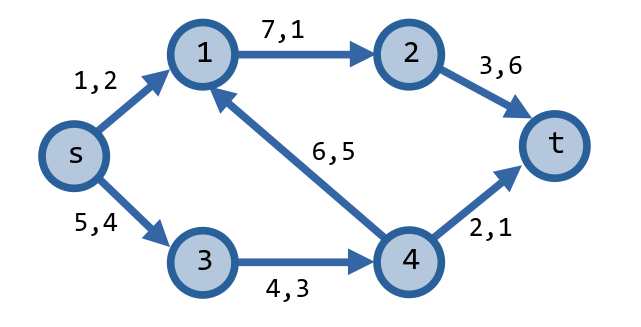
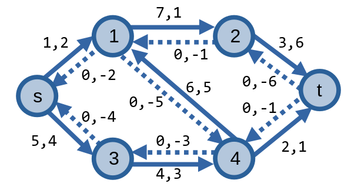

# Luồng với chi phí cực tiểu

*Được xuất hiện trên [VNOI Wiki](https://wiki.vnoi.info/algo/graph-theory/min-cost-flow)*

<br>

Bài toán luồng với chi phí cực tiểu là các bài toán yêu cầu ta phải gửi luồng trên mạng với chi phí nhỏ nhất có thể.

## Mạng

Giả sử ta được cho một mạng **mạng (network)** là một đồ thị có hướng \\(G = (V, E)\\) gồm các đỉnh và các cung nối các đỉnh lại với nhau. Mỗi cung \\(e\\) trên mạng sẽ có hai trọng số \\(c(e)\\) và \\(a(e)\\) chỉ lượng luồng có thể đi qua và chi phí khi gửi một đơn vị luồng đi qua cung này.

<center>

<p>Số bên trái là sức chứa, số bên phải là chi phí</p>
</center>

Nhiệm vụ của ta khi gửi luồng \\(f\\) trên mạng, ta cần cực tiểu hoá chi phí gửi luồng từ đỉnh nguồn \\(s\\) đến đỉnh thu \\(t\\).

\\[min \sum_{e \in E} f(e)a(e)\\]

## Bài toán

Ta có bài toán sau: Cho một mạng \\(G = (V, E)\\), tìm [luồng cực đại trên mạng](flow-network.md#luồng-cực-đại-và-lát-cắt-cực-tiểu) với chi phí cực tiểu. 

Ta sẽ xây dựng thuật toán giải quyết bài toán này dựa theo phương pháp [Ford-Fulkerson](max-flow-algorithms.md#phương-pháp-ford-fulkerson).

### Đồ thị thặng dư

Để xây dựng [đồ thị thặng dư](flow-network.md#Đồ-thị-thặng-dư) \\(G^f\\) cho mạng \\(G\\), ta cần tạo một đồ thị có hướng sao cho:
- **Đỉnh**: Các đỉnh có trong \\(G\\) đều có trong \\(G^f\\), hay \\(G^f(V) = G(V)\\).
- **Cạnh xuôi**: Với mỗi cung \\(uv\\) có trong \\(G\\), sẽ tồn tại một cạnh có hướng \\(uv\\) trong \\(G^f\\) có sức chứa thặng dư bằng \\(c^f(uv) = c(uv) - f(uv)\\) và có chi phí bằng \\(a(uv)\\). 
- **Cạnh ngược**: Với mỗi cung \\(uv\\) có trong \\(G\\), sẽ tồn tại một cạnh có hướng \\(vu\\) trong \\(G^f\\) có sức chứa thặng dư bằng \\(c^f(vu) = f(uv)\\) và có chi phí bằng \\(-a(uv)\\). 

<center>

</center>

Sở dĩ ta cho cạnh ngược có chi phí \\(-a(uv)\\) là bởi cạnh ngược là các cạnh được dùng để huỷ luồng đi qua cung trên mạng, và vì luồng đã bị huỷ nên ta cũng loại bỏ chi phí khi đi qua cung ấy. 

### Đường tăng luồng

Các thuật toán áp dụng phương pháp Ford-Fulkerson khi tìm luồng cực đại sẽ thực hiện tăng luồng với mỗi đường tăng luồng trên mạng mà nó tìm được sau mỗi bước. 

Để cực tiểu hoá chi phí, ta cần tìm đường tăng luồng có chi phí gửi luồng **_nhỏ nhất có thể_** ở mỗi bước để cực tiểu hoá chi phí. Việc tìm những đường tăng luồng này có thể được thực hiện bằng các thuật toán tìm đường đi ngắn nhất xử lí được trường hợp cạnh có trọng số âm như thuật toán [Bellman-Ford](bellman-ford.md) hoặc thuật toán [Dijkstra](dijkstra.md#dijkstra-trên-đồ-thị-có-trọng-số-âm) sửa đổi. Ở đây, ta sẽ sử dụng thuật toán [Johnson](https://en.wikipedia.org/wiki/Johnson's_algorithm).

### Thuật toán

Trước khi nói về phần cài đặt thuật toán, ta sẽ giới thiệu về thuật toán Johnson.

#### Thuật toán Johnson

Thuật toán Johnson là thuật toán tìm đường đi ngắn nhất giữa *mọi cặp đỉnh* trên đồ thị có hướng. Tuy nhiên, vì bài toán chỉ yêu cầu ta tìm đường tăng luồng với chi phí nhỏ nhất nên thuật toán sẽ được mô tả một cách đơn giản hơn.

Thuật toán bắt đầu bằng việc gán mỗi đỉnh \\(u\\) trên mạng một giá trị \\(\pi(u)\\) bằng giá trị của đường đi ngắn nhất từ đỉnh \\(s\\) đến đỉnh \\(u\\). Sau đó, ta cập nhật trọng số \\(w(uv)\\) của các cung trên đồ thị bằng giá trị mới \\(w(uv) + (\pi(u) - \pi(v))\\). Ta có thể chứng minh trọng số mới trên các cung sẽ có giá trị không âm bằng bất đẳng thức tam giác (xem ba đỉnh \\(s, u, v\\) là ba đỉnh của một tam giác với độ dài ba cạnh \\(su = \pi(u), sv = \pi(v), uv = w(uv)\\)).

Sau khi tìm đường đi ngắn nhất từ \\(s\\) đến \\(t\\) trên đồ thị có các trọng số mới này, ta có thể tìm lại giá trị của đường đi ngắn nhất trên đồ thị gốc bằng cách trừ đi \\(\pi(u) - \pi(v)\\) với mỗi cạnh \\(uv\\) trên đường đi ngắn nhất, hoặc chỉ cần trừ đi \\(\pi(s) - \pi(t)\\). Ta có thể chứng minh được rằng đường đi ngắn nhất từ \\(s\\) đến \\(t\\) trên đồ thị với các trọng số mới cũng là đường đi ngắn nhất từ \\(s\\) đến \\(t\\) trên đồ thị gốc.

> [!NOTE]
> **Chứng minh:**
>
> Ta có \\(p = (s, p_1, p_2, \dots, p_k, t)\\) là một đường đi ngắn nhất trên đồ thị có trọng số mới. Giá trị của đường đi trên đồ thị bằng:
> 
> \\(w(p) = (w(s, p_1) + \pi(s) - \pi(p_1)) + (w(p_1, p_2) + \pi(p_1) - \pi(p_2)) + \dots + (w(p_k, t) + \pi(p_k) - \pi(t))\\)
> 
> Công thức trên tương đương với:
> 
> \\(w(p) = (w(s, p_1) + w(p_1, p_2) + \dots + w(p_k, t)) + \pi(s) - \pi(t)\\)
> 
> Vì \\(\pi(s)\\) và \\(\pi(t)\\) không phụ thuộc vào \\(p\\) nên ta có thể kết luận rằng \\(p\\) cũng là đường đi ngắn nhất trên đồ thị gốc.

Về độ phức tạp của thuật toán Johnson: ở bước đầu tiên, vì đồ thị có các trọng số âm nên ta sử dụng thuật toán [Bellman-Ford](bellman-ford.md). Ở bước thứ hai, vì giá trị của các trọng số mới không âm, ta sử dụng thuật toán nhanh hơn để giải quyết - thuật toán [Dijkstra](dijkstra.md). Độ phức tạp của Bellman-Ford và Dijkstra lần lượt là \\(O(mn)\\) và \\(O(m\log{n})\\) nên độ phức tạp của thuật toán sẽ bằng \\(O(nm + m\log{n})\\).

#### Cài đặt

Khi áp dụng thuật toán Johnson để tìm các đường tăng luồng, bước một chỉ cần thực hiện một lần như một bước tiền xử lí khi mạng có trọng số âm, còn bước hai sẽ thực hiện một hoặc nhiều lần để tìm các đường tăng luồng ấy. 

Ta có thể hiểu rõ hơn về cách áp dụng qua chương trình mẫu dưới đây.

```C++
struct MinCostFlow{
    struct Edge{
        int u, v; ll c, w; // c(uv) = c, a(uv) = w
        Edge(){}
        Edge(int _u, int _v, ll _c, ll _w) : u(_u), v(_v), c(_c), w(_w) {}
    };
    const ll INF = 1e18;
    vector<vector<int>> adj;
    vector<Edge> edge;
    vector<ll> pi; // giá trị pi(u) sử dụng trong thuật toán Johnson
    vector<pair<int, int>> p;
    vector<bool> vst;
    vector<ll> d;
    int n;
    int s, t;
    bool negCost = 0; // đồ thị có tồn tại cạnh có chi phí âm

    MinCostFlow(){}
    MinCostFlow(int _n, int _s, int _t): 
        n(_n), s(_s), t(_t), adj(_n), vst(_n), pi(_n, 0), p(_n), d(_n) {
        // các đỉnh được đánh số từ 0 đến n - 1
        edge.clear();
    }

    void addEdge(int u, int v, ll c, ll w, ll bc = 0){
        adj[u].emplace_back(edge.size()); edge.emplace_back(Edge(u, v, c, w));
        adj[v].emplace_back(edge.size()); edge.emplace_back(Edge(v, u, bc, -w));
        negCost |= (w < 0); // kiểm tra nếu chí phí âm
    }

    void edgeflow(int id, ll flow){
        edge[id].c -= flow;
        edge[id ^ 1].c += flow;
    }

    void bellmanford(){
        // thực hiện tiền xử lí khi mạng tồn tại cạnh có chi phí âm
        if(!negCost) return;
        fill(pi.begin(), pi.end(), INF);
        pi[s] = 0;
        for(int i = 1; i < n; ++i){
            bool upd = 0;
            for(Edge &e: edge){
                if(pi[e.u] + e.w < pi[e.v]){
                    pi[e.v] = pi[e.u] + e.w;
                    upd = 1;
                }
            }
            if(!upd) break;
        }
    }

    pair<ll, ll> dijkstra(){
        // tìm đường tăng luồng
        fill(vst.begin(), vst.end(), 0);
        fill(d.begin(), d.end(), INF);
        d[s] = 0;
        priority_queue<pair<ll, int>> pq;
        pq.push({0, s});
        int u, v; ll w, tmp;
        while (!pq.empty()) {
            tie (tmp, u) = pq.top(); pq.pop(); 
            if(vst[u]) continue;
            vst[u] = 1;
            for(int id : adj[u]){
                v = edge[id].v; w = edge[id].w + pi[u] - pi[v];
                if(edge[id].c > 0 && d[u] + w < d[v]){
                    d[v] = d[u] + w;
                    p[v] = {u, id};
                    pq.push({-d[v], v});
                }   
            }
        }
        for(int i = 0; i < n; ++i) pi[i] = min(pi[i] + d[i], INF); // cập nhật giá trị

        if(!vst[t]) return {-1, -1}; // không tìm thấy đường tăng luồng
        // tìm thấy đường tăng luồng
        // tìm điểm nghẽn và chi phí
        ll flow = INF, cost = 0;
        for(int cur = t; cur != s; cur = p[cur].first) {
            flow = min(flow, edge[p[cur].second].c);
            cost += edge[p[cur].second].w;
        }
        return {flow, cost}; 
    }

    pair<ll, ll> MinCostMaxFlow(){
        bellmanford(); // tiền xử lí
        long long flow = 0, cost = 0, bottleneck, c;
        while((tie(bottleneck, c) = dijkstra(), bottleneck) > 0){ // tìm thấy đường tăng luồng
            // tăng luồng
            flow += bottleneck; 
            cost += c * bottleneck;
            for(int cur = t; cur != s; cur = p[cur].first) {
                edgeflow(p[cur].second, bottleneck);
            }
        }
        return {flow, cost}; // {luồng cực đại, chi phí cực tiểu}
    }
};
```

Vì số lượng đường tăng luồng tối ta có thể tìm được là \\(O(v(f^\*))\\) nên khi sử dụng thuật toán Johnson để tìm đường tăng luồng, độ phức tạp của thuật toán tìm luồng cực đại với chi phí cực tiểu của ta bằng \\(O(|V||E| + v(f^\*)|E|\log{|V|})\\).

Đối với các bài toán yêu cầu ta gửi \\(K\\) đơn vị luồng trên mạng, ta có thể thêm một hàm giúp giải quyết bài toán này vào chương trình trên.

```C++
ll sendKFlow(ll k){
    bellmanford();
    ll cost = 0, bottleneck, c;
    while(k > 0 && (tie(bottleneck, c) = dijkstra(), bottleneck) > 0){ // tìm thấy đường tăng luồng
        // tăng luồng
        bottleneck = min(bottleneck, k);
        k -= bottleneck;
        cost += c * bottleneck;
        int cur = t;
        while(cur != s){
            edgeflow(p[cur].second, bottleneck);
            cur = p[cur].first;
        }
    }
    if(k != 0) return INF; // không thể gửi K luồng trên mạng
    return cost; // chi phí cực tiểu
}
```

Độ phức tạp khi này bằng \\(O(|V||E| + K|E|\log{|V|})\\).