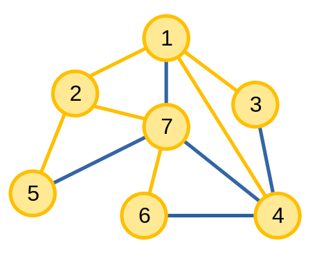

# Cây khung nhỏ nhất

Một **cây khung (spanning tree)** của một đồ thị vô hướng, liên thông \\(G\\) là một đồ thị con \\(T\\) có tất cả các đỉnh của \\(G\\) và có các cạnh của \\(G\\) sao cho các đỉnh liên thông với nhau và đồ thị không có chu trình. 

Ví dụ, các cạnh màu cam là các cạnh thuộc cây khung trong đồ thị.

<center>

</center>

Đối với đồ thị *có trọng số*, định nghĩa của một **cây khung nhỏ nhất (minimum spanning tree - MST)** là một cây khung có tổng giá trị các trọng số của các cạnh nhỏ nhất có thể.

<center>

</center>

Cây khung nhỏ nhất của đồ thị bao gồm các cạnh và các đỉnh màu cam, có tổng giá trị bằng \\(14\\).

## Tính chất

Vì là một [cây](overview.md#cây), nên cây khung sẽ có các tính chất tương tự với [cây](overview.md#cây-1).

Ngoài ra, ta có một số nhận xét:

**1.** Nếu đồ thị có \\(n\\) đỉnh, thì cây khung sẽ có \\(n - 1\\) cạnh. 

**2.** Một đồ thị có thể có nhiều hơn một cây khung. Với đồ thị ở đầu bài, ngoài cây khung trên, ta còn có các cây khung khác như:

<center>

</center>

Ta có thể tính được số lượng cây khung trên một số dạng đồ thị. Ví dụ nếu đồ thị là một cây thì đồ thị chỉ có một cây khung là chính nó, hoặc nếu đồ thị là một [đồ thị đầy đủ](overview.md#Đồ-thị-đầy-đủ) thì số cây khung của đồ thị sẽ bằng \\(n^{n - 2}\\) với \\(n\\) là số đỉnh. 

Đối với đồ thị có trọng số, nếu trọng số của các cạnh phân biệt, tức không tồn tại \\(2\\) cạnh nào có trọng số bằng nhau, thì đồ thị sẽ có *duy nhất* một cây khung nhỏ nhất.

## Tìm kiếm cây khung

Để tìm kiếm *một* cây khung trên đồ thị không trọng số, ta có thể sử dụng thuật toán [DFS hoặc BFS](graph-traversal-applications.md#xây-dựng-cây-khung-của-đồ-thị).

Đối với đồ thị có trọng số, ta có hai thuật toán phổ biến là thuật toán Kruskal và thuật toán Prim, cả hai thuật toán đều có cách tiếp cận [tham lam](../paradigms/greedy.md) với bài toán tìm cây khung nhỏ nhất.

### Thuật toán Kruskal

**Thuật toán Kruskal** là thuật toán tìm cây khung nhỏ nhất trên đồ thị vô hướng có trọng số. Thuật toán sẽ tìm các cạnh thuộc cây khung nhỏ nhất bằng cách duyệt các cạnh trên đồ thị theo trọng số tăng dần.

Thuật toán Kruskal tìm một cây khung nhỏ nhất \\(T\\) của đồ thị \\(G\\) như sau:
- Cho \\(T\\) là một [đồ thị rỗng](overview.md#Đồ-thị-đầy-đủ) với tất cả các đỉnh của \\(G\\).
- Duyệt các cạnh của \\(G\\) theo thứ tự tăng dần theo trọng số. Với mỗi cạnh \\(uv\\) có trọng số \\(w\\) trong \\(G\\):
	- Nếu \\(u\\) liên thông với \\(v\\) trên đồ thị \\(T\\), cạnh  \\(uv\\) không thuộc cây khung nhỏ nhất.
	- Nếu \\(u\\) *không* liên thông với \\(v\\) trên đồ thị \\(T\\), cạnh \\(uv\\) thuộc cây khung nhỏ nhất. Khi này ta thêm cạnh \\(uv\\) vào \\(T\\).

Ta có quá trình thực hiện thuật toán trên một đồ thị. Các cạnh màu xanh dương là các cạnh chưa được xét, các cạnh màu xanh lục là các cạnh thuộc cây khung nhỏ nhất, còn cạnh màu đỏ là các cạnh không thuộc cây khung nhỏ nhất. 

<center>

</center>

Đầu tiên, ta xét cạnh \\(\\{1, 2\\}\\) có trọng số \\(1\\). Vì \\(1\\) không liên thông với \\(2\\) nên cạnh \\(\\{1, 2\\}\\) là một cạnh thuộc cây khung nhỏ nhất.

<center>

</center>

Tiếp theo, ta xét cạnh \\(\\{2, 7\\}\\) có trọng số \\(1\\). Vì \\(2\\) không liên thông với \\(7\\) nên cạnh \\(\\{2, 7\\}\\) là một cạnh thuộc cây khung nhỏ nhất.

<center>

</center>

Tiếp theo, ta xét cạnh \\(\\{1, 7\\}\\) có trọng số \\(2\\). Vì \\(1\\) liên thông với \\(7\\) nên cạnh \\(\\{1, 7\\}\\) không là một cạnh thuộc cây khung nhỏ nhất.

<center>

</center>

Cứ tiếp tục như thế cho tới khi ta tìm được cây khung nhỏ nhất của đồ thị.

<center>

</center>

Khi cài đặt thuật toán, ta thay thế đồ thị \\(T\\) bằng CTDL [DSU](../data-structures/dsu.md).

```C++
vector<tuple<int, int, int>> edge; // danh sách cạnh của đồ thị
int n; // số đỉnh của đồ thị
// giả dụ các đỉnh được đánh số từ 0 đến n - 1
// một cạnh uv có trọng số w sẽ được lưu trong edge dưới dạng (w, u, v)

int kruskal() {
	sort(edge.begin(), edge.end());

	UnionFind dsu(n); // cấu trúc UnionFind được viết ở phần DSU

	int u, v, w;
	int mst = 0;

	for(auto it : edge){
		tie(w, u, v) = it;
		if (dsu.Union(u, v)) { // u, v không liên thông
			mst += w;
			// kết thúc sớm việc duyệt cạnh nếu đã hoàn thành 
	        // việc tìm các cạnh trong cây khung nhỏ nhất
			if(dsu.CC() == 1) break; 
		}
	}

	return mst; // giá trị của cây khung nhỏ nhất
}
```

Việc sắp xếp cạnh mất \\(O(|E|\log{|E|})\\), và việc tìm các cạnh thuộc cây khung nhỏ nhất mất \\(O(|E|)\\) nên độ phức tạp của thuật toán là \\(O(|E|\log{|E|})\\).

### Thuật toán Prim

**Thuật toán Prim** là thuật toán tìm cây khung nhỏ nhất trên đồ thị vô hướng có trọng số. 

Thuật toán Prim tìm một cây khung nhỏ nhất \\(T\\) của đồ thị \\(G\\) như sau:
- Chọn một đỉnh bất kì từ đồ thị \\(G\\) và thêm vào \\(T\\).
- Dần dần xây dựng \\(T\\) bằng cách thêm cạnh và đỉnh. Với mỗi cạnh \\(uv\\) với một trong hai đầu mút là một đỉnh có trong \\(T\\) và đầu mút còn lại là một đỉnh không có trong \\(T\\), chọn cạnh có trọng số nhỏ nhất và thêm cạnh ấy và đỉnh đầu mút không có trong \\(T\\) vào \\(T\\). 
- Thực hiện bước trên cho tới khi \\(T\\) thành cây khung nhỏ nhất.

Ta có quá trình thực hiện thuật toán trên một đồ thị. Các cạnh và đỉnh màu xanh dương là các cạnh và đỉnh chưa được xét, các cạnh và đỉnh màu cam là các cạnh và đỉnh thuộc cây khung nhỏ nhất. 

<center>

</center>

Ta chọn đỉnh \\(1\\).

<center>

</center>

Bước tiếp theo, ta thấy cạnh \\(\\{1, 2\\}\\) là cạnh có trọng số nhỏ nhất, có hai đỉnh đầu mút thỏa mãn yêu cầu nên ta thêm cạnh \\(\\{1, 2\\}\\) và đỉnh \\(2\\) vào cây khung.

<center>

</center>

Sau đó, ta thấy cạnh \\(\\{2, 7\\}\\) là cạnh có trọng số nhỏ nhất, có hai đỉnh đầu mút thỏa mãn yêu cầu nên ta thêm cạnh \\(\\{2, 7\\}\\) và đỉnh \\(7\\) vào cây khung.

<center>

</center>

Tiếp tục cho tới khi kết thúc thuật toán và ta có cây khung nhỏ nhất của đồ thị.

<center>

</center>

Ta có cài đặt thuật toán như sau, giả sử các đỉnh được đánh số từ \\(0\\) đến \\(n - 1\\), và chọn đỉnh \\(0\\) làm đỉnh đầu tiên:

```C++
const int INF = 1e9;
vector<pair<int, int>> adj[N]; // danh sách cạnh lưu đồ thị có trọng số 
int n; 

int prim(){
	vector<bool> vst(n, 0);
	vector<int> weight(n, INF);
	// weight[u] lưu trọng số w nhỏ nhất của cạnh có một 
    // đỉnh đầu mút nằm trong T và đỉnh đầu mút u
	set<pair<int, int>> pq;
	
	weight[0] = 0;
	for(int i = 0; i < n; ++i) pq.insert({weight[i], i});
	
	int mst = 0;
	for(int i = 0, w, u, v; i < n; ++i){
		tie(w, u) = *pq.begin(); pq.erase(pq.begin());
		mst += w;
		vst[u] = 1;
		for(auto it : adj[u]){
			tie(v, w) = it;
			if(vst[v]) continue;
			if(w < weight[v]){
				pq.erase({weight[v], v});
				weight[v] = w;
				pq.insert({weight[v], v});
			}
		}
	}
	return mst;
}
```

Độ phức tạp của thuật toán là \\(O((|V| + |E|)\log{|V|})\\). 

Ta thấy cách cài đặt của thuật Prim rất giống với cách cài đặt của thuật toán [Dijkstra](dijkstra.md#thuật-toán). Và cũng tương tự với Dijkstra, ta cũng có thể áp dụng kĩ thuật [xóa lười](dijkstra.md#dijkstra--priority_queue) với thuật toán Prim.

Dưới đây là cách cài đặt sử dụng `priority_queue`.

```C++
vector<pair<int, int>> adj[N];
int n;

int prim(){
    priority_queue<pair<int, int>, 
                   vector<pair<int, int>>, 
                   greater<pair<int, int>>> pq;
    vector<bool> vst(n, 0);
    int nodes = 0, mst = 0;

    pq.push({0, 0});
    int u, v, w;
    while(pq.size()){
        tie(w, u) = pq.top(); pq.pop();
        
        if(vst[u]) continue;
        mst += w;
        vst[u] = 1;

        for(auto it : adj[u]){
            tie(v, w) = it;
            if(vst[v]) continue;
            pq.push({w, v});
        }

        if(++nodes == n) break;
    }
    return mst;
}
```

Độ phức tạp của thuật toán là \\(O((|V| + |E|)\log{|E|})\\). 