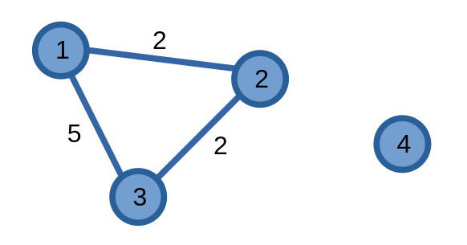

# Các thuật toán tìm đường đi ngắn nhất

Đường đi ngắn nhất giữa hai đỉnh trong một đồ thị là khoảng cách ngắn nhất của con đường từ một đỉnh đến đỉnh còn lại.

Ta cùng ví dụ bằng việc tìm đường đi ngắn nhất từ đỉnh \\(1\\) đến các đỉnh còn lại trên đồ thị có trọng số sau:

Đường đi ngắn nhất từ đỉnh \\(1\\) đến đỉnh \\(1\\) là \\(0\\) bởi vì ta không cần di chuyển đi đâu cả.

Đường đi ngắn nhất từ đỉnh \\(1\\) đến đỉnh \\(2\\) là \\(2\\) bởi vì ta cần đi qua cạnh có trọng số \\(2\\) để đến được đỉnh \\(2\\).

Đường đi ngắn nhất từ đỉnh \\(1\\) đến đỉnh \\(3\\) có vẻ là \\(5\\) vì tồn tại một cạnh có trọng số \\(5\\) nối hai đỉnh này nhưng thực chất ta có thể đi vòng qua đỉnh \\(2\\) để có giá trị là \\(4\\).

Vì không tồn tại đường đi từ đỉnh \\(1\\) đến đỉnh \\(4\\) nên ta biểu diễn giá trị đường đi ngắn nhất của hai đỉnh này bằng các giá trị đặc biệt, ví dụ như \\(-1\\) hoặc \\(\infty\\).

Ta sẽ tìm hiểu về một số thuật toán phổ biến, dùng để tìm đường đi ngắn nhất:

- [Thuật toán Dijkstra](dijkstra.md)
- [Thuật toán Bellman-Ford](bellman-ford.md)
- [Thuật toán Floyd-Warshall](floyd-warshall.md)
