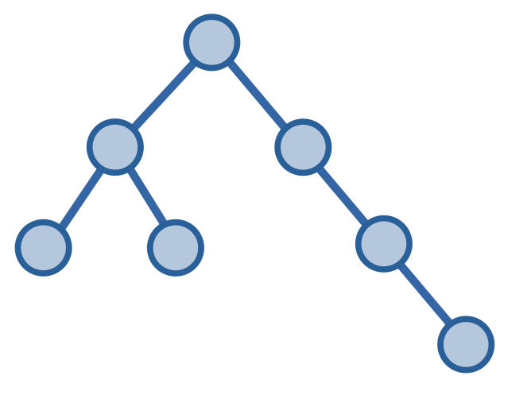
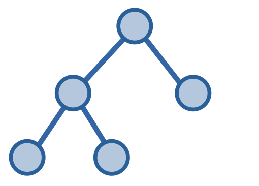
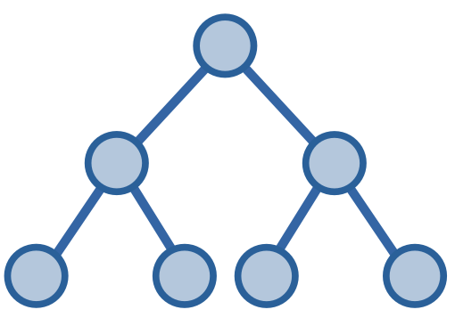
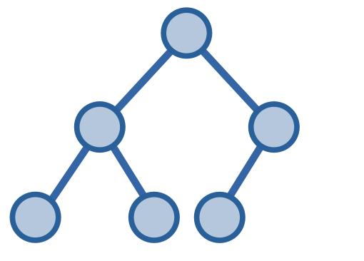
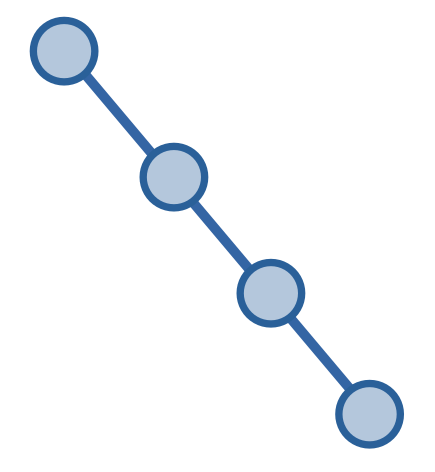
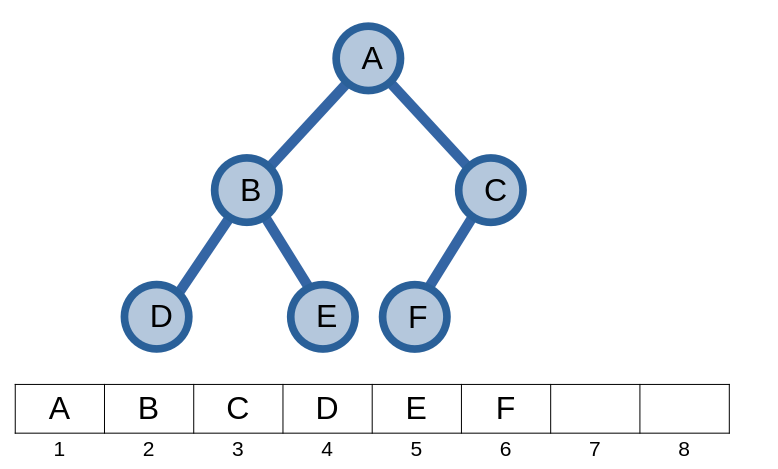
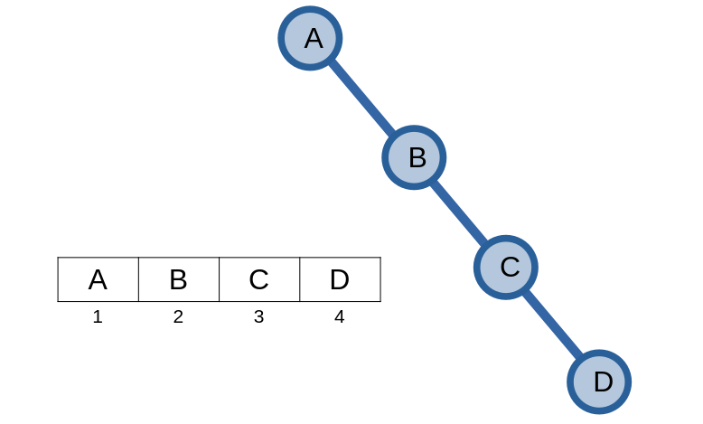
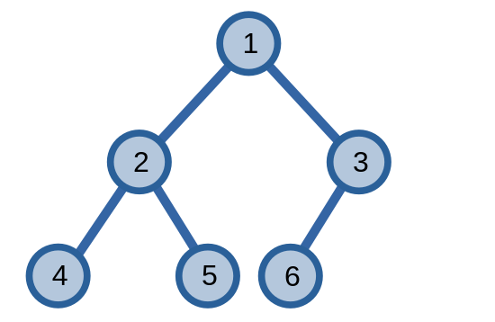

# Cây

Ta đã biết đến [cây](overview.md#cây) và [các định nghĩa, tính chất](overview.html#cây-1) của nó. 

Ở phần này, ta sẽ tìm hiểu thêm về một số dạng cây khác, các bài toán liên quan và những kĩ thuật liên quan đến cây.

## Giải quyết các bài toán trên cây

Ta sẽ thử giải quyết các bài toán trên đồ thị ở các phần trước và xét nó trên một đồ thị cây.

### Tìm đường đi ngắn nhất 

Đối với cây, ta biết được rằng chỉ có **một** đường đi duy nhất từ đỉnh \\(u\\) đến đỉnh \\(v\\) thuộc cây. Từ đây, ta có thể kết luận rằng con đường ấy cũng là con đường đi ngắn nhất.

### Kiểm tra đồ thị hai phía

Nếu ta đọc lại cách [xác định đồ thị hai phía](graph-traversal-applications.md#kiểm-tra-đồ-thị-hai-phía), ta thấy thuật toán tận dụng việc đồ thị là hai phía khi nó không có chu trình có lẻ đỉnh. Vì cây không có chu trình nên ta có thể kết luận rằng *mọi* cây đều là đồ thị hai phía. 

### Thứ tự tô-pô

Tiếp tục với việc cây không có chu trình, ta nhận xét rằng cây là một [DAG](overview.md#directed-acyclic-graph-dag), tồn tại thứ tự tô-pô.

### Tìm khớp cầu

Ta đã biết được rằng mọi cạnh của cây đều là cạnh cầu. Đối với đỉnh khớp, ta chỉ cần xét xem nếu đỉnh ấy có phải đỉnh lá hay không: nếu là đỉnh lá thì đỉnh không phải là đỉnh khớp, nếu không phải đỉnh lá thì đỉnh đó là đỉnh khớp.

## Cây nhị phân

**Cây nhị phân (binary tree)** là một cây với mỗi đỉnh có nhiều nhất *hai* đỉnh con. Hai đỉnh này có tên gọi là đỉnh *trái* và đỉnh *phải*.

<center>

</center>

Cây con có gốc ở là đỉnh trái được gọi là **cây con trái (left subtree)**, còn đỉnh bên phải được gọi là **cây con phải (right subtree)**.

Giống cây nhị phân, **cây k-phân (k-ary tree)** là các cây có tối đa \\(k\\) đỉnh. Ta sẽ chỉ tập trung vào cây nhị phân. 

### Các dạng cây nhị phân

Cây nhị phân có rất nhiều dạng khác khau. Ta sẽ nói về một số dạng cây nhị phân phổ biến.

#### Cây nhị phân đầy đủ

Cây nhị phân *đầy đủ* -  **full** binary tree, là một cây nhị phân với các đỉnh có \\(0\\) hoặc \\(2\\) đỉnh.

<center>

</center>

#### Cây nhị phân hoàn hảo

Cây nhị phân *hoàn hảo* - **perfect** binary tree, là một cây nhị phân với các đỉnh có \\(2\\) đỉnh và các đỉnh lá trong cây có *chung tầng*. Cây nhị phân hoàn hảo cũng là một cây nhị phân đầy đủ.

<center>

</center>

#### Cây nhị phân hoàn chỉnh

Cây nhị phân *hoàn chỉnh* - **complete** binary tree, là một cây nhị phân mà nếu ta không xét đến các đỉnh ở tầng cuối cùng thì cây nhị phân của ta sẽ là cây nhị phân hoàn hảo, và các đỉnh ở tầng cuối cùng này sẽ dồn về phía bên trái cây.

<center>

</center>

#### Cây nhị phân cân bằng

Cây nhị phân *cân bằng* - **balanced** binary tree, là một cây nhị phân mà với mỗi đỉnh, chênh lệch chiều cao của hai đỉnh không vượt quá \\(1\\). Các cây có \\(1\\) đỉnh thì luôn cân bằng. Cây nhị phân hoàn chỉnh và cây nhị phân hoàn hảo cũng là một cây cân bằng.


#### Cây suy biến

Cây *suy biến* - **degenerate** tree, là một cây mà các đỉnh không phải đỉnh lá chỉ có một đỉnh con.  

<center>

</center>

Ta có thể gọi cây suy biến bằng một cái tên khác thân thuộc hơn: cây **tre** (vì nhìn cây suy biến rất giống cây tre).

### Lưu trữ cây nhị phân

Ngoài các cách [lưu trữ đồ thị](overview.md#tổ-chức-dữ-liệu), ta có thể lưu trữ cây nhị phân trên một mảng.

Giả sử ta lưu một đỉnh ở chỉ số \\(p\\), ta có thể lưu hai nút con trái và phải ở các vị trí \\(2p\\) và \\(2p + 1\\) tương ứng.

Với đỉnh gốc có chỉ số \\(1\\), ta lưu các đỉnh trên đồ thị như sau: 

<center>

</center>

Nếu ta chuyển đổi chỉ số ở dạng số nhị phân, ta có thể sử dụng thông tin này để xác định đường đi từ gốc đến đỉnh ấy. Bắt đầu từ bit thứ \\(2\\) của chí số của một đỉnh, giá trị của bit thứ \\(i\\) cho ta biết nên duyệt đỉnh con bên trái hay phải để đến được đỉnh có chỉ số này - \\(0\\) là duyệt đỉnh trái, \\(1\\) và duyệt đỉnh phải. 

Ví dụ với đỉnh \\(F\\), ta thấy đỉnh \\(5\\) có chỉ số \\(5\\) trên mảng, có dạng biểu diễn nhị phân là \\(101_2\\). Từ đây, ta hiểu rằng từ đỉnh gốc \\(A\\), ta sẽ đi xuống đỉnh trái của \\(A\\), và từ đỉnh ấy đi xuống đỉnh phải để đến được đỉnh \\(F\\).

Cách lưu trữ cây nhị phân này sẽ tối ưu nhất khi lưu cây nhị phân hoàn chỉnh - một cây nhị phân hoàn chỉnh có \\(n\\) đỉnh sẽ được lưu trên một mảng có \\(n\\) đỉnh.

Đối với cây suy biến, ta có thể lưu trên một mảng với từng phần tử lưu thông tin của một đỉnh.

<center>

</center>

### Duyệt cây nhị phân

Cách duyệt cây nhị phân sẽ tùy thuộc vào cách ta muốn xử lí các đỉnh của cây nhị phân. Ta sẽ ví dụ bằng một bài toán yêu cầu in chỉ số của các đỉnh trên cây nhị phân hoàn chỉnh có \\(n\\) đỉnh.

<center>

</center>

Hàm `print` in chỉ số của đỉnh có chỉ số \\(p\\).

```C++
void print(int p){
	cout << p;
}
```

#### Duyệt trước (Pre-order)

**Duyệt trước** tức là ta xử lí một đỉnh *trước khi* xét các đỉnh thuộc cây con trái và phải.

```C++
void dfs(int p){
	if(p > n) return; // nếu đỉnh không thuộc cây
	print(p);
	dfs(p << 1); // xét cây con trái
	dfs(p << 1 | 1); // xét cây con phải
}
```

Kết quả in ra của cách duyệt trước khi gọi `dfs(1)`:

```
1 2 4 5 3 6
```

#### Duyệt sau (Post-order)

**Duyệt sau** tức là ta xử lí một đỉnh *sau khi* xét các đỉnh thuộc cây con trái và phải.

```C++
void dfs(int p){
	if(p > n) return; 
	dfs(p << 1); 
	dfs(p << 1 | 1);
	print(p);
}
```

Kết quả in ra của cách duyệt sau khi gọi `dfs(1)`:

```
4 5 2 6 3 1
```

#### Duyệt giữa (In-order)

**Duyệt giữa** tức là ta xét đỉnh thuộc cây con trái, sau đó xử lí đỉnh, và cuối cùng xét cây con phải.

```C++
void dfs(int p){
	if(p > n) return; 
	dfs(p << 1); 
	print(p);
	dfs(p << 1 | 1);
}
```

Kết quả in ra của cách duyệt sau khi gọi `dfs(1)`:

```
4 2 5 1 6 3
```

#### Duyệt theo tầng (Level-order)

**Duyệt theo tầng** tức là ta xử lí tất cả các đỉnh thuộc cùng một tầng theo chiều từ trái sang phải trước khi in các đỉnh ở tầng tiếp theo.

```C++
void dfs(int p){
	if(p > n) return;
	print(p);
	dfs(p + 1);
}
``` 

Kết quả in ra của cách duyệt theo tầng khi gọi `dfs(1)`:

```
1 2 3 4 5 6
```

Ngoài ra, các cách duyệt trên có thể có cách duyệt ngược lại khi ta xét các đỉnh từ phải sang trái.