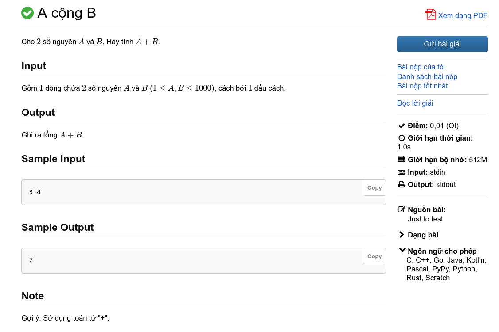

# Giới thiệu về lập trình thi đấu

**Lập trình thi đấu**, tên tiếng anh là **competitive programming**, về cơ bản là một *bộ môn thể thao trí tuệ*, nơi thí sinh viết nên các chương trình máy tính để giải quyết các bài toán.

## Thuật toán

Để giải một bài toán về lập trình thi đấu, ta cần sử dụng **thuật toán (algorithm)**. Thuật toán là một tập hợp hữu hạn các bước, mỗi bước là các phép toán hoặc thao tác cụ thể, nhằm giải quyết một vấn đề.

Trong hầu hết các trường hợp, thuật toán có dạng như sau: 

> **dữ liệu đầu vào (input)** \\(\rightarrow\\) thuật toán \\(\rightarrow\\) **dữ liệu đầu ra (output)**

Ta ví dụ với bài toán [**A cộng B**](https://oj.vnoi.info/problem/post):



Bài toán yêu cầu ta tính tổng của \\(2\\) số \\(A\\) và \\(B\\). Dữ liệu đầu vào sẽ là \\(2\\) số \\(A\\) và \\(B\\) trên \\(1\\) dòng và yêu cầu ta in ra tổng hai số.

Để giải quyết bài toán này, ta thực hiện hai bước chính: **thiết kế thuật toán** và **cài đặt thuật toán**.

Bước thứ nhất, **thiết kế thuật toán**, yêu cầu ta thiết kế một thuật toán phù hợp để giải quyết bài toán. Bước này yêu cầu ta phải có kĩ năng tư duy giải quyết vấn đề. Thuật toán được thiết kế phải nhanh và hiệu quả để có thể giải quyết được bài toán theo các giới hạn mà bài đề ra.

Thông thường, các bài toán thường sẽ liên quan đến những chủ đề như tổ hợp, lí thuyết đồ thị, xử lí xâu, v.v. Việc áp dụng lí thuyết sẵn có cùng với các hướng giải quyết mới sẽ giúp ta thiết kế thuật toán phù hợp.

Đối với bài toán này, thuật toán sẽ lấy hai số \\(A\\) và \\(B\\), thực hiện việc cộng hai số, và trả về tổng tính được.

Bước thứ hai, **cài đặt thuật toán**, là quá trình biến thuật toán mà ta đã thiết kế thành một chương trình máy tính. Sự hiểu biết về ngôn ngữ lập trình và cách áp dụng nó vào việc cài đặt thuật toán mà một yêu cầu hết sức quan trọng trong quá trình giải quyết bài toán.	 

Các chương trình cần được viết một cách ngắn gọn và xúc tích (một chương trình dài nhất cũng chỉ nên dài khoảng vài trăm dòng) bởi trong các cuộc thi lập trình: thời gian là có hạn. Các chương trình cũng phải thoả mãn những giới hạn mà bài toán đề ra như thời gian thực thi và bộ nhớ được sử dụng.

Dưới đây là một chương trình C++ giải quyết bài toán *A cộng B*.

```C++
#include <bits/stdc++.h>
#define ll long long
using namespace std;

int main () {
	ios_base::sync_with_stdio(0);
	cin.tie(0);
	int a, b; cin >> a >> b;
	cout << a + b;	

	return 0;
}
```

## Các bài nộp và kết quả

Khi ta nộp chương trình lên các *trình chấm*, máy chấm sẽ chạy chương trình của ta qua một danh sách các dữ liệu đầu vào (testcase) và kiểm tra đáp án mà chương trình in ra với đáp án của mỗi testcase tương ứng. Với mỗi testcase, máy chấm sẽ trả về cho ta một trong các kết quả sau đây:

|Kết quả|Ý nghĩa|
|---|---|
|<span style="color:Green">Accepted (AC)</span>| Chương trình in kết quả đúng và thoả mãn các yêu cầu của bài.|
|<span style="color:Red">Wrong Answer (WA)</span>| Chương trình cho ra kết quả sai.|
|<span style="color:gray;">Compilation Error (CE)</span>| Chương trình bị lỗi biên dịch.|
|<span style="color:Orange">Runtime Error (RTE)</span>| Chương trình gặp lỗi khi chạy.|
|<span style="color:Orange">Output Limit Exceeded (OLE)</span>| Chương trình in ra quá nhiều dữ liệu. |
|<span style="color:Orange">Memory Limit Exceeded (MLE)</span>| Chương trình sử dụng bộ nhớ nhiều hơn quy định.|
|<span style="color:gray;">Time Limit Exceeded (TLE)</span>| Chương trình chạy quá thời gian quy định.|
|<span style="color:Red">Internal Error (IE)</span>| Lỗi đến từ hệ thống máy chấm.|

Tùy vào *thể thức* của mỗi cuộc thi mà điểm cho mỗi bài sẽ khác nhau. Có thể thức sẽ tính điểm theo số lượng testcase AC, có thể thức chỉ cho điểm khi ta AC toàn bộ các testcase. 

#### Subtask

Một số bài toán sẽ chia các testcase theo các nhóm khác nhau, giúp thí sinh giành được một phần điểm số của bài toán. Các nhóm testcase này được gọi là subtask. Các subtask thường sẽ chứa những testcase có các giới hạn về dữ liệu đầu vào nhỏ hơn giới hạn bài toán, hoặc có một số tính chất đặc biệt nào đó, hoặc cả hai.

## Vì sao cần lập trình thi đấu?

Việc giải các bài toán và tham gia các cuộc thi lập trình thi đấu có thể giúp các thí sinh có hứng thú với các ngành liên quan đến khoa học máy tính. Những kiến thức học được từ lập trình thi đấu cũng cải thiện khả năng lập trình và tư duy logic của các lập trình viên, giúp họ có lợi thế trong công việc.

Một số thí sinh tham gia các cuộc thi tin học như Kì thi chọn Học sinh giỏi Quốc gia đoạt giải cao được tuyển thẳng vào các trường đại học trong nước và có cơ hội được học bổng cho các năm học.  

## Các cuộc thi lập trình

Có vô số cuộc thi lập trình phổ biến ở trong nước và quốc tế. Ta cùng điểm qua một số cuộc thi tiêu biểu.

### Kì thi Học sinh giỏi các cấp (trường/thành phố/tỉnh/...) (môn Tin học)

Mục đích của các kì thi này nhằm động viên, khuyến khích học sinh và giáo viên phát huy và nâng cao năng lực của bản thân, đồng thời phát hiện và bồi dưỡng những học sinh có năng khiếu ở các môn học.

### Kì thi chọn Học sinh giỏi Quốc gia (môn Tin học)

**Kì thi chọn học sinh giỏi quốc gia trung học phổ thông** (viết tắt là kì thi HSGQG) là kì thi chọn học sinh giỏi cấp quốc gia dành cho học sinh bậc trung học phổ thông do Bộ Giáo dục và Đào tạo tổ chức vào khoảng từ tháng 12 đến tháng 1 hằng năm. Những học sinh đạt điểm cao nhất trong kì thi này ở một vài bộ môn được Bộ Giáo dục và Đào tạo triệu tập tại Hà Nội, Việt Nam để tham gia kì thi chọn các học sinh vào đội tuyển Quốc gia Việt Nam tham dự các cuộc thi Olympic khu vực và quốc tế[^1].

Ta có thể gọi các kì thi HSGQG là các cuộc thi Olympic trong nước, với tên gọi môn tin học là **Vietnamese Olympiad in Informatics - VOI**.

### Cuộc thi Olympic truyền thống 30/4 (môn Tin học)

**Cuộc thi Olympic truyền thống 30/4** là một cuộc thi học sinh giỏi hàng năm dành cho học sinh khối 10 và 11 của khu vực phía Nam. Cuộc thi này do trường THPT Chuyên Lê Hồng Phong TPHCM sáng lập và được tổ chức lần đầu tiên vào năm 1995 với mục đích phát hiện, bồi dưỡng những học sinh có năng khiếu thuộc các khối lớp 10 và 11, chuẩn bị đội ngũ cho kì thi học sinh giỏi quốc gia, tạo điều kiện cho việc giao lưu học hỏi giữa các học sinh giỏi và trao đổi chuyên môn giữa các thầy cô dạy lớp chuyên của các tỉnh phía Nam[^2].

### Kì thi chọn Học sinh giỏi khu vực Duyên Hải và đồng bằng Bắc Bộ (môn Tin học)

Kì thi do Hội các trường THPT chuyên khu vực duyên hải và đồng bằng Bắc Bộ tổ chức hằng năm. Kì thi là dịp phát hiện học sinh giỏi, học sinh xuất sắc các bộ môn để các trường THPT chuyên có kế hoạch lựa chọn, bồi dưỡng các em tham gia các kì thi học sinh giỏi quốc gia, khu vực và quốc tế. Đồng thời là dịp để đội ngũ cán bộ quản lí và giáo viên các trường THPT chuyên trao đổi, chia sẻ kinh nghiệm, nâng cao trình độ chuyên môn bồi dưỡng môn chuyên và học sinh giỏi[^3].

### Kì thi Olympic Tin học Miền Trung - Tây Nguyên

**Kì thi Olympic Tin học miền Trung - Tây Nguyên** do Trường Đại học Công nghệ Thông tin và Truyền thông Việt - Hàn (VKU), Đại học Đà Nẵng chủ trì, phối hợp cùng Hội Tin học Việt Nam, ICPC Việt Nam, Sở Giáo dục và Đào tạo Thành phố Đà Nẵng và Trường THPT Chuyên Lê Quý Đôn, Đà Nẵng tổ chức với sự đồng hành của Hanwha Life và Quỹ ChildFund Korea (CFK), Hàn Quốc từ kì thi thứ V. Đây là sân chơi hấp dẫn, bổ ích, thúc đẩy đam mê học hỏi, cập nhật, thực hành và sáng tạo các giải pháp lập trình, góp phần cung cấp nguồn nhân lực chất lượng cao trong tương lai cho khu vực miền Trung - Tây Nguyên nói riêng và cả nước nói chung[^4].

Kì thi này cũng là kì thi AI đầu tiên của Việt Nam dành cho các em học sinh bậc trung học với sự xuất hiện của bảng thi "AI Challenge".

### Hue-ICT (phần thi lập trình)

Cuộc thi lập trình dành cho học sinh trung học phổ thông và sản phẩm sáng tạo công nghệ thông tin dành cho sinh viên cao đẳng, đại học là cuộc thi do Trường Đại học Khoa học, Đại học Huế và Hội Công nghệ thông tin và Điện tử viễn thông Thành phố Huế tổ chức hàng năm dưới sự chỉ đạo của Ủy ban nhân dân Thành phố Huế[^5].

### Hội thi Tin học trẻ các cấp

**Hội thi Tin học trẻ** là kì thi tin học thường niên dành cho các học sinh các cấp. Đây là sân chơi uy tín trong lĩnh vực tin học, do Trung ương Đoàn, Bộ Khoa học và Công nghệ, Bộ Giáo dục và Đào tạo, Bộ Thông tin và Truyền thông và Hội Tin học Việt Nam phối hợp tổ chức thường niên từ năm 1995.

### Olympic Tin học Quốc tế (IOI)

**Olympic Tin học Quốc tế** (**International Olympiad in Informatics - IOI**) là một cuộc thi quốc tế lập trình thi đấu thường niên dành cho học sinh trung học (cấp 2 và 3). Cuộc thi đầu tiên được tổ chức vào năm 1989 tại Bulgaria.

### ICPC

**International Collegiate Programming Contest**, hay **ICPC**, là một cuộc thi lập trình dành cho sinh viên. Đây là cuộc thi lập trình lâu đời nhất, lớn nhất và danh tiếng nhất thế giới. Hằng năm, cuộc thi thu hút hơn 50 000 thí sinh từ hơn 3 000 trường đại học khác nhau trên toàn thế giới[^6].

Mặc dù cuộc thi chỉ giới hạn cho các trường đại học, ở Việt Nam, ban tổ chức ICPC Việt Nam cũng tổ chức Kì thi ICPC cho các bạn học sinh THPT trên khắp cả nước.

### Các cuộc thi online

Ngoài các cuộc thi lập trình thi đấu trực tiếp, nhiều trang web được tạo ra nhằm hỗ trợ và cung cấp nhiều điều bổ ích cho các thí sinh trên toàn thế giới. Các trang như [VNOJ](https://oj.vnoi.info/), [Codeforces](https://codeforces.com/), [Atcoder](https://atcoder.jp/),... là một trong những ví dụ điển hình. Các trang này tổ chức các cuộc thi online, có nhiều dạng bài phong phú, một số trang còn hỗ trợ tìm kiếm việc làm liên quan đến lập trình!

[^1]: Wikipedia, *Kỳ thi chọn học sinh giỏi quốc gia trung học phổ thông*, <https://vi.wikipedia.org/wiki/Kỳ_thi_chọn_học_sinh_giỏi_quốc_gia_trung_học_phổ_thông> [Truy cập ngày 27/6/2025]

[^2]: ITC - lehongphong.edu.vn, *Kỳ thi Olympic truyền thống 30/4 lần thứ XXVI năm 2021*, Trường THPT Chuyên Lê Hồng Phong - Tp. Hồ Chí Minh, 2021. <http://www.thpt-lehongphong-tphcm.edu.vn/vi/content/ky-thi-olympic-truyen-thong-304-lan-thu-xxvi-nam-2021> [Truy cập ngày 27/6/2025]

[^3]: Thế Anh, *Gần 2.000 học sinh khu vực duyên hải và đồng bằng Bắc Bộ thi chọn học sinh giỏi tại TP Hải Dương*, Báo Hải Phòng, 2024. <https://baohaiduong.vn/gan-2-000-hoc-sinh-khu-vuc-duyen-hai-va-dong-bang-bac-bo-thi-chon-hoc-sinh-gioi-tai-tp-hai-duong-387551.html> [Truy cập ngày 27/6/2025]

[^4]: Trung tâm Học liệu và Truyền thông, *Olympic Tin học Miền Trung-Tây Nguyên lần thứ VI – 2025: khẳng định uy tín, chất lượng của một kỳ thi đạt chuẩn mực quốc gia và quốc tế với sứ mệnh phát hiện và ươm tạo nhân tài số*, Trường Đại học Công nghệ Thông tin và Truyền thông Việt – Hàn, Đại học Đà Nẵng, 2025. <https://vku.udn.vn/vi/olympic-tin-hoc-mien-trung-tay-nguyen-lan-thu-vi-2025-khang-dinh-uy-tin-chat-luong-cua-mot-ky-thi-dat-chuan-muc-quoc-gia-va-quoc-te-voi-su-menh-phat-hien-va-uom-tao-nhan-tai-so/> [Truy cập ngày 27/6/2025]

[^5]: HUE-ICTC 2025, <https://hue-ictc.husc.edu.vn/> [Truy cập ngày 27/6/2025]

[^6]: icpc.foundation, <https://icpc.global/> [Truy cập ngày 27/3/2025]