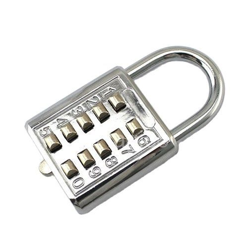
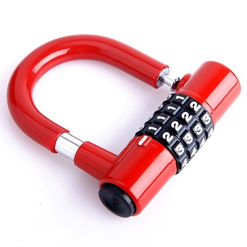

# Tổ hợp

Hai hình dưới đây là hai loại khoá số khác nhau. Khoá A là khoá số bấm với \\(10\\) số. Khoá B là khoá số xoay \\(4\\) vòng, mỗi vòng \\(10\\) chữ số. Hỏi: khoá nào có số lượng mật khẩu có thể nhiều hơn?

|Khoá số A|Khoá số B|
|---|---|
|||