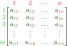
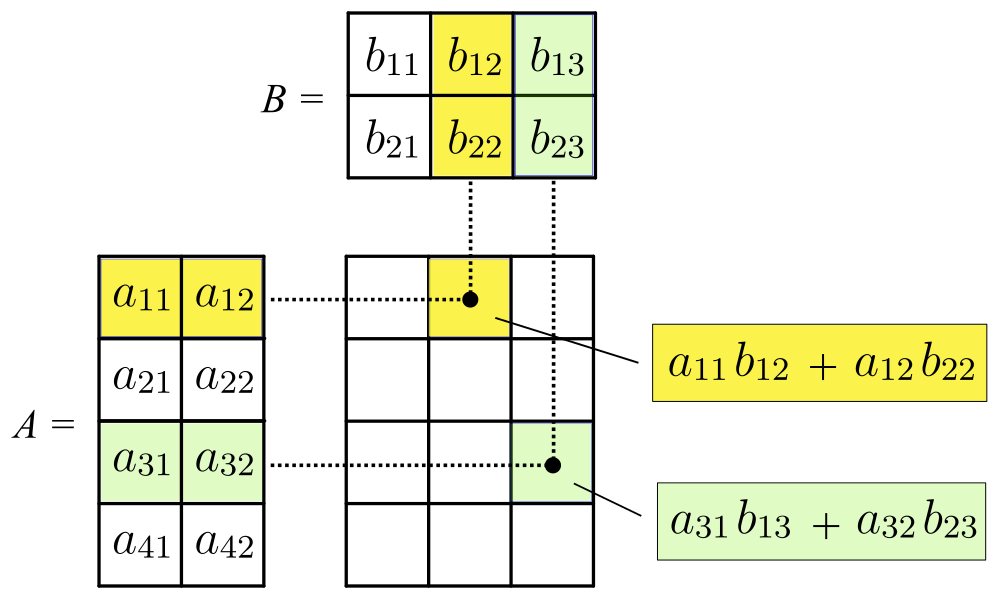

# Ma trận

**Ma trận** là một mảng hai chiều chứa các số. Ở ví dụ này, ta có ma trận \\(A_{2 \times 3}\\) (ma trận \\(2\\) hàng, \\(3\\) cột) \\[A = \begin{bmatrix}1 & 2 & 3\\\\4 & 5 & 6\end{bmatrix}\\] 

Kí hiệu thường gặp nhất của ma trận là kí hiệu ma trận được viết hoa, còn các phần tử thì viết thường. Chỉ số của các phần tử trên ma trận được đánh số theo chiều từ trái sang phải đối với các cột, từ trên xuống dưới đối với các hàng. 

<center>


<sup> Một ma trận kích thước \\(m\times n\\) - [Mavaddat](https://commons.wikimedia.org/wiki/File:MatrixLabelled.svg) - [CC BY-SA 4.0](https://creativecommons.org/licenses/by-sa/4.0/deed.en)</sup>
</center>

## Các ma trận đặc biệt

### Ma trận chuyển vị 

Một ma trận \\(B_{m\times n}\\) được gọi là **ma trận chuyển vị** của ma trận \\(A_{n\times m}\\) nếu \\(b_{i, j} = a_{j, i} \forall 1 \le i \le m, 1\le j \le m\\). Ta kí hiệu ma trận chuyển vị của \\(A\\) là \\(A^{T}\\). Ta có: \\[A^T = \begin{bmatrix}1 & 4\\\\ 2 & 5 \\\\ 3 & 6\end{bmatrix}\\] 

### Ma trận hàng, ma trận cột, ma trận vuông

**Ma trận hàng** là các ma trận có kích thước \\(1 \times n\\): \\[\begin{bmatrix}1 & 2 & 3\end{bmatrix}\\] 

Tương tự như vậy, **ma trận cột** là các ma trận có kích thước \\(n \times 1\\): \\[\begin{bmatrix}1 \\\\ 2 \\\\ 3\end{bmatrix}\\] 

> [!NOTE]
> Nhận xét:
> 
> \\[\begin{bmatrix}a_1 & a_2 & a_3\end{bmatrix}^T = \begin{bmatrix}a_1 \\\\ a_2 \\\\ a_3\end{bmatrix}\\]
> 
> \\[\begin{bmatrix}a_1 \\\\ a_2 \\\\ a_3\end{bmatrix}^T = \begin{bmatrix}a_1 & a_2 & a_3\end{bmatrix}\\]

**Ma trận vuông** là các ma trận có kích thước \\(n\times n\\): \\[\begin{bmatrix}1 & 2 & 3\\\\4 & 5 & 6\\\\7 & 8 & 9\end{bmatrix}\\]

### Ma trận đơn vị 

Một **ma trận đơn vị bậc \\(n\\)** là một ma trận có kich thước \\(n \times n\\) và các phần tử thuộc đường chéo chính (**đường chéo chính** là tập hợp \\(\\{a_{i, j} \\ | \\ i = j, 1 \le i \le m, 1\le j \le m \\}\\)) bằng \\(1\\). 

\\[\begin{bmatrix}1 & 0 & 0\\\\0 & 1 & 0\\\\0 & 0 & 1\end{bmatrix}\\]

Ta kí hiệu một ma trận đơn vị bậc \\(n\\) là \\(I_n\\).

## Các thao tác trên ma trận

### Cộng ma trận

Khi ta cộng ma trận \\(A_{m\times n}\\) với ma trận \\(B_{m\times n}\\), ta được một ma trận \\(C_{m\times n}\\) với \\(c_{i, j} = a_{i, j} + b_{i, j} \forall 1 \le i \le m, 1\le j \le m\\).

\\[\begin{bmatrix}1 & 2 & 3\\\\4 & 5 & 6\end{bmatrix} + \begin{bmatrix}7 & 8 & 9\\\\10 & 11 & 12\end{bmatrix} = \begin{bmatrix}1 + 7 & 2 + 8 & 3 + 9\\\\4 + 10 & 5 + 11 & 6 + 12\end{bmatrix} = \begin{bmatrix}6 & 10 & 12\\\\14 & 16 & 18\end{bmatrix}\\]

### Trừ ma trận

Khi ta trừ ma trận \\(A_{m\times n}\\) cho ma trận \\(B_{m\times n}\\), ta được một ma trận \\(C_{m\times n}\\) với \\(c_{i, j} = a_{i, j} - b_{i, j} \forall 1 \le i \le m, 1\le j \le m\\).

\\[\begin{bmatrix}1 & 2 & 3\\\\4 & 5 & 6\end{bmatrix} - \begin{bmatrix}7 & 8 & 9\\\\10 & 11 & 12\end{bmatrix} = \begin{bmatrix}1 - 7 & 2 - 8 & 3 - 9\\\\4 - 10 & 5 - 11 & 6 - 12\end{bmatrix} = \begin{bmatrix}-6 & -6 & -6\\\\-6 & -6 & -6\end{bmatrix}\\]

### Phép nhân vô hướng (scalar multiplication)

Khi ta cộng ma trận \\(A_{m\times n}\\) với một số \\(c\\), ta được một ma trận \\(B_{m\times n}\\) với \\(b_{i, j} = c\times a_{i, j} \forall 1 \le i \le m, 1\le j \le m\\).

\\[\begin{bmatrix}1 & 2 & 3\\\\4 & 5 & 6\end{bmatrix} \times 2 = \begin{bmatrix}1 \times 2 & 2 \times 2 & 3 \times 2\\\\4 \times 2 & 5 \times 2 & 6 \times 2\end{bmatrix} = \begin{bmatrix}2 & 4 & 6\\\\8 & 10 & 12\end{bmatrix}\\]

### Nhân ma trận

Nhân ma trận mà một phép tính khá khó hiểu nếu chỉ đọc lướt qua. Ta có hai ma trận \\(A_{m\times n}\\) và \\(B_{n\times p}\\). Khi ta nhân ma trận \\(A\\) với ma trận \\(B\\), ta được một ma trận \\(C_{m\times p}\\) với \\[c_{i,j} = a_{i,1}b_{1,j} +  a_{i,2}b_{2,j}  + \cdots + a_{i,n}b_{n,j} = \sum_{k=1}^n a_{i,k}b_{k,j}\\]

<center>


<sup> Nhân hai ma trận - [Svjo](https://commons.wikimedia.org/wiki/File:MatrixMultiplication.png) - [CC BY-SA 4.0](https://creativecommons.org/licenses/by-sa/4.0/deed.en)</sup>
</center>

Độ phức tạp của phép nhân ma trận là \\(O(mnp)\\). Đối với ma trận vuông, độ phức tạp sẽ bằng \\(O(n^3)\\). Mặc dù có những thuật toán nhân ma trận nhanh hơn, nhưng trong lập trình thi đấu thì độ phức tạp như thế này là đủ nhanh cho các bài toán cần áp dụng. 

> [!IMPORTANT]
> 
> Lưu ý rằng \\(A \times B\\) sẽ khác với \\(B \times A\\) do phép nhân ma trận không có [tính chất giao hoán](https://vi.wikipedia.org/wiki/T%C3%ADnh_giao_ho%C3%A1n).

### Luỹ thừa ma trận

Ta có thể thực hiện việc nhân luỹ thừa cho ma trận vuông. Ví dụ: \\[\begin{bmatrix}1 & 2 & 3\\\\4 & 5 & 6\\\\7 & 8 & 9\end{bmatrix}^2 = \begin{bmatrix}1 & 2 & 3\\\\4 & 5 & 6\\\\7 & 8 & 9\end{bmatrix} \times \begin{bmatrix}1 & 2 & 3\\\\4 & 5 & 6\\\\7 & 8 & 9\end{bmatrix} = \begin{bmatrix}30 & 36 & 42\\\\66 & 81 & 96\\\\102 & 126 & 150\end{bmatrix}\\] 
\\[\begin{bmatrix}1 & 2 & 3\\\\4 & 5 & 6\\\\7 & 8 & 9\end{bmatrix}^3 = \begin{bmatrix}1 & 2 & 3\\\\4 & 5 & 6\\\\7 & 8 & 9\end{bmatrix}^2 \times \begin{bmatrix}1 & 2 & 3\\\\4 & 5 & 6\\\\7 & 8 & 9\end{bmatrix} = \begin{bmatrix}30 & 36 & 42\\\\66 & 81 & 96\\\\102 & 126 & 150\end{bmatrix} \times \begin{bmatrix}1 & 2 & 3\\\\4 & 5 & 6\\\\7 & 8 & 9\end{bmatrix} = \begin{bmatrix}468 & 576 & 684\\\\1062 & 1305 & 1548\\\\1656 & 2034 & 1412\end{bmatrix}\\] 

Ta có: \\({A_{n \times n}}^0 = I_n\\).

## Cài đặt

Ta có cài đặt ma trận có modulo.

```C++
struct Matrix{
	int m, n; // m hàng, n cột
	int MOD;
	// chỉ số bắt đầu từ 0
	vector<vector<ll>> d; 
	Matrix(int _m, int _n, int _MOD = 1e9 + 7) : m(_m), n(_n), 
													MOD(_MOD), d(_m, vector<ll>(_n, 0)) {}

	// Cộng ma trận
	Matrix operator+ (const Matrix &a) const{
		Matrix res(m, n);
		for(int i = 0; i < m; ++i) {
			for(int j = 0; j < n; ++j) res.d[i][j] = (d[i][j] + a.d[i][j]) % MOD;
		} 
		return res;
	}
	// Trừ ma trận
	Matrix operator- (const Matrix &a) const{
		Matrix res(m, n);
		for(int i = 0; i < m; ++i) {
			for(int j = 0; j < n; ++j) res.d[i][j] = (d[i][j] - a.d[i][j] + MOD) % MOD;
		} 
		return res;
	}

	// Nhân với số thực
	Matrix operator* (const ll &c) const{
		Matrix res(m, n);
		for(int i = 0; i < m; ++i) {
			for(int j = 0; j < n; ++j) res.d[i][j] = (c*d[i][j]) % MOD;
		} 
		return res;
	}

	// Nhân ma trận
	Matrix operator* (const Matrix &a) const{
		int x = m, y = n, z = a.n;
		Matrix res(x, z);
		for(int i = 0; i < x; ++i) {
			for(int j = 0; j < z; ++j) {
				for(int k = 0; k < y; ++k) {
					res.d[i][j] += d[i][k] * a.d[k][j];
				}
				res.d[i][j] %= MOD;
			}
		}
		return res;
	}
	// Luỹ thừa ma trận
	Matrix operator^ (ll k) const{
		Matrix res(n, n);
		for (int i = 0; i < n; ++i) res.d[i][i] = 1;
		Matrix mul = *this;
		while (k > 0) {
			if (k & 1) res = res * mul;
			mul = mul * mul;
			k >>= 1;
		}
		return res;
	}
};
```

## Ứng dụng

### Hồi quy tuyến tính

Ứng dụng phổ biến nhất của ma trận trong lập trình thi đấu đó chính là giải **phương trình hồi quy tuyến tính**. Một phương tình hồi quy tuyến tính sẽ có dạng: 

\\[
\begin{align*}
f_n &= c_1\times f_{n-1} + c_2\times f_{n-2} + \cdots + c_k\times f_{n-k} \\\\
	&= \sum_{i = 1}^k c_i \times f_{n - k}
\end{align*}
\\]

#### Số fibonacci

Một ví dụ về phương trình hồi quy tuyến tính đó là số [fibonacci](paradigms/dp.html#fibonacci). Ở đây, ta có \\(k = 2\\) và \\(c_1 = c_2 = 1\\).

Ta có thể tính số fibonacci một cách hiệu quả bằng cách tìm một ma trận vuông \\(X_{2\times 2}\\) sao cho:

\\[X \times \begin{bmatrix}f(n-1)\\\\ f(n)\end{bmatrix} = \begin{bmatrix}f(n)\\\\ f(n+1)\end{bmatrix} \\]

Ma trận \\(X\\) sẽ bằng: \\[X = \begin{bmatrix}0 & 1\\\\ 1 & 1\end{bmatrix}\\]

Từ đây, ta tính được \\(f(n)\\) với \\(n \le 10^{18}\\):

\\[\begin{bmatrix}f(n)\\\\ f(n+1)\end{bmatrix} = X^n \times \begin{bmatrix}f(0)\\\\ f(1)\end{bmatrix} = X = \begin{bmatrix}0 & 1\\\\ 1 & 1\end{bmatrix}^n \times \begin{bmatrix}0\\\\ 1\end{bmatrix}\\]

Độ phức tạp thuật toán bằng \\(O(2^3 \times \log{n}) = O(\log{n})\\).

#### Trường hợp tổng quát

Ta có ma trận vuông \\(X_{k\times k}\\) thoả mãn:

\\[X \times \begin{bmatrix}f(n)\\\\ f(n + 1) \\\\ \vdots \\\\ f(n + k - 1)\end{bmatrix} = \begin{bmatrix}f(n + 1)\\\\ f(n + 2) \\\\ \vdots \\\\ f(n + k)\end{bmatrix} \\]

Thì ta có ma trận \\(X\\) như sau:

\\[X = \begin{bmatrix}
0 & 1 & 0 & 0 & \cdots & 0 \\\\
0 & 0 & 1 & 0 & \cdots & 0 \\\\
0 & 0 & 0 & 1 & \cdots & 0 \\\\
\vdots & \vdots & \vdots & \vdots & \ddots & \vdots \\\\
0 & 0 & 0 & 0 & \cdots & 1 \\\\
c_k & c_{k-1} & c_{k-2} & c_{k-3} & \cdots & c_1 \\\\
\end{bmatrix}\\]

Khi này, ta tính được \\(f(n)\\):

\\[\begin{bmatrix}f(n)\\\\ f(n + 1) \\\\ \vdots \\\\ f(n + k - 1)\end{bmatrix} = X^n \times \begin{bmatrix}f(0)\\\\ f(1) \\\\ \vdots \\\\ f(k-1)\end{bmatrix}\\]


Độ phức tạp thuật toán bằng \\(O(k^3\log{n})\\).

#### Luỹ thừa

Ta có thể tính được giá trị của luỹ thừa. Ở ví dụ dưới đây ta tìm cho các số mũ nhỏ như mũ \\(1, 2\\) hoặc \\(3\\).

\\[X \times \begin{bmatrix}n^3\\\\ n^2 \\\\ n \\\\ 1\end{bmatrix} = \begin{bmatrix}(n + 1)^3\\\\ (n + 1)^2 \\\\ n + 1 \\\\ 1\end{bmatrix} \\]

\\[X = 
\begin{bmatrix}
1 & 3 & 3 & 1 \\\\
0 & 1 & 2 & 1 \\\\
0 & 0 & 1 & 1 \\\\
0 & 0 & 0 & 1 \\\\
\end{bmatrix}
\\]

