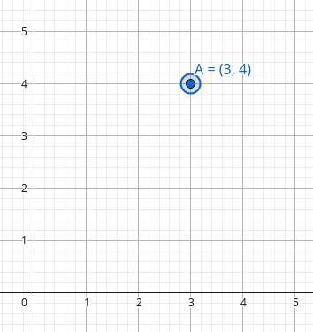
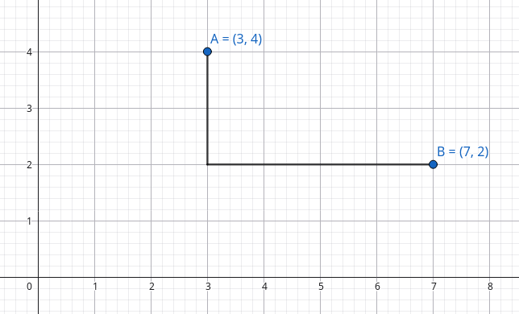
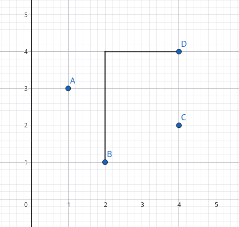
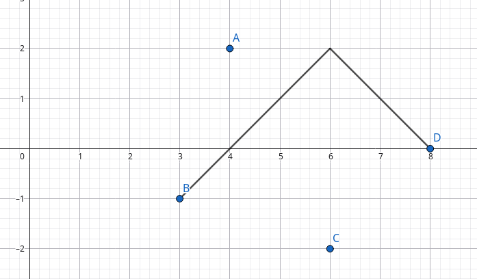
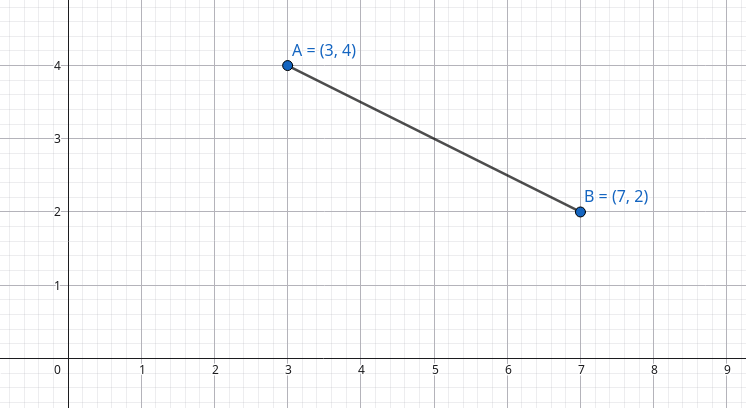

# Điểm, vector

## Điểm

Hãy hình dung một điểm nằm trên trục toạ độ \\(Oxy\\) và gọi điểm này là \\(A\\). 

<center>

</center>

Điểm \\(A\\) này sẽ chứa hai thông tin về toạ độ \\(x\\) và \\(y\\) trên hai trục toạ độ tương ứng. Ở đây, ta có \\(A(3, 4)\\). 

### Khoảng cách Manhattan

Cho một con robot xuất phát từ gốc toạ độ \\(O(0, 0)\\). Với các thao tác di chuyển dọc và ngang, hãy tìm độ dài con đường ngắn nhất để đi đến đỉnh \\(A\\).

Dễ thấy, con đường ngắn nhất chính là di chuyển \\(3\\) ô về bên phải, rồi sau đó di chuyển \\(4\\) ô về trước. Khoảng cách khi này sẽ bằng \\(3 + 4 = 7\\). 

Khoảng cách này được gọi **khoảng cách Manhattan**. Tổng quát hơn, cho hai điểm \\(A\\) và \\(B\\), khoảng cách Manhattan của hai đỉnh bằng: \\[|A_x - B_x| + |A_y - B_y|\\]


<center>

<sup>

Khoảng cách Manhattan giữa hai điểm \\(A(3, 4)\\) và \\(B(7, 2)\\) là \\(|3 - 7| + |4 - 2| = 6\\)

</sup>
</center>

#### Thay đổi toạ độ

Ta có bài toán tìm khoảng cách Manhattan lớn nhất giữa hai đỉnh bất kì.

<center>

<sup>

Khoảng cách Manhattan lớn nhất là giữa hai điểm \\(B\\) và \\(D\\) bằng \\(5\\).

</sup>
</center>

Ta có thể giải quyết bài toán này bằng cách thay đổi toạ độ của các điểm. Cụ thể hơn, điểm có toạ độ \\((x, y)\\) sẽ thay đổi thành \\(x + y, y - x\\). Khi này, khoảng cách Manhattan của hai điểm \\(A(x^{\*}, y^{\*})\\) và \\(B(x^{\*}, y^{\*})\\) bằng: \\[|A_x - B_x| + |A_y - B_y| = \max(|A_{x^{\*}} - B_{x^{\*}}|, |A_{y^{\*}} - B_{y^{\*}}|)\\]


<center>

</center>

### Khoảng cách Euclid

Cũng là con robot đó tại gốc toạ độ. giờ đây ta có thể di chuyển theo bất kì hướng nào mà ta mong muốn. Đường đi ngắn nhất bây giờ là một con đường đi thẳng, di chuyển từ gốc toạ độ đến đỉnh \\(A\\).

Khoảng cách này được gọi **khoảng cách Euclid**. Tổng quát hơn, cho hai điểm \\(A\\) và \\(B\\), khoảng cách Manhattan của hai đỉnh bằng: \\[\sqrt{(A_x - B_x)^2 + (A_y - B_y)^2}\\]

Công thức này tương tự với công thức trong [định lí Pytago](https://vi.wikipedia.org/wiki/%C4%90%E1%BB%8Bnh_l%C3%BD_Pythagoras).

<center>

<sup>

Khoảng cách Euclid giữa hai điểm \\(A(3, 4)\\) và \\(B(7, 2)\\) là \\(\sqrt{(3 - 7)^2 + (4 - 2)^2} = 2\sqrt{5}\\)

</sup>
</center>

## Cài đặt

```C++
struct Point{
	int x, y;
	Point(){}
	Point(int u, int v) : x(u), y(v) {}
};

// Khoảng cách Manhattan
int manhattan(const Point& a, const Point& b) {
	return abs(a.x - b.x) + abs(a.y - b.y);
}

// Thay đổi toạ độ
Point rotate(const Point& a){
	return Point(a.x + a.y, a.y - a.x);
}

// Khoảng cách Manhattan sau khi thay đổi toạ độ
int manhattanRotated(const Point& a, const Point& b) {
	return max(abs(a.x - b.x), abs(a.y - b.y));
}

// Khoảng cách Euclid
double euclid(const Point& a, const Point& b) {
	return sqrtl((a.x - b.x) * (a.x - b.x) + (a.y - b.y) * (a.y - b.y));
}
```

### Biến đổi điểm

## Vector

### Tích vô hướng

### Tích có hướng

## Hệ toạ độ cực
