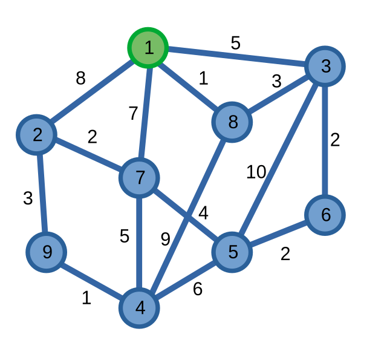

# Quy hoạch động bitmask

**Quy hoạch động bitmask** là một kĩ thuật QHĐ giải quyết các bài toán. Thông thường, QHĐ bitmask tối ưu các bài toán bằng cách xem các tập hợp như các trạng thái QHĐ, và các tập hợp này được lưu trữ bằng [bitmask](../basic/bit-manipulation.md#bitmask-mảng-bit).

## Tối ưu các thuật toán \\(O(n!)\\) thành \\(O(2^n)\\)

Một trong những ứng dụng dễ thấy nhất của QHĐ bitmask chính là tối ưu các thuật toán có độ phức tạp \\(O(n!)\\) xuống còn khoảng \\(O(2^n)\\).

Ta có bài toán sau: cho một [đồ thị](../graph-theory/graph.md) vô hướng liên thông có trọng số \\(G = (V, E)\\) với số đỉnh nhỏ \\((|V| = n \le 16)\\) và đỉnh xuất phát \\(S\\). Yêu cầu của bài toán là tìm đường đi ngắn nhất xuất phát từ đỉnh \\(S\\) đi hết tất cả các đỉnh trên đồ thị sao cho mỗi đỉnh chỉ được đi qua một lần.


<center>


<sup>

Đường đi ngắn nhất xuất phát từ đỉnh \\(1\\) đi qua tất cả các đỉnh trên đồ thị một lần là một con đường đi qua các đỉnh theo thứ tự sau: \\((1 - 8 - 3 - 6 - 5 - 7 - 2 - 9 - 4)\\)

</sup>
</center>

Một thuật toán chạy "trâu" cho bài toán này có thể thực hiện các bước sau: xây dựng các hoán vị các đỉnh của đồ thị với có phần tử đầu tiên là đỉnh \\(S\\). Sau đó, với mỗi hoán vị, kiểm tra xem có nó phải là một đường đi hợp lệ hay không và tìm độ dài nhỏ nhất trong các đường đi ấy. Có tất cả \\((n - 1)!\\) có thể được sinh ra, và mỗi hoán vị cần phải được kiểm tra trong \\(O(n)\\), nên độ phức tạp của thuật toán này là \\(O(n!)\\).

<br>

Ta cần rút ra một số nhận xét để có thể giải quyết được bài toán này. 

Giả sử ta đã xây dựng được con đường ngắn nhất đi từ đỉnh \\(S\\) đến một đỉnh \\(u\\) nào đó trên đồ thị. Điều ta cần làm là lưu trạng thái của con đường ngắn nhất này để thực hiện QHĐ. Ta nhận xét rằng ta không cần quan tâm đến cách mà con đường này được hình thành, cụ thể hơn là thứ tự các đỉnh mà con đường này đi qua. Ta chỉ cần nhớ là đường đi này đi qua những đỉnh nào và đỉnh cuối của đường đi đó. 

Từ đây, ta có hai trạng thái quy hoạch động. Với mỗi đường đi ngắn nhất, ta có:
- \\(X\\) là tập hợp các đỉnh trên đường đi. 
- \\(u\\) là đỉnh cuối của đường đi ấy.

Giờ đây, nếu ta muốn tìm con đường ngắn nhất tới đỉnh \\(v\\), từ trạng thái \\((X, u)\\), ta có thể di chuyển tới trạng thái \\((X \cup \\{v\\}, v)\\) nếu tồn tại cạnh \\(uv\\) trên đồ thị.

Từ đây, với \\(f(X, u)\\) là đường đi ngắn nhất từ đỉnh \\(S\\) tới đỉnh \\(u\\) đi qua các đỉnh nằm trong tập \\(X\\), kết quả của bài toán sẽ bằng: \\[\min_{1 \le i \le n} f(G(V), i)\\]

Và \\(f(X, u)\\) có giá trị bằng: \\[f(X, u) = \min_{v \in X, uv \in E} (f(X \backslash \\{u\\}, v) + w(uv))\\]

Với \\(w(uv)\\) là trọng số của cạnh \\(uv\\). Các trường hợp cơ sở:
- \\(f(\\{S\\}, S) = 0\\)
- \\(f(\emptyset, u) = \infty\\)
- \\(f(\\{u\\}, u) = \infty\\) nếu \\(u \neq S\\)

Trong QHĐ bitmask, ta biểu diễn tập hợp \\(X\\) bằng [bitmask](../basic/bit-manipulation.md#bitmask-mảng-bit), và các đỉnh của đồ thị được đánh số từ \\(0\\) đến \\(n - 1\\).

```C++
const int N = 16;
int dp[N][1 << N];
int mat[N][N]; // đồ thị ma trận kề
int n, s; // các đỉnh được đánh số từ 0

void solve(){
	for(int i = 0; i < n; ++i) {
		for(int mask = 0; mask < (1 << n); ++mask) {
			dp[i][mask] = INT_MAX; 
		}
	}

	// đỉnh xuất phát
	dp[s][1 << s] = 0;

	for(int mask = 0; mask < (1 << n); ++mask){
		for(int i = 0; i < n; ++i) {
			// đường đi ngắn nhất từ đỉnh s đến đỉnh i, với 
			// các đỉnh trong đường đi thuộc mask
			if((mask >> i & 1) && dp[i][mask] != INT_MAX) {
				for(int j = 0; j < n; ++j) {
					if(mask >> j & 1) continue;

					// QHĐ "kéo" tìm đường đi ngắn nhất từ đỉnh s đến đỉnh j, với 
					// các đỉnh trong đường đi thuộc nmask
					int nmask = mask | (1 << j);
					dp[j][nmask] = min(dp[j][nmask], dp[i][mask] + mat[i][j]);
				}
			}
		}
	}

	// tìm kết quả
	int mn = INT_MAX;
	for(int i = 0; i < n; ++i) mn = min(mn, dp[i][(1 << n) - 1]);
	cout << mn;
}
```

Độ phức tạp thuật toán là \\(O(n^2\times 2^n)\\) - nhỏ hơn nhiều so với \\(O(n!)\\).

Ở một số bài toán khác, ta có thể có các độ phức tạp như \\(O(2^n)\\), \\(O(n \times 2^n)\\), từ đó giải được các trường hợp mà \\(n \le 20\\).

## QHĐ trên hồ sơ "gãy"

Một ứng dụng khó và hiếm gặp của QHĐ bitmask đó chính là QHĐ trên hồ hơ "gãy".