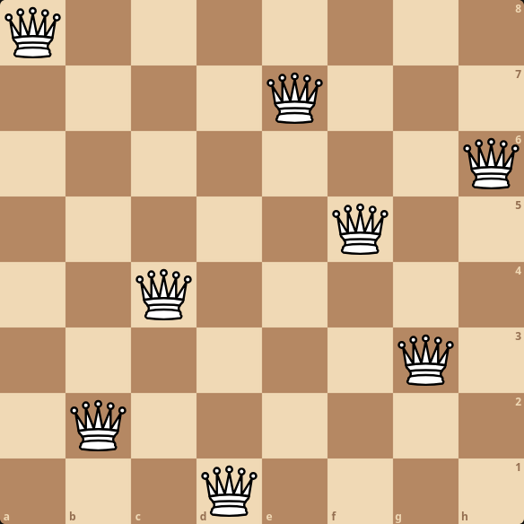
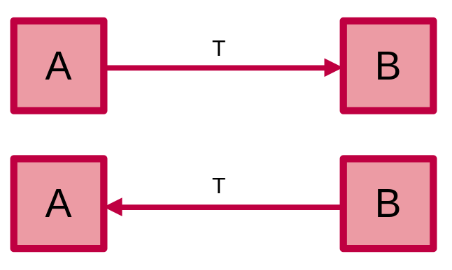
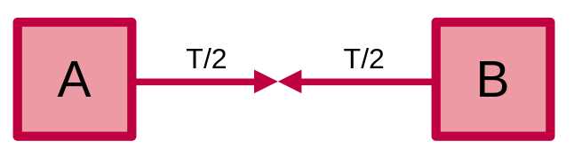

# Duyệt toàn bộ

**Duyệt toàn bộ (Complete search)**, hay với các tên gọi khác như *duyệt trâu*, *vét cạn*, *brute force* đều được dùng để chỉ chung một mô hình thuật toán. Các thuật toán duyệt toàn bộ sẽ giải quyết bài toán bằng cách kiểm tra (gần như) toàn bộ không gian tìm kiếm của bài để tìm kiếm kết quả thoả mãn, ví dụ như kiểm tra các phần tử, các cặp giá trị, các tập con, hoán vị, v.v. 

Ưu điểm của duyệt toàn bộ là luôn đảm bảo cho ra kết quả chính xác. Tuy nhiên, thời gian thực thi lại lâu, độ phức tạp lớn. 

Trong các cuộc thi lập trình, các thí sinh có xem xét việc cài đặt thuật toán theo mô hình duyệt toàn bộ khi không thể tìm ra thuật toán khác tốt hơn. Bằng cách này, thí sinh có thể giành điểm ở những subtask đầu tiên - các subtask dễ và có thể giải được bằng duyệt toàn bộ (nếu có). Ngoài ra, thí sinh cũng có thể cài đặt thuật toán duyệt toàn bộ kể cả khi tồn tại thuật toán tối ưu hơn nếu giới hạn của bài toán đủ nhỏ.

Đôi khi, việc chạy thuật toán duyệt toàn bộ trên một số test nhỏ có thể giúp ta hiểu được bản chất của bài toán dễ dàng hơn, giúp tăng khả năng tìm được thuật toán chuẩn của bài.

## Sinh tập con

Ta xem xét các bài toán yêu cầu ta sinh ra tất cả các tập con của danh sách \\(n\\) phần tử. Ví dụ với danh sách \\(3\\) phần tử thì ta sẽ có các tập con chứa chỉ số của các phần tử (bắt đầu tử chỉ số \\(0\\)): 
\\[\emptyset, \\{0\\}, \\{1\\}, \\{2\\}, \\{0, 1\\}, \\{0, 2\\}, \\{1, 2\\}, \\{0, 1, 2\\}\\]

Ta sử dụng đệ quy để sinh các tập con.

```C++
vector<int> subset;

void search(int idx) {
	if (idx == n) {
		// Xét tập con
		return;
	}

	// Phần tử idx có trong tập con
	subset.push_back(idx);
	search(idx + 1);
	
	// Phần tử idx không có trong tập con
	subset.pop_back();
	search(idx + 1);
}
```

Ta cũng có thể sử dụng [bitmask](../basic/bit-manipulation.md#bitmask-mảng-bit) để xét các tập con.

Ví dụ: \\(5_{10} = 101_2\\) biểu thị tập hợp \\(\\{0, 2\\}\\). 

Ta duyệt các số từ \\(0\\) đến \\(2^n - 1\\), tương đương với duyệt các tập con của tập hợp \\(n\\) phần tử

```C++
for(int s = 0; s < (1 << n); ++s){
	vector<int> subset;
	for(int j = 0; j < n; ++j){
		if((i >> j) & 1){
			subset.push_back(j);
		}
	}
	// Xét tập con
}
```

Ta cũng có thể sử dụng [cách duyệt khác](../basic/bit-manipulation.md#duyệt-các-tập-con-của-bitmask) với khả năng tương tự.

```C++
int mask = (1 << n) - 1;
for(int s = mask; ; s = (s - 1) & mask){
	vector<int> subset;
	for(int j = 0; j < n; ++j){
		if((i >> j) & 1){
			subset.push_back(j);
		}
	}
	// Xét tập con
	if(s == 0) break;
}
```

Có nhiều nhất \\(n\\) phần tử cho mỗi tập con nên độ phức tạp khi sinh và xét các tập con sẽ là \\(O(2^n \times n)\\). Nếu ta có thể vừa xét vừa duyệt các tập con đối với phương thức đệ quy thì có thể giảm xuống thành \\(O(2^n)\\).

## Sinh hoán vị

Ta xem xét các bài toán yêu cầu ta sinh ra tất cả các hoán vị của danh sách \\(n\\) phần tử. Ví dụ với danh sách \\(3\\) phần tử thì ta sẽ có các hoán vị chứa chỉ số của các phần tử (bắt đầu tử chỉ số 0): 

\\[\\{0, 1, 2\\}, \\{0, 2, 1\\}, \\{1, 0, 2\\}, \\{1, 2, 0\\}, \\{2, 0, 1\\}, \\{2, 1, 0\\}\\].

Ta có thể sử dụng đệ quy:

```C++
vector<int> permutation;
bitset<N> chosen;

void search() {
	if (permutation.size() == n) {
		// Xét hoán vị
		return;
	} 
	for (int i = 0; i < n; ++i) {
		if (chosen[i]) continue;
		chosen[i] = true;
		permutation.push_back(i);
		search();
		chosen[i] = false;
		permutation.pop_back();
	}
}
```

hoặc có thể sử dụng hàm `next_permutaion` để xét các hoán vị.

```C++
vector<int> permutation(n, 0);
// Gán các số từ 0 đến n - 1
iota(permutation.begin(), permutation.end(), 0);
do{
	// Xét hoán vị
}while(next_permutaion(permutation.begin(), permutation.end()));
```

Có \\(n\\) phần tử cho mỗi hoán vị nên độ phức tạp cho cả hai cách là \\(O(n! \times n)\\).

## Quay lui

Quay lui là một kĩ thuật sử dụng đệ quy để liệt kê các cấu hình. Nó sẽ xây dựng các cấu hình mới từ cấu hình cũ, nếu nó xác định cấu hình này không thể cho ra kết quả tối ưu thì nó sẽ bỏ qua và "quay lui" về cấu hình trước tạo nên nó.

Một bài toán kinh điển về quay lui chính là bài toán \\(8\\) quân hậu.
 
### Bài toán \\(8\\) quân hậu

Phát biểu bài toán: Cho một bàn cờ vua kích thước \\(8 \times 8\\), tìm tất cả cách xếp \\(8\\) quân hậu sao cho không con hậu nào ăn được nhau. 

<center>

</center>

#### Thuật toán \\( \_{64} C_{8}\\)

Có \\(8 \times 8 = 64\\) ô trên bàn cờ, ta cần đặt \\(8\\) quân hậu trên các ô này. Ta có thể thử đặt \\(8\\) quân hậu trên \\(8\\) ô bất kì trong \\(64\\) ô và kiểm tra nếu nó hợp lệ hay không.

Ta có số cách chọn \\(8\\) ô trong \\(64\\) ô là \\(\_{64} C_{8} \approx 4 \times 10^9\\) cách - hơi lớn.

#### Thuật toán \\(8^8\\)

Ta biết rằng các quân hậu không thể ở **chung hàng**. Ta có thể sử dụng thông tin này và xắp xếp mỗi quân hậu một vị trí bất kì trên một hàng và kiểm tra. 

Tổng số cách chọn cho phương pháp này là \\(8^8 \approx 17 \times 10^6\\) - suýt soát vừa đủ giới hạn.

#### Thuật toán \\(8!\\)

Ta cũng biết rằng các quân hậu không thể ở chung hàng và **chung cột**. Từ thông tin này, ta sẽ sắp xếp \\(8\\) quân hậu ở mỗi hàng một vị trí ở các cột riêng biệt với nhau.

Tổng số cách chọn cho phương pháp này là \\(8! = 40320\\) - siêu nhỏ.

#### Thuật toán nhỏ hơn \\(8!\\)

Để tối ưu hơn nữa thuật toán \\(8!\\), ta cần áp dụng thêm một tính chất nữa chính là các quân hậu không thể ở chung hai đường chéo chính và phụ.

Nếu một quân hậu ở vị trí \\((x, y)\\) sẽ giữ vị trí ở hai đường chéo \\(x + y\\) và \\(x - y\\). Ta đánh dấu hai đường chéo và duyệt vị trí các quân hậu tiếp theo. 

Vì \\(x - y\\) có thể nhỏ hơn \\(0\\) nên khi lưu ta cần dịch giá trị của nó đi một khoảng.

```C++
int diag1[15], diag2[15];
int col[8];

void queen8(int row){
	if(row == 8){ // Đã sắp xếp được 8 quân hậu
		for(int i = 0; i < 8; ++i){
			cout << i << ' ' << col[i] << '\n';
		}
		cout << '\n';
		return;
	}
	for(int i = 0; i < 8; ++i){
		if(col[i] == 0 && diag1[i + row] == 0 && diag2[i - row + 7] == 0){
			col[i] = diag1[i + row] = diag2[i - row + 7] = row;
			queen8(row + 1);
			col[i] = diag1[i + row] = diag2[i - row + 7] = 0;
		}
	}
}
```

Ta gọi `queen8(0)` để bắt đầu thuật toán.

## Chia đôi tập

**Chia đôi tập (Meet in the middle)** là một kĩ thuật tối ưu thuật toán bằng cách chia đôi không gian tìm kiếm ra làm hai và kết hợp kết quả từ hai không gian tìm kiếm lại với nhau để tìm đáp án của bài toán.

Chia đôi tập giống như hai người bạn hẹn nhau đi chơi vậy.

Nếu hai bạn hẹn nhau tại một trong hai nhà của hai bạn thì thời gian để bạn còn lại đi đến nhà bạn kia sẽ là \\(T\\).

<center>

</center>

Như nếu hai bạn đồng ý cùng đi đến một địa điểm nào đó có khoảng cách đến nhà hai bạn (gần) bằng nhau thì ta có thể giảm thời gian xuống còn \\(T / 2\\).

<center>

</center>

<br>

Một bài toán ví dụ cho kĩ thuật chia đôi tập như sau: cho \\(n\\) đồng xu với các giá trị khác nhau. Kiểm tra liệu có tồn tại cách chọn các đồng xu sao cho tổng giá trị của nó bằng \\(X\\) hay không? Giới hạn: \\(n \le 40\\).

Ta sử dụng phương pháp [sinh tập con](#sinh-tập-con) ở đầu chương để tìm cách chọn đồng xu.

```C++
ll c[41]; // Giá trị các đồng xu 
ll X;
int n;
bool exist = 0 // tồn tại cách chọn

void search(int idx, ll sum) {
	if(exist) return;
	if (idx == n) {
		if(sum == X) {
			exist = 1;
			// Tồn tại cách chọn các đồng xu
		}
		return;
	}
	search(idx + 1, sum + c[idx]); // Chọn đồng xu
	search(idx + 1, sum); // không chọn đồng xu
}
```


Độ phức tạp thuật toán sẽ là \\(O(2^n)\\).

Nếu \\(n\\) lớn (Ví dụ: \\(n = 32\\)) thì thuật toán trên sẽ quá thời gian.

Ta áp dụng kĩ thuật chia đôi tập.

Đầu tiên, lưu giá trị của các cách chọn của \\(\left\lfloor \frac{n}{2} \right\rfloor\\) đồng xu đầu tiên vào một danh sách.

Sau đó, thực hiện xét giá trị các cách chọn của các đồng xu còn lại. Gọi \\(sum\\) là giá trị của một cách chọn các đồng xu còn lại kia. Nếu \\(X - sum\\) được lưu trong danh sách thì tồn tại cách chọn các đồng xu.

```C++
vector<ll> arr;
ll c[41]; 
ll X;
int n;
bool exist = 0; 

void search1(int idx, int fin, ll sum) {
	if (idx == fin) {
		arr.push_back(sum);
		return;
	}
	search1(idx + 1, fin, sum + c[idx]);
	search1(idx + 1, fin, sum); 
}
void search2(int idx, int fin, ll sum){
	if(exist) return;
	if(idx == fin){
		if(binary_search(arr.begin(), arr.end(), X - sum)){
			exist = 1;
			return;
		}
	}
	search2(idx + 1, fin, sum + c[idx]);
	search2(idx + 1, fin, sum); 
}
void solve(){
	search1(0, n / 2, 0);
	sort(arr.begin(), arr.end());
	search2(n / 2, n, 0);
}
```

Độ phức tạp thuật toán của ta sẽ là \\(O(2^{n / 2}\log{2^{n / 2}}) \approx O(2^{n / 2}\log{n})\\) - không vượt quá giới hạn thời gian kể cả khi \\(n = 40\\).