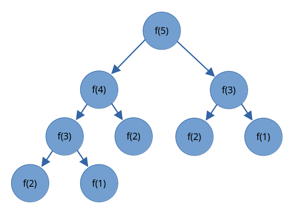
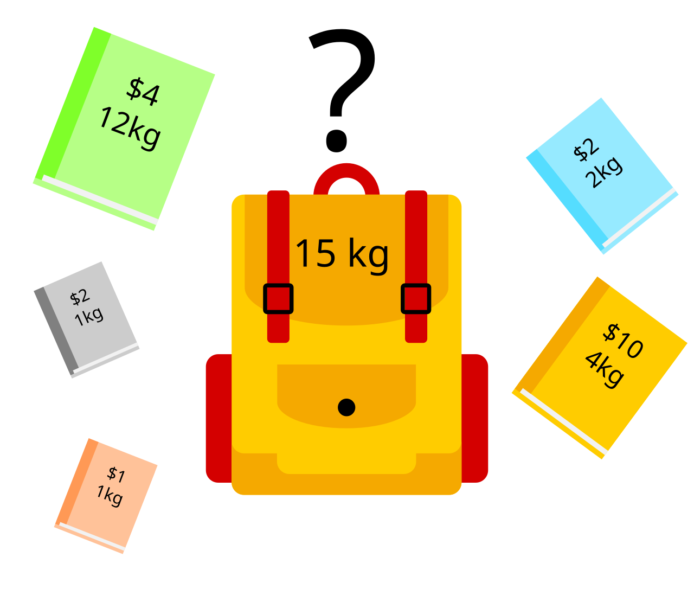

# Quy hoạch động

**Quy hoạch động (Dynamic Programming - DP)**, từ giờ sẽ được viết tắt thành *QHĐ*, là phương pháp chia một bài toán lớn thành các bài toán con có thước nhỏ hơn với mục tiêu tìm được đáp án của bài toán ban đầu bằng kết quả của những bài toán con đã giải được. 

Khác với [chia để trị](dnc.md) với việc chia bài toán lớn thành các các bài toán con rời nhau, QHĐ sẽ chia bài toán thành **các bài toán con gối nhau (overlapping subproblem)**. Giống với [tham lam](greedy.md), các bài toán QHĐ cũng có **cấu trúc con tối ưu**.

QHĐ thường được sử dụng cho các bài toán:
- Tìm kết quả tối ưu: bài toán yêu cầu tìm đáp án chính xác, hoặc tìm giá trị lớn nhất/nhỏ nhất có thể.
- Đếm số lượng kết quả: bài toán yêu cầu đếm số lượng kết quả có thể xây dựng.

## Fibonacci

**Dãy số Fibonacci** là một dãy số mà giá trị của một số được xác định bằng tổng của hai số trước đó. Các số trong dãy số Fibonacci được gọi là *số Fibonacci*. Bắt đầu dãy số Fibonacci với hai số \\(0\\) và \\(1\\), ta có dãy số:

\\[0, 1, 1, 2, 3, 5, 8, 13, 21, 34, 55, 89, 144, ...\\]

Ta có hàm \\(f(n)\\) trả về giá trị của số Fibonacci thứ \\(n\\):
- \\(f(n) = 0\\) nếu \\(n = 1\\).
- \\(f(n) = 1\\) nếu \\(n = 2\\).
- \\(f(n) = f(n - 1) + f(n - 2)\\) nếu \\(n \gt 2\\).

Ta có hàm đệ quy quay lui tính số Fibonacci thứ \\(n\\):

```C++
int f(int n){
	if(n == 1) return 0;
	if(n == 2) return 1;
	return f(n - 1) + f(n - 2);
}
```

Ta có hình minh họa quá trình hàm \\(f\\) tìm giá trị của số Fibonacci thứ \\(5\\):

<center>

</center>

Ta thấy giá trị của số Fibonacci thứ \\(3\\) được tính lại hai lần, và khi thứ tự của số Fibonacci mà ta muốn tìm càng lớn thì số lần ta phải tính toán lại càng nhiều. 

Độ phức tạp thuật toán này là \\(O(2^n)\\).

### QHĐ Top-Down

Đối với đoạn code trên, các số Fibonacci sẽ phải tính đi tính lại nhiều lần. Vậy nên một hướng giải quyết đơn giản mà ta có thể nghĩ ra chính là lưu những kết quả này lại, những lần sau nếu hàm có yêu cầu một số Fibonacci nào đó thì ta chỉ cần trả về giá trị đã lưu thay vì thực hiện tính toán. Kĩ thuật này tên tiếng anh là **memoization**, dịch sang tiếng Việt có nghĩa là **kĩ thuật ghi nhớ**.

Áp dụng hàm đệ quy quay lui ở trên và kĩ thuật ghi nhớ, ta có cách cài đặt cho bài toán tìm số Fibonacci nói riêng và các bài toán QHĐ nói chung bằng QHĐ **Top-Down**, hay **từ trên xuống**:
- Tạo một CTDL lưu giá trị của các **trạng thái** trong hàm đệ quy quay lui. Thông thường, ta chỉ cần một mảng có một hoặc nhiều chiều, với mỗi chiều là một trong nhiều trạng thái của hàm đệ quy quay lui. Đối với bài toán tìm số Fibonacci này, ta tạo một mảng một chiều lưu giá trị trạng thái \\(n\\).
- Với mỗi lần gọi hàm đệ quy quay lui, ta xử lí *hai* trường hợp:
	- Trường hợp \\(1\\): Nếu kết quả của trạng thái này đã được tính, ta trả về giá trị ấy.
	- Trường hợp \\(2\\): Nếu kết quả của trạng thái này chưa được tính, thực hiện việc tính giá trị và lưu kết quả vào CTDL cho trạng thái tương ứng.

Ta có mảng `calc` chỉ nếu số Fibonacci thứ \\(n\\) đã được tính hay chưa, và một mảng `memo` lưu giá trị của số ấy.

```C++
bool calc[N];
int memo[N];

int f(int n){
	if(n == 1) return 0;
	if(n == 2) return 1;
	if(calc[n]) return memo[n]; // số fibonacci thứ n đã được tính ở trước đó

	memo[n] = f(n - 1) + f(n - 2); // Lưu kết quả tính được
	calc[n] = 1; 
	return memo[n];
}
```

Các số Fibonacci được tính nhiều nhất \\(1\\) lần, độ phức tạp thuật toán của ta giảm xuống còn \\(O(n)\\).

Ta có thể loại bỏ mảng `calc` bằng cách gán trước cho mảng `memo` một giá trị biểu thị rằng số Fibonacci ấy chưa được tính trước khi thực hiện việc tìm giá trị của số Fibonacci thứ \\(n\\).

```C++
int memo[N]; // các phần từ trong memo được gán giá trị -1

int f(int n){
	if(n == 1) return 0;
	if(n == 2) return 1;
	if(memo[n] != -1) return memo[n];

	memo[n] = f(n - 1) + f(n - 2);
	return memo[n];
}
```

Độ phức tạp của thuật toán giờ đây sẽ là \\(O(n)\\).

### QHĐ Bottom-Up

QHĐ **Bottom-Up**, hay **từ dưới lên**, là một hướng tiếp cận những bài toán QHĐ khác với QHĐ Top-Down. 

Ta bắt đầu với những bài toán con nhỏ nhất, hay những trường hợp cơ sở của bài toán tìm số Fibonacci: hai số Fibonacci đầu tiên \\(0\\) và \\(1\\). 

Tiếp theo, ta tạo một bảng QHĐ lưu những trường hợp cơ sở. Từ đây, ta sẽ dần dần xây dụng các bài toán con lớn hơn cho tới khi ta tính được kết quả của bài toán gốc.

Ví dụ, từ hai số Fibonacci đầu tiên, ta có thể xây dụng số Fibonacci thứ \\(3\\), rồi thứ \\(4, 5, \dots\\) cho tới khi ta xây dựng được số Fibonacci thứ \\(n\\).

Ta có mảng `dp` là bảng QHĐ.

```C++
int dp[N]; // Bảng QHĐ

dp[1] = 0;
dp[2] = 1;

for(int i = 3; i <= n; ++i){
	dp[i] = dp[i - 1] + dp[i - 2];
}
```

Độ phức tạp của thuật toán tương tự QHĐ Top-Down: \\(O(n)\\).

Quá trình ta xây dựng các bài toán từ nhỏ đến lớn, và điền các kết quả ấy vào bảng QHĐ của ta được gọi là **tabulation**, tạm dịch sang tiếng Việt có nghĩa là **kĩ thuật ghi bàn**.	

### Top-Down hay Bottom-Up?

Đối với nhiều bài toán QHĐ, việc giải quyết bài toán theo hướng top-down thông thường sẽ dễ hiểu và cách cài đặt đơn giản hơn nhiều so hướng giải quyết bottom-up. Mặc khác, với hướng tiếp cận bottom-up, chương trình của ta sẽ ngắn gọn hơn (trong hầu hết trường hợp), và sẽ chạy nhanh hơn so với top-down do không gọi hàm nhiều. 

## Bài toán đổi tiền

Ở phần [tham lam](greedy.md#bài-toán-đổi-tiền---coin-change), ta được biết rằng thuật toán tham lam chỉ có thể tìm ra đáp án tối ưu cho bài toán đổi tiền đối với một số tập hợp mệnh giá tờ tiền nhất định.

Ta sẽ giải quyết bài toán này bằng QHĐ. Ta có các mệnh giá của những tờ tiền:

\\[\\{1, 3, 4\\}\\]

Gọi \\(f(x)\\) là số tờ tiền ít nhất để có tổng bằng \\(x\\), ta có:

|\\(x\\)|\\(0\\)|\\(1\\)|\\(2\\)|\\(3\\)|\\(4\\)|\\(5\\)|\\(6\\)|\\(7\\)|\\(8\\)|\\(9\\)|\\(10\\)|
|---|---|---|---|---|---|---|---|---|---|---|---|
|\\(f(x)\\)|\\(0\\)|\\(1\\)|\\(2\\)|\\(1\\)|\\(1\\)|\\(2\\)|\\(2\\)|\\(2\\)|\\(2\\)|\\(3\\)|\\(3\\)|

\\(f(10) = 3\\) vì ta cần \\(3\\) tờ tiền \\(3 + 3 + 4 = 10\\).

Một nhận xét từ bài toán là ta có thể thực hiện việc tính số lượng đồng tiền ít nhất một cách đệ quy. Thay vì xét các cách chọn những loại tiền, ta chỉ cần tâp trung vào một tờ tiền duy nhất. Giả sử ta chọn \\(1\\) trong quá trình chọn số lượng đồng tiền ít nhất có tổng bằng \\(10\\), nhiệm vụ mới của ta bây giờ là tìm số lượng đồng tiền ít nhất sao cho tổng bằng \\(9\\). Tương tự với các đồng tiền \\(3\\), \\(4\\).

Ta có công thức cho hàm \\(f(x)\\):  
- \\(f(x) = \infty\\) nếu \\(x \lt 0\\) vì không thể chọn các tờ tiền để tổng âm.
- \\(f(x) = 0\\) nếu \\(x = 0\\) vì ta chọn \\(0\\) tờ tiền để tổng bằng \\(0\\).
- \\(f(x) = \min_{c \in S}{f(x - c) + 1}\\) nếu \\(x \gt 0\\) với \\(S\\) là tập hợp các tờ tiền.

```C++
const int INF = 1e9;
int dp[N];

dp[0] = 0;
for(int i = 0; i <= n; ++i){
	dp[i] = INF;
	for(auto c : s){ // s là tập hợp các tờ tiền
		if(c >= i) {
			dp[i] = min(dp[i], dp[i - c] + 1); 
		}
	}
}
```

Độ phức tạp thuật toán là \\(O(nS)\\) với \\(S\\) là số lượng tờ tiền.

### Xây dựng đáp án

Khi ta cần tìm lại cách thuật toán xây dựng được kết quả tối ưu, như trong bài toán này là cách thuật toán chọn những tờ tiền tối ưu, ta sẽ có cách xử lí như sau.

Giả sử trong các \\(f(x - c) + 1\\) thì \\(f(x - 3) + 1\\) giúp ta xây dựng kết quả tối ưu cho \\(f(i)\\), tức là để giải quyết được bài toán trạng thái \\(i\\), ta cần giải bài toán có trạng thái \\(i - 3\\). Vì vậy, ta sẽ lưu lại trạng thái \\(i - 3\\). Ở đoạn code dưới đây, mảng `state` sẽ thực hiện việc lưu những trạng thái này.

```C++
const int INF = 1e9;
int dp[N];
int state[N]; // Lưu trạng thái trước đó giúp xây dựng kết quả tối ưu

dp[0] = 0;
for(int i = 0; i <= n; ++i){
	dp[i] = INF;
	state[i] = 0;
	for(auto c : s){ // s là tập hợp các tờ tiền
		if(c >= i) {
			if(dp[i - c] + 1 < dp[i]){
				dp[i] = dp[i - c] + 1;
				state[i] = i - c; // i - c giúp xây dụng kết quả tối ưu cho i
			}
		}
	}
}
```

Để tìm lại cách chọn những tờ tiền, ta xử dụng những gì đã được lưu trong mảng `state`.

```C++
int sum = n;
while(sum){
	cout << sum - state[sum] << '\n';
	sum = state[sum];
}
```

### Đếm số cách

Ta có \\(g(x)\\) là số cách chọn những tờ tiền sao cho tổng bằng \\(x\\).

Ví dụ, sử dụng những tờ tiền ở trên, ta có \\(g(5) = 6\\):
- \\(1 + 1 + 1 + 1 + 1\\)
- \\(1 + 1 + 3\\)
- \\(1 + 3 + 1\\)
- \\(3 + 1 + 1\\)
- \\(1 + 4\\)
- \\(4 + 1\\)

Ta có công thức cho hàm \\(g(x)\\):  
- \\(g(x) = 0\\) nếu \\(x \lt 0\\) vì không thể chọn các tờ tiền để tổng âm.
- \\(g(x) = 1\\) nếu \\(x = 0\\) vì có một cách chọn những tờ tiền để tổng bằng \\(0\\).
- \\(g(x) = \sum_{c \in S} g(x - c)\\) nếu \\(x \gt 0\\) với \\(S\\) là tập hợp các tờ tiền.

```C++
const int MOD = 1e9 + 7;
int dp[N];

dp[0] = 1;
for(int i = 0; i <= n; ++i){
	dp[i] = 0;
	for(auto c : s){ // s là tập hợp các tờ tiền
		if(c >= i) {
			dp[i] += dp[i - c]; 
			dp[i] %= MOD; // modulo 
		}
	}
}
```

## Dãy con có tổng lớn nhất

Giả sử ta có một mảng `a` có \\(n\\) phần tử. Nhiệm vụ của ta là tìm dãy con với các phần tử liên tiếp có tổng lớn nhất trong mảng `a`. Ví dụ:

\\[[1, 7, -5, 2, -6, 3, 4, -8]\\]

có dãy con có tổng lớn lớn bao gồm hai phần tử đầu tiên: \\(1 + 7 = 8\\).

Ta có thể xét từng dãy con một và tìm tổng lớn nhất với độ phức tạp \\(O(n^3)\\) hoặc \\(O(n^2)\\) nếu ta vừa tính tổng vừa tìm dãy con lớn nhất. 

Thực tế, ta có thể tìm được dãy con có tổng lớn nhất với độ phức tạp thuật toán \\(O(n)\\). 

Gọi \\(f(i)\\) là tổng lớn nhất của dãy con liên tiếp kết thúc tại \\(i\\), \\(f(i)\\) sẽ có giá trị bằng:

\\[f(i) = max(f(i - 1) + a_i, a_i)\\]

Trong đó, \\(f(0)\\) có giá trị bằng \\(0\\).

Công thức trên có nghĩa là: liệu tổng của dãy con liên tiếp kết thúc tại \\(i\\) sẽ có kết quả lớn nhất nếu ta nối dài thêm dãy con lớn nhất kết thúc tại \\(i - 1\\), hay ta nên xét một dãy con mới với đúng một phần tử \\(a_i\\) để cho ra tổng lớn nhất.

Kết quả của dãy con có tổng lớn nhất sẽ là giá trị lớn nhất trong tất cả các \\(f(i)\\).

```C++
int dp[N];

dp[0] = 0;
for(int i = 1; i <= n; ++i){
	dp[i] = max(dp[i - 1] + a[i], a[i]);
}

cout << *max_element(dp + 1, dp + 1 + n);
```

Ta có thể tối ưu bộ nhớ của thuật toán, chỉ sử dụng \\(2\\) biến.

```C++
int sum = 0, best = 0;
for(int i = 1; i <= n; ++i){
	sum = max(sum + a[i], a[i]);
	best = max(best, sum);
}

cout << best;
```

Thuật toán này, có tên gọi là *thuật toán Kadane*, có độ phức tạp thuật toán là \\(O(n)\\).

## Dãy con tăng dài nhất

Bài toán dãy con tăng dài nhất được phát biểu như sau: cho một mảng `a` chứa \\(n\\) phần tử, tìm dãy con dài nhất từ mảng `a` (không nhất thiết phải liên tiếp) với mỗi phần tử trong dãy con lớn hơn phần tử đứng trước.  

Đối với mảng dưới đây:

\\[[1, 3, 2, 5, 8, 4, 7, 6]\\]

Có dãy con \\([1, 2, 5, 7]\\) là dãy con tăng dài nhất trong mảng. Ngoài ra, còn có các dãy con như \\([1, 3, 5, 7]\\), \\([1, 2, 5, 8]\\), v.v.

Ta sẽ giải quyết bài toán này bằng QHĐ.

Ta có mảng `dp` lưu độ dài dãy con tăng dài nhất kết thúc tại \\(i\\). Ban đầu, \\(dp_i = 1\\) với mọi \\(i\\) từ \\(1\\) đến \\(n\\).

Sau đó, ta có công thức tính \\(dp_i\\): Kiểm tra các giá trị \\(j\\) từ \\(1\\) đến \\(i - 1\\), nếu \\(a_j < a_i\\), cập nhật \\(dp_i\\) thành \\(dp_j + 1\\) nếu \\(dp_i \lt dp_j + 1\\).

Độ dài của dãy con tăng dài nhất sẽ là giá trị lớn nhất trong mảng `dp`.

```C++
int dp[N];
for(int i = 1; i <= n; ++i){
	dp[i] = 1;
	for(int j = 1; j < i; ++j){
		if(a[j] < a[i]) dp[i] = max(dp[i], dp[j] + 1);
	}
}
cout << *max_element(dp + 1, dp + 1 + n);
```

Độ phức tạp của thuật toán là \\(O(n^2)\\).

Để tối ưu thuật toán, ta có phương pháp sau:  

Khi duyệt các phần tử từ \\(1\\) đến \\(n\\), ta có một mảng `dp` lưu phần tử cuối cùng nhỏ nhất trong các dãy con tăng có độ dài \\(x\\) khi ta đang duyệt.

Khi duyệt phần tử \\(a_i\\), tìm chỉ số \\(j\\) lớn nhất mà \\(a_i\\) lớn hơn các phần tử đứng trước \\(j\\) và nhỏ hơn các phần tử đứng sau \\(j\\) trong mảng `dp`. Chỉ số \\(j\\) này cũng là độ dài của dãy con tăng có giá trị cuối cùng là \\(a_i\\). Sau khi đã tìm được \\(j\\), ta cập nhật \\(dp_j\\) thành \\(a_i\\) nếu \\(dp_j \gt a_i\\). 

```C++
vector<int> dp(n + 1, INF);
dp[0] = -INF;
int k = 0;
for(int i = 1; i <= n; ++i){
    int j = lower_bound(dp.begin(), dp.begin() + k + 1, a[i]) - dp.begin();
    k = max(k, j);
    dp[j] = min(dp[j], a[i]);
}
cout << k;
```

Độ phức tạp của thuật toán là \\(O(n\log{k})\\), với \\(k\\) là độ dài của dãy con tăng dài nhất trong mảng `a`.

## Bài toán cái túi - Knapsack problem

Bài toán cái túi được phát biểu như sau: Cho một danh sách các món đồ, mỗi món đồ có khối lượng và giá trị xác định, và một cái túi có thể mang các vật. Bài toán yêu cầu tìm cách chọn các món đồ sao cho tổng khối lượng của những món đồ có thể nằm trong giới hạn khối lượng của cái túi, và tổng giá trị là lớn nhất.

<center>


<sup> Bài toán cái túi - [VectorVoyager](https://commons.wikimedia.org/wiki/File:Knapsack_Problem_Illustration.svg) - [CC BY-SA 4.0](https://creativecommons.org/licenses/by-sa/4.0/deed.en)</sup>
</center>

Ví dụ với bài toán trên, để có thể lựa những cuốn sách sao cho tổng khối lượng không vượt quá giới hạn 15kg của cái túi và có giá trị lớn nhất, ta chọn tất cả cuốn sách ngoại trừ cuốn sách màu xanh lục.

Các hướng tiếp cận tham lam như chọn những món đồ có khối lượng nhỏ nhất hay những vật có giá trị lớn nhất trước đều không khả thi khi ta có thể dễ dàng tạo ra những trường hợp mà các hướng tiếp cận này sẽ cho ra kết quả sai.

Ta kí hiệu \\(n\\) là số món đồ, khối lượng và giá trị của từng món lần lượt là \\(w\\) và \\(v\\), và giới hạn khối lượng của cái túi là \\(W\\).

Ta có \\(f(idx, remW)\\) là giá trị mà ta đang có sau khi xét qua \\(idx\\) món đồ, và giới hạn khối lượng hiện tại của túi là \\(remW\\).

Ta có hai trường hợp có thể xảy ra:
- Chọn món đồ thứ \\(idx\\): nếu ta có thể chọn món đồ thứ \\(idx\\) (\\(w_{idx} \le remW\\)), giá trị các món đồ mà ta đã chọn sẽ bằng \\(f(idx - 1, remW - w_{idx}) + v_{idx}\\).
- Không chọn món đồ thứ \\(idx\\): nếu ta không chọn món đồ thứ \\(idx\\), giá trị các món đồ mà ta chọn sẽ bằng \\(f(idx - 1, remW)\\).

Kết quả lớn hơn trong hai trường hợp sẽ là kết quả của hàm \\(f\\).

Từ đây ta có công thức tính \\(f(idx, remW)\\):
- \\(f(idx, remW) = 0\\) nếu \\(idx = 0\\) hoặc \\(remW = 0\\): không còn món đồ để chọn hoặc túi hết chỗ chứa.
- \\(f(idx, remW) = f(idx - 1, remW)\\) nếu \\(remW \lt w_{idx}\\).
- \\(f(idx, remW) = max(f(idx - 1, remW), f(idx - 1, remW - w_{idx}) + v_{idx})\\) nếu \\(remW \ge w_{idx}\\).

Kết quả của bài toán bằng \\(f(n, W)\\).

```C++
int memo[N][W];
int n, W;

int f(int idx, int rw){
	if(idx == 0 || rw == 0) return 0;
	if(memo[idx][rw] != -1) return memo[idx][rw];
	int ans = f(idx - 1, rw); // không chọn món đồ thứ idx

	if(w[idx] <= rw) { // có thể thêm món đồ thứ idx vào cái túi không
		ans = max(ans, v[idx] + f(idx - 1, rw - w[idx])); // chọn món thứ đồ idx
	}
	return memo[idx][rw] = ans;
}
```

Ta cũng có cách cài đặt bottom-up. Ở đây, ta tối ưu bộ nhớ bằng cách loại bỏ trạng thái \\(idx\\) của bài toán khi lưu:

```C++
int dp[M]; // M là giới hạn của W
int n, W;

for(int i = 1; i <= n; ++i){
	for(int j = W; j >= w[i]; --j){
		dp[j] = max(dp[j], dp[j - w[i]] + v[i]);
	}
}

cout << dp[W];
```

Độ phức tạp của thuật toán là \\(O(nW)\\).