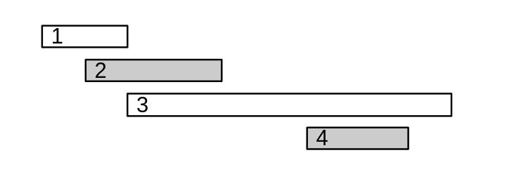
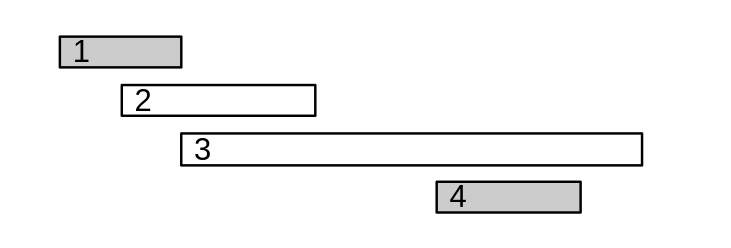
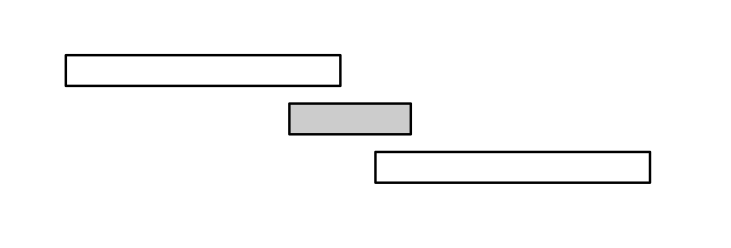
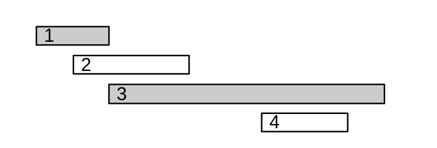
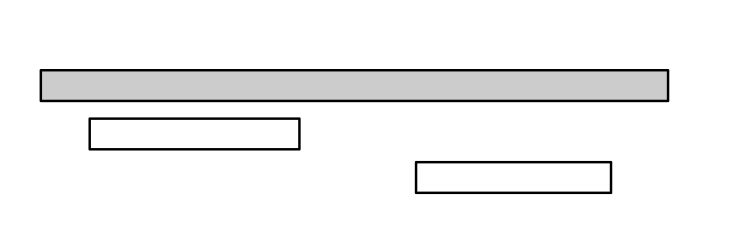
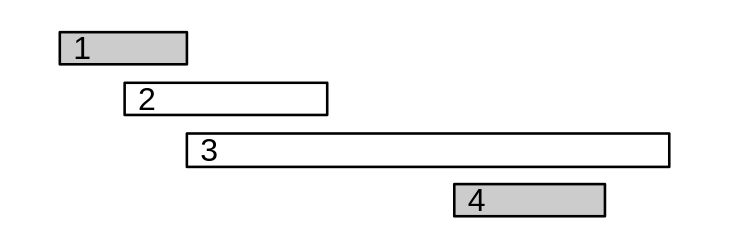

# Tham lam

*"Tham thì thâm" - Thành ngữ*

 

Một thuật toán **tham lam** là một thuật toán xây dựng đáp án từ phương án nhìn tốt nhất ở thời điểm hiện tại. Các thuật toán tham lam sẽ không chọn lại đáp án, làm cho nó thực hiện thuật toán vô cùng nhanh và hiệu quả.

Hầu hết các bài toán tham lam sẽ có hai tính chất:

- **Tính tham lam**: Nếu ta chọn phương án tốt nhất ở hiện tại và cứ tiếp tục như thế cho đến cuối thuật toán, ta sẽ có kết quả tối ưu. Việc xác định tính tham lam của một bài toán là một điều khó! 
- **Cấu trúc con tối ưu (optimal substructure)**: Ta nói một bài toán có tính chất tối ưu nếu đáp án tối ưu được xây dựng từ kết quả tối ưu của các bài toán con.

Ta cùng điểm qua một số bài toán kinh điển có thể được giải bằng thuật toán tham lam.

## Bài toán đổi tiền - Coin Change

Giả sử ta có một số lượng rất lớn tờ tiền Việt Nam Đồng (nghìn đồng): 

\\[\\{1, 2, 5, 10, 20, 50, 100, 200, 500\\}\\]

Nhiệm vụ của ta là sử dụng ít tờ tiền nhất sao cho tổng giá trị những tờ tiền ta chọn bằng \\(X\\) nghìn đồng. Ví dụ: nếu \\(X = 670\\) thì ta cần ít nhất \\(4\\) tờ tiền. Một cách chọn tối ưu chính là \\(500 + 100 + 50 + 20\\).

Một thuật toán tham lam giải quyết bài toán này là ta lần lượt trừ số tiền hiện tại bằng giá trị tờ tiền lớn nhất có thể cho đến khi số tiền hiện tại bằng \\(0\\).

Ta có:

\\[670 \rightarrow 670 - 500 = 170\\]
\\[170 \rightarrow 170 - 100 = 70 \\]
\\[70 \rightarrow 70 - 50 = 20\\]
\\[20 \rightarrow 20 - 20 = 0\\]

Thuật toán trên thỏa mãn hai tính chất của một thuật toán tham lam:

- Cấu trúc con tối ưu: Lời giải tối ưu cho \\(670\\) nghìn đồng sử dụng đáp án của lời giải tối ưu cho \\(170\\) nghìn đồng. Lời giải cho \\(170\\) lại sử dụng đáp án của lời giải \\(70\\) nghìn đồng và cứ tiếp tục như thế.
- Tính tham lam: Sử dụng thuật toán tham lam, ta có thể tìm ra kết quả tối ưu của bài toán (bỏ qua phần chứng minh).

Tuy nhiên các thuật toán tham lam chỉ đúng với một số trường hợp như trường hợp trên. Giả sử các tờ tiền được thay đổi thành:

\\[\\{1, 3, 4\\}\\]

Thì thuật toán tham lam sẽ không còn đúng nữa. Nếu \\(X = 6\\) thì thuật toán trên sẽ cần \\(3\\) tờ tiền \\(4 + 1 + 1\\), trong khi đáp án tối ưu là \\(2\\) tờ tiền \\(3 + 3\\).

## Bài toán xếp lịch

Các bài toán xếp lịch sẽ bao gồm một số sự kiện với \\(2\\) mốc thời gian bắt đầu và kết thúc cho mỗi sự kiện. Nhiệm vụ của ta là tìm một tập hợp các sự kiện sao cho các sự kiện không trùng nhau và số lượng sự kiện là nhiều nhất có thể.

Ta ví dụ với các sự kiện sau:

|Sự kiện thứ|Thời gian bắt đầu|Thời gian kết thúc|
|---|---|---|
|\\(1\\)|\\(1\\)|\\(3\\)|
|\\(2\\)|\\(2\\)|\\(6\\)|
|\\(3\\)|\\(3\\)|\\(10\\)|
|\\(4\\)|\\(7\\)|\\(9\\)|

Ta có thể chọn các sự kiện \\(2 - 4\\) để có số lượng sự kiện nhiều nhất không mâu thuẫn với nhau.

Ta không thể chọn các sự kiện như \\(1 - 3 - 4\\) vì sự kiện \\(3\\) vẫn còn đang diễn ra khi sự kiện \\(4\\) bắt đầu.

Hãy xem một số thuật toán tham lam giải quyết bài toán này:

### Thuật toán thứ \\(1\\)

Thuật toán thứ \\(1\\) tiếp cận bài toán bằng việc lựa chọn những sự kiện ngắn nhất có thể.

Tuy nhiên, thuật toán này sẽ cho kết quả sai như trường hợp dưới đây:

Kết quả tối ưu của các sự kiện này là \\(2\\) vì ta có thể chọn hai sự kiện dài hơn thay vì một sự kiện ngắn.

### Thuật toán thứ \\(2\\)

Thuật toán thứ \\(2\\) tiếp cận bài toán bằng việc lựa chọn sự kiện tiếp theo có thời gian xảy ra sớm nhất có thể.

Tuy nhiên, thuật toán này sẽ cho kết quả sai như trường hợp dưới đây:

Ta có thể chọn hai sự kiện xảy ra chậm hơn thay vì một sự kiện diễn ra đầu tiên.

### Thuật toán thứ \\(3\\)

Thuật toán thứ \\(3\\) tiếp cận bài toán bằng việc lựa chọn sự kiện tiếp theo có thời gian kết thúc sớm nhất có thể.

Thuật toán này sẽ luôn cho ra kết quả đúng. Ta có thể thấy rằng nếu ta chọn sự kiện tiếp theo kết thúc chậm hơn, thuật toán có thể hình thành đáp án có số lượng sự kiện nhỏ hơn hoặc bằng đáp án tối ưu.

## Các thuật toán tham lam

Một số thuật toán có thể áp dụng tham lam để giải quyết vấn đề như thuật toán [Dijkstra](../graph-theory/dijkstra.md) hay các thuật toán tìm [cây khung nhỏ nhất](../graph-theory/mst.md) như Kruskal hay Prim.