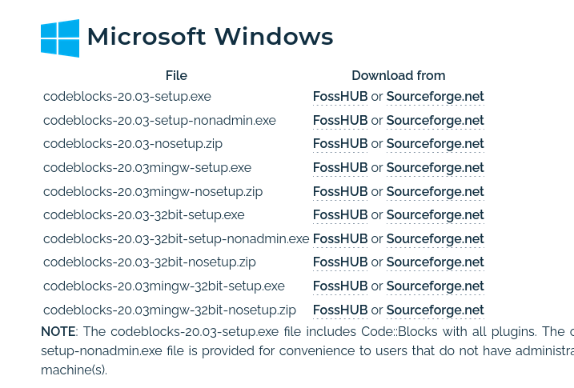

# Lập trình C++

Đối với những người lớn lên trong chương trình giáo dục phổ thông cũ thì ngôn ngữ lập trình Pascal là một điều không thể thiếu trong bộ môn Tin học, hoặc Python đối với chương trình mới. Tuy nhiên, trong lập trình thi đấu, ta (chủ yếu) sử dụng ngôn ngữ lập trình C++.

Ngôn ngữ lập trình C++ là một trong ngôn ngữ được sử dụng phổ biến, nếu không muốn nói là phổ biến nhất trong lập trình thi đấu. Chính vì thế, tất cả các đoạn code minh họa trong Smol Book sẽ được viết trên C++, phiên bản C++14 để phù hợp với **[Themis [Θέμις]- Chương trình chấm bài tự động](https://dsapblog.wordpress.com/2013/12/24/themis/)** - phần mềm chấm thi *chính thức* của Bộ Giáo dục và Đào tạo, thường xuyên được sử dụng để chấm thi trong các kỳ thi Học sinh giỏi cấp Tỉnh, Khu vực và Quốc gia - chạy các bài nộp C++ theo phiên bản C++14.

## Cài đặt môi trường code C++

Để chạy chương trình code C++ cần \\(2\\) phần mềm chính:

- Trình biên dịch C++ (Compiler)
- Trình soạn thảo văn bản (Text editor)

**GNU Compiler Collection (GCC)** là một trình biên dịch C++ vô cùng phổ biến.

Người dùng Windows có thể tải MinGW để sử dụng GCC.

Người dùng GNU+Linux/MacOS có thể tải về g++ thông qua package manager tương ứng.

Một trong các IDE được sử dụng rộng rãi trong các máy thi là [Code::Blocks](https://www.codeblocks.org/).

Trên các máy Windows, để tải về Code::Blocks, ta truy cập [trang web](https://www.codeblocks.org/downloads/binaries/) của Code::Blocks và tải về phiên bản mingw-setup bằng \\(1\\) trong \\(2\\) đường dẫn mà trang chỉ ta đến, sau đó thực hiện việc tải Code::Blocks.

### Cài đặt Code::Blocks cho lập trình thi đấu

Code::Blocks trong các máy thi thường hoặc là mới được tải về hoặc là đang sử dụng các cài đặt mặc định. Mặc định, Code::Blocks sẽ cho trình biên dịch C++ biên dịch chương trình của ta theo tiêu chuẩn C++98 (hơn \\(26\\) năm về trước). 

Để Code::Blocks chạy chương trình của ta với theo những tiêu chuẩn mới hơn của C++, ta thực hiện các bước sau:

- Từ thanh menu, chọn `Settings -> Compiler`.
- Ở phần `Select compiler` chọn `GNU GCC Compiler` làm trình biên dịch C++.
- Ở phần `Compiler Flags`, đánh dấu tích <input type="checkbox" disabled checked /> ở phần `Have g++ follow the C++14 ISO C++ language standard [-std=c++14]`

	Nếu trong Code::Blocks không có ô chọn biên dịch theo tiêu chuẩn C++14 như trên thì ta sang phần `Other compiler options` và thêm `-std=c++14` vào để cho kết quả tương đương.

Ngoài việc thêm flag `-std=c++14` để trình biên dịch biên dịch theo tiêu chuẩn C++14, ta còn thêm một số flag để giúp ta trong việc lập trình:

- `Enable all common compiler warnings (overrides many other settings) [-Wall]`
- `Enable extra compiler warnings [-Wextra]`
- `Optimize even more (for speed) [-O2]`

Các flag này sẽ cảnh bảo ta về một số cảnh báo khi ta chương trình (`-Wall`, `-Wextra`) và tối ưu chương trình khi chạy (`-O2`).

