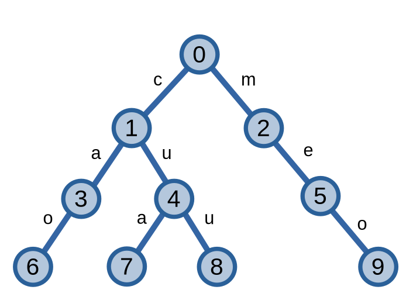
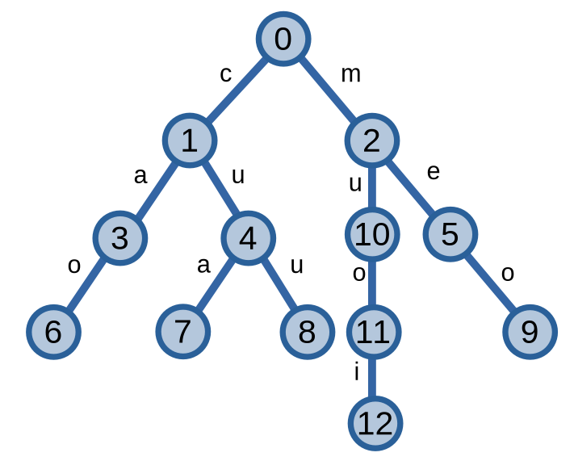
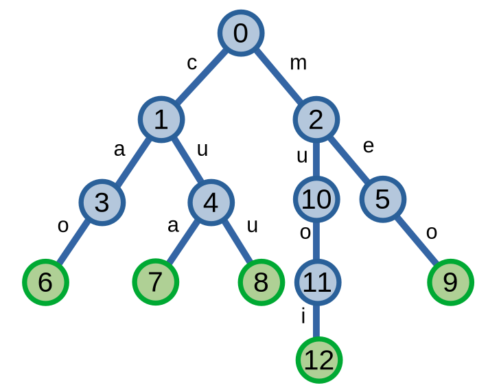
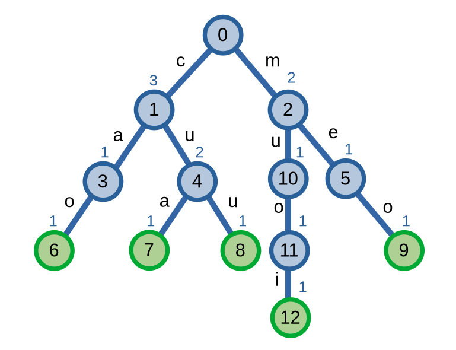

# Trie

**Trie**, hay CTDL **cây tiền tố**, là một CTDL quản lí tập hợp các xâu kí tự. Mặc dù là một CTDL tương đối đơn giản nhưng trie lại có rất nhiều ứng dụng khác nhau.

Các thao tác cơ bản của trie bao gồm thêm, tìm kiếm và xoá xâu kí tự.

## Cấu trúc 

Trie lưu trữ các xâu kí tự trên [cây](../graph-theory/tree.md). Cây của trie bao gồm các đỉnh và các cạnh. mỗi cạnh có trọng số là một kí tự. Đường đi từ đỉnh gốc với một đỉnh là một xâu kí tự được hình thành từ các kí tự của các cạnh trên đường đi ấy. 

Dưới đây là ví dụ của một trie lưu trữ \\(4\\) xâu "mèo", "cáo", "cua", "cừu" không dấu.

<center>

</center>

## Thêm xâu

Quá trình thêm xâu \\(S\\) vào tập hợp diễn ra như sau: gọi đỉnh đang duyệt trên cây là \\(p\\), ban đầu ta cho \\(p\\) nằm tại gốc. Ta bắt đầu duyệt các kí tự trên sâu S. Giả sử kí tự hiện tại đang duyệt là `c`. Nếu có đỉnh con của \\(p\\) được nối với cạnh có trọng số là `c`, ta di chuyển tới đỉnh con ấy. Nếu như không có thì ta cần tạo một đỉnh con mới tương ứng rồi sau đó mới di chuyển.  

Ví dụ, khi ta thêm xâu "muỗi" không dấu: từ đỉnh gốc \\(0\\) ta đi xuống đỉnh \\(2\\) bằng cạnh có trọng số là kí tự `m`. Tiếp theo, vì ta không có cạnh nào có trọng số `u` đi tới đỉnh con của đỉnh \\(2\\) nên ta tạo một đỉnh mới tương ứng và tiếp tục duyệt. Quá trình này lặp lại cho tới khi ta duyệt xong kí tự cuối cùng, tức là kí tự `i`.

<center>

</center>

Độ phức tạp của việc thêm xâu \\(S\\) là \\(O(|S|)\\).

## Tìm kiếm xâu

Đối với quá trình tìm kiếm xâu \\(S\\) trong trie thì quá trình duyệt cũng tương tự với việc thêm xâu. Điểm khác biệt là nếu không có đường đi hình thành xâu \\(S\\) thì ta trả về là không tìm được. Khi như có đường đi, ta kiểm tra xem nếu \\(S\\) có phải là một xâu kí tự trong trie hay không. Để thực hiện điều này ta gần gán giá trị cho các đỉnh trên cây biểu thị rằng xâu hình thành từ đường đi từ đỉnh gốc đến đỉnh này là xâu kí tự mà ta đã thêm. Ở đây, ta thấy các đỉnh màu xanh lá (\\(6, 7, 8, 9, 12\\)) biểu thị giá trị ấy.

<center>

</center>

Khi ta tìm kiếm một xâu như xâu "cá" không dấu, mặc dù tồn tại đường đi trên cây nhưng do đỉnh \\(3\\) không được gán giá trị nêu trên nên ta kết luận xâu "cá" không có trong trie. Ở một ví dụ khác, xâu "cóc" không dấu không có trong trie do không tồn tại đường đi trên trie hình thành nên xâu này.

Độ phức tạp của việc tìm kiếm xâu \\(S\\) là \\(O(|S|)\\).

## Xoá xâu

Trước khi thực hiện xoá xâu \\(S\\) thì ta cần phải biết được rằng nếu xâu \\(S\\) có tồn tại trong trie hay không. Sau khi đã xác định sự tồn tại của xâu \\(S\\), ta thực hiện việc xoá xâu \\(S\\). 

Trước hết, ở các đỉnh của trie, ta thêm một biến biểu thị số lượng xâu có tiền tố là đường đi từ gốc đến đỉnh ấy. Sau đó, ta thực hiện trừ \\(1\\) các giá trị trên các đỉnh là tiền tố của xâu \\(S\\). Cuối cùng, thực hiện xoá các đỉnh mà biến của nó bằng \\(0\\).

<center>

</center>

Giả sử ta muốn xoá xâu "mèo" không dấu. Ta thấy rằng xâu "mèo" có tồn tại trên trie nên ta sẽ thực hiện việc xoá xâu. Các đỉnh \\(2, 5, 9\\), vì là các tiền tố của xâu "mèo", sẽ bị giảm giá trị xuống còn \\(1, 0, 0\\) thay vì \\(2, 1, 1\\) như ban đầu. Vì không có xâu nào có tiền tố là "me" và "meo" nên ta thực hiện việc xoá hai đỉnh \\(5, 9\\).

Độ phức tạp của việc xoá xâu \\(S\\) là \\(O(|S|)\\).

## Cài đặt

Có hai cách cài đặt Trie phổ biến: cài đặt bằng con trỏ và cài đặt bằng mảng. Điểm khác nhau giữa hai cách cài đặt là ở cách cài đặt bằng con trỏ, ta có thể xoá được đỉnh trên cây.

Dưới đây là hai cách cài đặt trie lưu trữ các xâu kí tự chứa các kí tự in thường: `a..z`.

Cài đặt bằng mảng:

```C++
struct Trie{
	struct Node{
		int nxt[26];
		int end, cnt; // số lượng xâu kí tự, số lượng tiền tố tại đỉnh này
		Node() {
			end = cnt = 0;
			memset(nxt, -1, sizeof nxt);
		}
	};
	vector<Node> trie = {Node()}; // đỉnh gốc

	Trie() {}

	void insert(string &s) {
		int p = 0;
		for(char c : s) {
			int id = c - 'a';
			if(trie[p].nxt[id] == -1) {
				trie[p].nxt[id] = trie.size();
				trie.emplace_back();
			}
			p = trie[p].nxt[id];
			++trie[p].cnt;
		}
		++trie[p].end;
	} 

	bool search(string &s) {
		int p = 0;
		for(char c : s) {
			int id = c - 'a';
			if(trie[p].nxt[id] == -1) return false;
			p = trie[p].nxt[id];
		}
		return trie[p].end > 0;
	} 

	bool delete_string(int p, string &s, int i) {
		if(i != s.size()) {
			int id = s[i] - 'a';
			bool childDeleted = delete_string(trie[p].nxt[id], s, i+1);
			if(childDeleted) trie[p].nxt[id] = -1;
		} else --trie[p].end;
		if(p != 0) {
			return (--trie[p].cnt == 0);
		}
		return false;
	}

	void deletion(string &s) {
		if(!search(s)) return ;
		delete_string(0, s, 0);
	}
};
```

Cài đặt bằng con trỏ:

```C++
struct Trie{
	struct Node{
		Node* child[26];
		int end, cnt; 
		Node() {
			end = cnt = 0;
			for(int i = 0; i < 26; ++i) child[i] = NULL;
		}
	} *root; // đỉnh gốc

	Trie() {
		root = new Node();
	}
	
	void insert(string &s) {
		Node *node = root;
		for(char c : s) {
			int id = c - 'a';
			if(node->child[id] == NULL) node->child[id] = new Node();
			node = node->child[id];
			++node->cnt;
		}
		++node->end;	
	} 
	
	bool search(string &s) {
		Node *node = root;
		for(char c : s) {
			int id = c - 'a';
			if(node->child[id] == NULL) return false;
			node = node->child[id];
		}
		return node->end > 0;	
	} 

	bool delete_string(Node *node, string &s, int i) {
		if(i != s.size()) {
			int id = s[i] - 'a';
			bool childDeleted = delete_string(node->child[id], s, i+1);
			if(childDeleted) node->child[id] = NULL;
		} else --trie->fin;

		if(i != 0) {
			if(--node->cnt == 0){
				delete(node);
				return true;
			}
		}
		
		return false;
	}

	void deletion(string &s) {
		if(!search(s)) return ;
		delete_string(root, s, 0);
	}
};
```